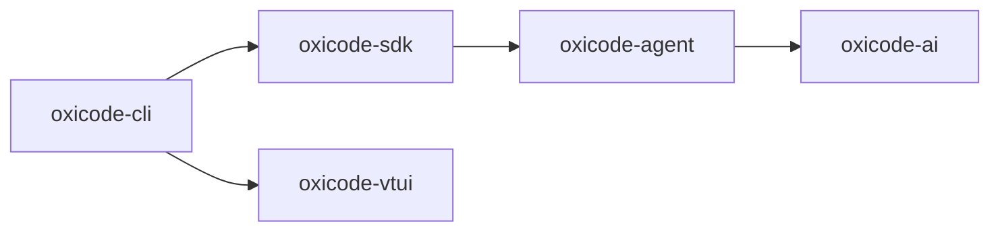

<div align="center">


# oxicode

**A terminal-based AI coding assistant built in Rust.**

A Rust port of [pi](https://github.com/earendil-works/pi) by Mario Zechner.
Multi-provider · Streaming-first · Extensible · Session persistence

[](https://github.com/project-oxi/oxicode/actions)
[](https://github.com/project-oxi/oxicode/actions)
[](https://crates.io/crates/oxicode-cli)
[](https://docs.rs/oxicode-cli)
[](https://github.com/project-oxi/oxicode/releases)
[](LICENSE.md)
[](https://github.com/project-oxi/oxicode/stargazers)
[](https://www.rust-lang.org/))
[](docs/rfcs/RFC-005-CI-CD-INFRA.md)

[Getting Started](#getting-started) · [Architecture](#architecture) · [Configuration](#configuration) · [Contributing](CONTRIBUTING.md) · [Changelog](CHANGELOG.md)

</div>

---

## Why oxicode?

oxicode is a Rust port of [pi](https://github.com/earendil-works/pi), re-implementing its core architecture — unified LLM API, agent runtime, tool calling, terminal UI, and session persistence — in idiomatic Rust with Tokio, Ratatui, and Serde.

It brings the power of LLM-based coding assistants directly to your terminal — fast, private, and fully under your control.

| Feature | Description |
|---------|-------------|
| 🌐 **Multi-provider** | OpenAI, Anthropic, Google, DeepSeek, Mistral, Groq, Cerebras, xAI, OpenRouter, Azure |
| ⚡ **Streaming-first** | Real-time token streaming with thinking/reasoning support |
| 🔧 **Tool calling** | Built-in read, write, edit, bash, grep, find — plus extensible trait system |
| 🖥️ **Interactive TUI** | Component-based terminal UI with themes, markdown rendering, and image support |
| 🌳 **Session system** | Persistent conversations with branching, forking, and JSONL storage |
| 🧩 **Skill system** | Pluggable prompt skills (brainstorming, deep research, code review, etc.) |
| 🔌 **Extensions** | Dynamically load native `.so`/`.dylib`/`.dll` or WASM plugins |
| 📦 **Package manager** | Install, update, and manage skill/extension packages |
| 🤖 **Multi-agent SDK** | Build multi-agent pipelines with the oxicode-sdk builder pattern |

## Getting Started

### Install

**cargo install** (any Rust toolchain ≥ 1.96):
```bash
cargo install oxicode-cli
```

**cargo binstall** (10-100x faster — uses prebuilt binary from the GitHub release):
```bash
cargo install cargo-binstall
cargo binstall oxicode-cli
```

**Pre-built binary** (macOS Apple Silicon):
```bash
# aarch64-apple-darwin
curl -fsSL https://github.com/project-oxi/oxicode/releases/latest/download/aarch64-apple-darwin.tar.gz \
  | tar xz -C /usr/local/bin
```
Or download from the [Releases page](https://github.com/project-oxi/oxicode/releases).
Each release ships with `SHA256SUMS` for integrity verification.

**Build from source** (last resort):
```bash
git clone https://github.com/project-oxi/oxicode.git
cd oxicode && cargo build --release
cp target/release/oxicode /usr/local/bin/
```

### Verify a downloaded binary

```bash
curl -fsSL https://github.com/project-oxi/oxicode/releases/latest/download/SHA256SUMS -o SHA256SUMS
sha256sum -c SHA256SUMS 2>/dev/null | grep aarch64-apple-darwin
```

### Configure

```bash
# Set your API key (Anthropic, OpenAI, Google, etc.)
export ANTHROPIC_API_KEY="sk-ant-..."
```

### Run

```bash
# Interactive mode (default)
oxicode

# Single prompt
oxicode "Explain Rust ownership"

# Specify provider and model
oxicode -p openai -m gpt-4o "Design a REST API"
```

That's it. No config files required — oxicode works out of the box.

## Architecture

oxicode is a multi-crate Rust workspace designed for modularity:



| Crate | Purpose |
|-------|---------|
| [**oxicode-ai**](oxicode-ai/) | Unified LLM API — 8 providers, streaming, tool calling, compaction |
| [**oxicode-agent**](oxicode-agent/) | Agent runtime — tool-calling loop, event system, MCP client |
| [**oxicode-vtui**](oxicode-vtui/) | Terminal UI framework — ratatui widgets, theme registry, markdown, vim engine |
| [**oxicode-sdk**](oxicode-sdk/) | Multi-agent SDK — agent groups, message bus, port-based adapters, builder pattern |
| [**oxicode-cli**](oxicode-cli/) | CLI binary — ties everything together (TUI + RPC + port composition root) |

## Configuration

Settings are layered — later layers override earlier ones:

```
defaults → ~/.oxicode/settings.toml → .oxicode/settings.toml → env vars → CLI flags
```

Example `~/.oxicode/settings.toml`:

```toml
default_model = "anthropic/claude-sonnet-4-20250514"
default_provider = "anthropic"
thinking_level = "medium"
theme = "default"
temperature = 0.7
max_tokens = 4096
auto_compaction = true
```

Environment variable overrides:

| Variable | Setting |
|----------|---------|
| `OXICODE_MODEL` | `default_model` |
| `OXICODE_PROVIDER` | `default_provider` |
| `OXICODE_THEME` | `theme` |
| `OXICODE_TEMPERATURE` | `default_temperature` |
| `OXICODE_MAX_TOKENS` | `max_response_tokens` |

## CLI Reference

```
oxicode [OPTIONS] [PROMPT]

Options:
  -p, --provider <PROVIDER>    Provider (anthropic, openai, google, ...)
  -m, --model <MODEL>          Model (claude-sonnet-4-20250514, gpt-4o, ...)
  -i, --interactive            Force interactive mode
      --thinking <LEVEL>       off, minimal, low, medium, high, xhigh
  -e, --extension <PATH>       Load extension (repeatable)
  -h, --help                   Print help
  -V, --version                Print version

Commands:
  sessions                     List all sessions
  tree [SESSION_ID]            Show session tree
  fork <PARENT> <ENTRY>        Fork a session
  delete <SESSION>             Delete a session
  pkg install <SOURCE>         Install a package
  pkg list                     List packages
  config show                  Show configuration
  config set <KEY> <VALUE>     Set a configuration value
```

## Built-in Skills

| Skill | Purpose |
|-------|---------|
| **Autonomous Loop** | Self-correcting design→implement→verify cycle |
| **Brainstorming** | Collaborative ideation with multi-approach comparison |
| **Deep Research** | Investigation, analysis, and design documentation |
| **Reviewer** | Multi-axis code review |
| **Super Review** | Deep system-level review |
| **Planner** | Implementation planning with dependency batching |
| **Scout** | Fast codebase reconnaissance and structure analysis |
| **Design Farmer** | Design system construction (colors, tokens, a11y) |
| **Playwright CLI** | Browser automation via Playwright |
| **Worktree** | Git worktree management |

## Development

```bash
cargo build                          # Debug build
cargo build --release                # Release binary
cargo test --workspace               # Run all tests (2,000+)
cargo clippy --workspace -- -D warnings   # Lint
cargo fmt --all -- --check           # Format check
```

See [CONTRIBUTING.md](CONTRIBUTING.md) for the full development guide.

## FAQ

<details>
<summary><strong>Which providers are supported?</strong></summary>

OpenAI, Anthropic, Google, DeepSeek, Mistral, Groq, Cerebras, xAI, OpenRouter, and Azure OpenAI. Set the relevant `API_KEY` environment variable and use `-p <provider>` to select one.
</details>

<details>
<summary><strong>Can I use oxicode as a library?</strong></summary>

Yes. Each crate is published independently: `oxicode-ai` (LLM API), `oxicode-agent` (agent runtime), `oxicode-vtui` (terminal UI), `oxicode-sdk` (multi-agent SDK). See individual crate READMEs for details.
</details>

<details>
<summary><strong>How do sessions work?</strong></summary>

Sessions are stored as append-only JSONL files in `~/.oxicode/sessions/`. Each session is a tree — you can fork from any point to explore alternative paths without losing history. Use `oxicode sessions` to list, `oxicode tree` to inspect, and `oxicode fork` to branch.
</details>

<details>
<summary><strong>Does oxicode send my code to third parties?</strong></summary>

oxicode only communicates with the LLM provider you select. No telemetry, no analytics, no third-party data collection. Your code stays between you and your chosen provider.
</details>

## Attribution

oxicode is a Rust port of [pi](https://github.com/earendil-works/pi) by [Mario Zechner](https://github.com/badlogicgames).
The architectural design, provider abstraction, tool system, streaming events, and session tree
are derived from the original pi project (MIT License). See [NOTICE.md](NOTICE.md) for details.

## License

[MIT](LICENSE.md) © 2025 Mario Zechner, 2025–2026 oxicode contributors

## Sponsorship

oxicode is developed and maintained by volunteers. If oxicode saves you time or
makes your workflow better, consider [sponsoring the project](https://github.com/sponsors/a7garden)
to fund continued work on providers, the agent loop, and the TUI.
