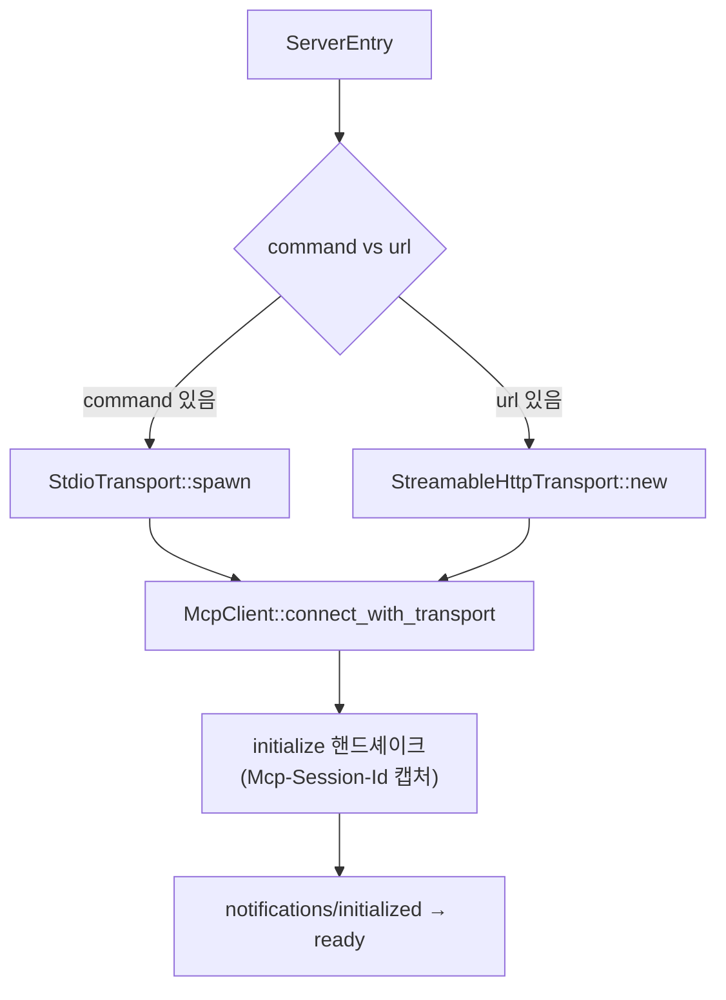

# MCP v2 설계 — 준수성·전송·생태계 패리티

> **참고:** 본 설계는 기존 [`MCP_ENHANCEMENT.md`](./MCP_ENHANCEMENT.md)(pi-mcp-adapter 기반, 5페이즈 + SDK)의 후속(v2)이다.
> 참조 모델을 pi-mcp-adapter에서 **OMP(oh-my-pi)** 와 **MCP 공식 스펙(2025-03-26)** 으로 상향하여,
> 기존 설계가 다루지 않았거나 "선택"으로 분류했던 갭을 재우선순위화한다.
> 비교 근거: `omp://mcp-{config,protocol-transports,runtime-lifecycle,server-tool-authoring}.md` ·
> https://modelcontextprotocol.io/specification/2025-03-26/basic/transports

---

## v2.0 구현 결과 (2026-06-19)

> **상태:** v2.0 착륙 완료. G1(스펙 비준수) 및 D-rev1(trait 재설계) 모두 코드·실험로 검증.

**착륙한 변경 (`oxi-agent/src/mcp/`):**
- `transport/mod.rs` — `McpTransport` trait 재설계: `request(id, json)` / `notify(json)` / `set_inbound_handler` / `close` / `is_connected`. `send`/`recv` 모델 폐기. `InboundHandler` 타입 별도 노출.
- `transport/stdio.rs` — **JSONL 프레이밍**(스펙 준수), `Content-Length` 완전 제거. `request()` 루프에서 인바운드 디스패치 + id 매칭. `MAX_LINE_SIZE=10MB` 상한으로 `fill_buf`/`consume` 기반 경계 보장. SIGTERM→5s→SIGKILL 종료 유지.
- `client.rs` — `send_request`를 `transport.request(id, json)` 한 줄로 축소. `drain_orphaned_responses` 제거. `transport.send→notify` 마이그레이션. 데드 `write_framed`/`read_framed` 제거. `connect_with_transport`에서 `default_inbound_handler()` 설치.
- `default_inbound_handler()` — `ping`→`{"result":{}}`, `roots/list`→`{"result":{"roots":[]}}`, 그 외→`-32601`. 알림은 무응답. v2.1에서 G4 전체 처리로 확장.

**검증:**
- `cargo build -p oxi-agent` ✅ (lib 컴파일, 사전 존재 `missing_docs` 경고만)
- `cargo test -p oxi-agent --test mcp_stdio_interop --no-run` ✅ (테스트 바이너리 생성)
- `cargo test -p oxi-agent --test mcp_stdio_interop -- --ignored` ✅ — **`@modelcontextprotocol/server-everything`** stdio 서버에 대해 initialize → `tools/list` (비어있지 않음) → `ping` 왕복 성공 (3.04s). G1 종결의 결정적 증거.
- `cargo clippy -p oxi-agent --lib -- -A missing_docs` — `mcp/` 경로 진단 **0건** (모든 경고는 사전 존재 `tools/{edit,hashline_fs,todo}.rs`).

**잔여:** v2.0 완결. v2.1–v2.4는 아래 "v2.1–v2.4 구현 결과" 절 참조.

---
## v2.1–v2.4 구현 결과 (2026-06-19)

> **상태:** v2.1–v2.4 착륙 완료. 전체 로드맵(G1–G8) 코드로 구현·빌드·실서버/목 테스트로 검증.

### v2.1 — Streamable HTTP + 인증 + G4
- `transport/http.rs` *(신규)* — **Streamable HTTP 전송**(스펙 2025-03-26): POST + `Accept: application/json, text/event-stream`, `Mcp-Session-Id` 캡처/첨부, `application/json` 단일 응답 분기 + `text/event-stream` SSE 파싱(id 매칭 + 인바운드 디스패치), DELETE 종료. `reqwest 0.12`(기존 의존) 사용, SSE 프레이머 직접 구현(새 크레이트 없음). refresh-on-401: 401/403 시 `provider.refresh()` 1회 재시도.
- `auth.rs` *(신규)* — `McpCredentialProvider` trait + `Credential` + `NoopCredentialProvider`. SDK port 아님(D11 존중).
- `mod.rs` — `McpManager::connect`가 `command`(stdio)/`url`(Streamable HTTP)로 전송 선택. `set_credential_provider(&self)` setter(RwLock 기반, breaking 아님). `connect_with_transport`가 기본 inbound responder 설치(G4).
- `config.rs` — `${VAR}`/`${VAR:-default}` 확장 + `!cmd` 셸 해석(10s, thread+recv_timeout) — `mcp.json` 값 해석. `ServerEntry.timeout`(ms, 0=비활성) 추가.
- `tests/mcp_http_interop.rs` *(신규, `#[ignore]`)* — 의존성 없는 목 TCP 서버로 Streamable HTTP initialize + `tools/list` 왕복 검증. **G2 종결 증거.**
- **의도적 축소:** 배경 GET SSE 리스너(server-push between requests)는 `Arc<Self>` 수명 문제로 v2.1에서 제외 — POST-SSE 응답 스트림 내 인바운드 디스패치는 처리. 사양 브라우저 OAuth authorization-code 플로우는 미구현(client_credentials만). 옛 HTTP+SSE(2024-11-05) 역호환 폴백 생략.

### v2.2 — OAuth client_credentials + oxi-cli 백엔드
- `oxi-cli/src/mcp_credentials.rs` *(신규)* — `FileMcpCredentialProvider`: `mcp.json`의 `oauth` 블록(`tokenUrl`/`clientId`/`clientSecret`/`scope`)에서 OAuth2 **client_credentials** 교환, 토큰 캐시(`~/.config/oxi/mcp-tokens.json`, atomic write), `expires_in` 기반 만료/자동갱신.
- `types.rs` — `OAuthConfig` + `ServerEntry.oauth` 필드.
- `bootstrap.rs` — `build_app`에서 `mcp.json` oauth 맵 → provider 생성 → `manager.set_credential_provider(...)`.
- `McpManager::reauth_server(server)` + `/mcp reauth <server>` 슬래시 명령(tools_commands.rs) — 토큰 강제 갱신.
- **의도적 축소:** 브라우저 기반 authorization-code + 로컬 콜백 서버는 미구현(인터랙티브 UX, 별도 작업). client_credentials 그랜트만 지원.

### v2.3 — resources/prompts + KeepAlive 백오프
- `mod.rs` — `McpManager::{list_resources, read_resource, list_prompts, get_prompt}` 메서드 추가.
- `tool.rs` — `mcp` 게이트웨이 툴에 `action: list-resources|read-resource|list-prompts|get-prompt` 추가. 자동 컨텍스트 주입은 **보수적 보류**(토큰 폭발 회피).
- `mod.rs` — `health_check_and_reconnect`가 **백오프 재시도**(500ms/1s/2s)로 1회-포기 과소복원 수정. 차단기(5회/30s)는 2차 방어로 명시만(미구현).

### v2.4 — 서드파티 config opt-in 발견
- `types.rs` — `McpSettings.discover_external_configs`(기본 false).
- `config.rs` — `load_mcp_config_from`가 활성화 시 `.claude/mcp.json`·`.cursor/mcp.json` 흡수(oxi 자체가 항상 승리, 외부는 빈 슬롯만 채움). VSCode(`servers`)/opencode(`mcp`) 스키마 정규화는 v2.4 범위 외.

### 검증 (v2.1–v2.4)
- `cargo build -p oxi-agent` ✅ · `cargo build -p oxi-cli` ✅ (둘 다 exit 0; 사전 존재 `missing_docs` 경고만)
- `cargo test -p oxi-agent --test mcp_stdio_interop --test mcp_http_interop -- --ignored` ✅ — **2 passed** (stdio server-everything + HTTP 목). v2.0 회귀 없음.
- **제약:** `cargo clippy --workspace --all-targets -- -D warnings`는 사전 존재 결함으로 실패 — (a) `tools/todo.rs:633`의 `&& false`(`clippy::overly_complex_bool_expr`, deny), (b) crate-wide `missing_docs`(~68건, tools.rs/todo.rs). MCP 코드는 warn-수준 스타일 린트(`collapsible_if` 등)만 발생, deny-수준 없음. close()의 MutexGuard-across-await는 수정.

---
## 1. 현황 — 기존 설계 대비 진척도

[`MCP_ENHANCEMENT.md`](./MCP_ENHANCEMENT.md)의 5페이즈 + SDK 레이어를 코드 기반으로 검증한 결과:

| 영역 | 설계 | 구현 상태 | 비고 |
|------|------|:---:|------|
| Phase 1: cache · lifecycle · `McpTransport` trait · `spawn()` | P0 | ✅ | `cache.rs`, `lifecycle.rs`, `transport/{mod,stdio}.rs`, `mod.rs:spawn*` |
| Phase 2: TUI 대시보드 데이터 | P0 | ✅ | `types.rs:McpDashboardData`, `dashboard_data()` |
| Phase 3: direct tools · consent Allow/Deny | P1 | ✅ | `direct_tool.rs`, `consent.rs`, `excludeTools` |
| SDK 레이어 (re-export · `with_mcp_config` · `mcp_tools` · `mcp()`) | v3 | ✅ | `oxi-sdk/src/{lib,builder,tool_factory}.rs` |
| Phase 4: consent `Ask` 모드 | P2 | ❌ | `ConsentState` = Allow/Deny만 |
| Phase 5: HTTP/SSE 전송 | P2 | ❌ | `transport/`에 `stdio.rs`만 존재; `url`/`headers` 필드는 dead field |

**결론:** 기존 설계의 *본류(Phase 1-3 + SDK)는 완료*됐다. 남은 Phase 4/5는 의도대로 미구현이다.

---

## 2. OMP·스펙 비교가 드러낸 새 갭

기존 설계(pi-mcp-adapter 기준)가 **간과하거나 과소평가**한 항목들. OMP 비교 + 스펙 직독으로 재발견:

| # | 갭 | 기존 설계에서의 취급 | 실제 심각도 | 근거 |
|---|---|---|:---:|---|
| G1 | **stdio 프레이밍 비준수** | 미언급 | 🔴 **P0(버그)** | 스펙: "Messages are delimited by newlines". oxi는 `Content-Length` 프레이밍(LSP) 사용 → 표준 stdio 서버와 통신 불가 |
| G2 | **Streamable HTTP 전송** | Phase 5 "http_sse"(🟢, thin stub) | 🔴 P1 | 기존은 deprecated(2024-11-05) HTTP+SSE 기반. 현재 스펙은 Streamable HTTP(2025-03-26) |
| G3 | **인증(API key + OAuth)** | 🟢 Low, 설계 없음 | 🔴 P1 | G2와 짝. 없으면 Slack·GitHub Copilot MCP 등 호스팅 서버 사용 불가 |
| G4 | **서버→클라이언트 요청** 처리 | 미언급 | 🟡 P2 | oxi `recv`는 id 불일치 메시지를 skip만 → `roots/list`·`ping` 응답 안 함 |
| G5 | **resources/prompts** 런타임 통합 | 🟡(메서드만) | 🟡 P2 | `McpClient`에 메서드는 있으나 `McpManager`가 에이전트에 노출 안 함 |
| G6 | **재연결 안정성**(KeepAlive 과소복원) | 미언급 | 🟡 P2 | KeepAlive가 1회 재연결 실패 후 헬스체크 영구 중단(`mod.rs:653`). lazy는 백오프 정상. 백오프 재시도 + 차단기(2차) 필요 |
| G7 | **`${VAR}`/`!cmd` 시크릿 해석** | 미언급 | 🟢 P3 | 토큰을 `mcp.json`에 커밋하지 않으려면 필요 |
| G8 | **서드파티 config 발견** (`.claude` 등) | 미언급 | 🟢 P3(의견 분기) | OMP는 적극 흡수. oxi는 4 고정경로만. 정체성 결정 필요 |

> **핵심 발견은 G1.** 이것은 "부족한 기능"이 아니라 **스펙 비준수 버그**로, 본 설계의 최우선 수정 대상이다.

---

## 3. 🔴 P0 — stdio 프레이밍 비준수 수정 (G1)

### 3.1 증거

MCP 스펙(2025-03-26, stdio 전송) 명문:

> *"Messages are delimited by newlines, and **MUST NOT** contain embedded newlines."*

OMP stdio는 newline-delimited JSON(JSONL)을 사용한다(`omp://mcp-protocol-transports.md`: *"newline-delimited JSON over subprocess stdio"*).

반면 oxi `StdioTransport`(`transport/stdio.rs`)는 LSP 방식을 쓴다:

```rust
// 현재 send(): Content-Length 헤더 + 바디 (LSP 프레이밍 — MCP 비준수)
async fn send(&mut self, json: &str) -> Result<()> {
    let header = format!("Content-Length: {}\r\n\r\n", json.len());  // ← MCP에 없음
    self.stdin.write_all(header.as_bytes()).await?;
    self.stdin.write_all(json.as_bytes()).await?; ...
}
// 현재 recv(): Content-Length 헤더를 파싱해 정확히 N 바이트 읽기 (LSP 방식)
```

**영향:** 공식 `@modelcontextprotocol/sdk` 및 생태계 대부분의 stdio 서버는 newline-delimited를 기대한다. oxi가 보내는 `Content-Length: ...` 프레임을 표준 서버는 파싱하지 못한다. 실서버 통합 테스트가 없어(기존 설계는 Mock MCP 서버만 가정) 미발견 상태다. `client.rs:461-500`의 `write_framed`/`read_framed`는 `#[allow(dead_code)]`로 이미 미사용 — 이 버그의 잔재다.
**실증(리뷰):** 공식 `@modelcontextprotocol/server-everything` stdio 서버에 두 프레이밍을 각각 전송해 재현 — Content-Length 프레이밍 = **무응답/행업**, newline-delimited = **즉시 `initialize` 응답**. oxi가 보내는 프레임을 표준 서버가 받아들이지 않음이 확인됐다(추론 아님).

### 3.2 수정

프레이밍 바이트 교체 자체는 `StdioTransport`에 국한이다. 단, v2.0은 함께 `McpTransport` trait을 `request`/`notify`로 재설계(§4.3, D-rev1)하므로, 최종적으로 `StdioTransport`·`McpClient` 양쪽이 수정된다. 아래 코드는 프레이밍 부분만 보여준다(trait 재설계는 §4.3).

```rust
// 수정 후 send(): JSON + '\n'
async fn send(&mut self, json: &str) -> Result<()> {
    // MCP stdio: 한 줄 JSON + 개행. 내장 개행 금지(serde_json::to_string은 단일 행 보장).
    debug_assert!(!json.contains('\n'), "MCP 메시지에 내장 개행 금지");
    self.stdin.write_all(json.as_bytes()).await?;
    self.stdin.write_all(b"\n").await?;
    self.stdin.flush().await?;
    Ok(())
}

// 수정 후 recv(): 한 줄 읽기 + JSON 파싱 (빈 줄·로그 라인 무시는 서버 stderr 책임이므로 stdout은 JSON만)
async fn recv(&mut self) -> Result<RawJsonRpcMessage> {
    loop {
        let mut line = String::new();
        let n = self.stdout.read_line(&mut line).await?;
        if n == 0 { anyhow::bail!("MCP 서버가 연결을 닫았습니다"); }
        let trimmed = line.trim();
        if trimmed.is_empty() { continue; }      // 스펙상 빈 줄 허용 → 스킵
        return serde_json::from_str::<RawJsonRpcMessage>(trimmed)
            .with_context(|| format!("MCP 메시지 파싱 실패: {}", trimmed));
    }
}
```

**정리:** `client.rs`의 dead `write_framed`/`read_framed`(490-500행) 제거. `MAX_HEADER_LINES`·`MAX_BODY_SIZE`·`Content-Length` 관련 코드 전부 삭제.

### 3.3 검증 기준(acceptance)

- `npx -y @modelcontextprotocol/server-everything` (또는 `server-filesystem`) stdio 서버와 실제 핸드셰이크 + `tools/list` + `tools/call` 성공.
- 새 통합 테스트 `oxi-agent/tests/mcp_stdio_interop.rs`: 위 공식 서버를 spawn해 실제 응답 round-trip 검증(기존엔 없었음 — 이 버그의 근본 원인).
- 기존 단위 테스트는 `connect_with_transport` + 인메모리 mock transport로 검증하므로 영향 없음.

---

## 4. 🔴 P1 — Streamable HTTP 전송 (G2, Phase 5 재설계)

기존 Phase 5 설계(`transport/http_sse.rs`)는 **deprecated된 2024-11-05 HTTP+SSE** 기반이다. 현재 스펙(2025-03-26)의 **Streamable HTTP**로 재설계.

### 4.1 전송 선택 분기

`McpManager::connect()`와 `McpClient`를 전송 무관하게 재구성. 현재 `McpClient::connect`는 stdio 전용(`command`/`args`/`env`/`cwd`/`debug` 시그니처).



`McpClient::connect`를 `connect_stdio(..)`로 개명하고, 공개 진입점은 `connect_with_transport(Box<dyn McpTransport>)`로 통일(이미 존재). `McpManager::connect`가 `ServerEntry`에서 전송을 선택해 주입.

### 4.2 `StreamableHttpTransport` 설계

```rust
/// MCP Streamable HTTP 전송 (스펙 2025-03-26).
/// reqwest 0.12(이미 oxi-agent 의존) 기반.
pub struct StreamableHttpTransport {
    endpoint: String,                       // 단일 MCP 엔드포인트
    client: reqwest::Client,
    session_id: parking_lot::Mutex<Option<String>>,  // Mcp-Session-Id
    pending: tokio::sync::Mutex<HashMap<i64, oneshot::Sender<RawJsonRpcMessage>>>,
    bg_listener: parking_lot::Mutex<Option<JoinHandle<()>>>, // GET SSE 리스너
    notification_tx: tokio::sync::mpsc::UnboundedSender<RawJsonRpcMessage>,
    notification_rx: tokio::sync::Mutex<UnboundedReceiver<RawJsonRpcMessage>>,
    next_id: AtomicI64,
}
```

핵심 동작(스펙 대응):

1. **POST request**: body = 단일 JSON-RPC 메시지; `Accept: application/json, text/event-stream`; `Mcp-Session-Id` 헤더(초기화 응답에서 캡처 후 모든 후속 요청에 첨부).
2. **응답 분기**:
   - `Content-Type: application/json` → 단일 응답, id 매칭으로 resolve.
   - `Content-Type: text/event-stream` → SSE 스트림 소비. 매칭 id의 응답을 resolve하고, 나머지(notifications/server→client requests)는 백그라운드로 drain.
3. **GET 리스너**(선택): 서버→클라이언트 notifications/requests 수신. initialize 이후 시작; `405`면 자동 비활성화(스펙: "MUST return 405 ... indicating no SSE stream").
4. **DELETE 종료**: `close()`가 `Mcp-Session-Id`와 함께 DELETE 전송(실패 무시).
5. **역호환 폴백**(스펙 §Backwards Compatibility): POST initialize가 4xx면 → GET으로 옛 `endpoint` 이벤트 대기 → 옛 HTTP+SSE 모드로 전환. (점진적 도입에서는 *생략 가능*, v2.1로 이연 명시.)

### 4.3 `McpTransport` trait 재설계 — `send`/`recv` → `request`/`notify` (리뷰 반영)

> **리뷰에서 발견한 구조적 약점:** 현재 trait은 stdio의 단일 파이프에 맞춘 `send(json) / recv() -> Message` 모델이다. HTTP에서는 응답이 POST 한 번에 같이 오므로, 이 trait을 그대로 쓰면 `send()`가 몰래 전체 HTTP 왕복을 수행하고 응답을 버퍼링한 뒤 `recv()`가 꺼내는 **의미론적 왜곡**이 생긴다(이름은 send지만 실제로는 request+response). 초기 설계(§4.3 구안)는 이를 recv를 "도착 큐"로 모델링해 억지로 끼워맞췄다.

**결정(D-rev1): trait을 OMP 모델인 `request`/`notify`로 재설계.**

```rust
#[async_trait]
pub trait McpTransport: Send + Sync {
    /// 요청 전송 + 매칭 응답 대기 (stdio: send+recv 루프, http: POST+응답).
    async fn request(&mut self, id: i64, json: &str) -> Result<RawJsonRpcMessage>;
    /// 응답 기대 없이 알림 전송 (stdio: write, http: POST→202/동기).
    async fn notify(&mut self, json: &str) -> Result<()>;
    /// 서버가 밀어넣는 notification / 서버→클라이언트 요청 수신 콜백.
    fn set_inbound_handler(&mut self, handler: Box<dyn Fn(RawJsonRpcMessage) + Send + Sync>);
    async fn close(&mut self) -> Result<()> { Ok(()) }
    fn is_connected(&self) -> bool;
}
```

- stdio 구현: `request` = send + recv id-매칭 루프; `notify` = write; inbound = 읽기 루프에서 id 없는 메시지 디스패치.
- http 구현: `request` = POST + (json | SSE) 응답; `notify` = POST(202); inbound = GET SSE 리스너 + POST-SSE 잔여 메시지.
- `McpClient::send_request`는 `transport.request(id, json)` 한 줄로 축소. id 매칭/버퍼링은 전송층 내부로 이동.

**비용:** `StdioTransport`와 `McpClient` 양쪽 수정. 단, 이 재설계가 G4(서버→클라이언트 요청)를 inbound handler로 자연스럽게 흡수한다. 따라서 **G4는 v2.3이 아니라 v2.1 전송 작업과 동반**해야 한다(아래 로드맵 정정). G1 프레이밍 수정은 이 재설계와 함께 v2.0에서 수행하는 것이 일관적이다.


### 4.4 SSE 파싱

reqwest `bytes_stream()` 위에 최소 SSE 프레이머(`data:`/`event:`/`id:` 라인 처리, `Last-Event-ID` 헤더)를 직접 구현. 새 크레이트(`eventsource-stream`) 없이 — SSE 포맷은 단순하고 의존 추가 비용이 가치보다 크다.

---

## 5. 🔴 P1 — 인증: API key + OAuth (G3)

G2와 짝. HTTP 전송만 있고 인증이 없으면 호스팅 MCP(Slack·GitHub Copilot)를 못 쓴다.

### 5.1 단계화

| 단계 | 범위 | 비고 |
|---|---|---|
| 5.1a | **API key + `${VAR}`/`!cmd` 해석**(G7 일부) | header/env 값의 변수·명령 해석 |
| 5.1b | **OAuth confidential flow** | credential 저장 + 갱신 + `/mcp reauth` |

### 5.2 크레이트 경계 문제 (핵심 제약)

`oxi-agent`는 `oxi-cli`에 의존할 수 없다(의존 흐름: `oxi-agent ← oxi-cli`). 그런데 **credential 저장소**는 `oxi-cli/src/store/auth_storage.rs`에 있다. OAuth 갱신 플로우는 `McpManager`(oxi-agent) 안에서 일어나야 하므로, credential 조회가 oxi-agent에서 가능해야 한다.

→ 기존 설계 D11(MCP를 port로 만들지 않음)을 존중하되, **MCP에 국한된 좁은 콜백 trait**을 도입:

```rust
// oxi-agent/src/mcp/auth.rs (신규)
/// MCP 서버 자격 증명 해결자. noop 기본 구현 = 해석 없음.
/// oxi-cli이 auth_storage 백엔드로 구현해서 주입.
#[async_trait]
pub trait McpCredentialProvider: Send + Sync {
    /// 서버별 OAuth 토큰 조회(갱신 포함). 없으면 None.
    async fn access_token(&self, server: &str, url: &str) -> Option<Credential>;
    /// 401/403 시 갱신 재시도. 실패 시 None.
    async fn refresh(&self, server: &str, url: &str) -> Option<Credential>;
}
pub struct NoopCredentialProvider;
#[async_trait] impl McpCredentialProvider for NoopCredentialProvider { /* None */ }
```

`McpManager::spawn_with_paths`에 `credential_provider: Arc<dyn McpCredentialProvider>` 추가(기본 `Noop`). oxi-cli bootstrap에서 `auth_storage` 백엔드 구현체 주입. **이것은 SDK port가 아니다** — MCP 모듈 로컬 trait이며, `coding_tools()` 패턴과 일관됨.

### 5.3 `${VAR}`/`!cmd` 해석 (5.1a)

`config.rs` 발견 단계에서 `ServerEntry`의 `headers`/`env`/`command`/`args`/`url` 문자열 값을 재귀 해석(OMP 동작 정합):

- `${VAR}` / `${VAR:-default}` → 환경변수 치환(미해결 시 리터럴 유지)
- 값이 `!`로 시작 → 나머지를 셸 명령(10s 타임아웃) 실행, trim한 stdout 사용. 실패/공백 시 해당 엔트리 생략.

`oxi-agent`에 셸 실행은 이미 bash 툴 경로로 있으나 MCP는 경량 `std::process::Command` 직접 사용(툴 인프라 의존 지양).

---

## 6. 🟡 P2 — 프로토콜 완전성: 서버→클라이언트 요청 (G4)

현재 `McpClient::send_request`의 recv 루프(`client.rs:406-427`)는 id 불일치 메시지를 **무조건 skip**한다. 스펙상 서버는 `roots/list`·`ping`·sampling·elicitation 등의 *요청*(method + id)을 보낼 수 있다. oxi는 이에 응답하지 않아 서버가 영구 대기하거나 세션을 끊을 수 있다.

### 6.1 recv 루프 개선

```rust
loop {
    let msg = self.transport.recv().await?;
    if let Some(rid) = msg.id {
        if Some(rid) == id {
            // 매칭 응답 → resolve
            return resolve(msg);
        }
        // 동일 id가 아닌데 method도 있으면 → 서버→클라이언트 "요청"
        if msg.method.is_some() {
            self.answer_server_request(rid, msg.method.as_deref(), msg.params).await;
            continue;
        }
        // id만 있고 method 없음 → 우리가 안 기다리는 응답(orphan) → skip
        continue;
    }
    // id 없음 → notification → dispatch (§6.2)
    self.dispatch_notification(&msg).await;
}
```

`answer_server_request` 기본 정책(보수적 최소 구현):

| 서버 요청 | 응답 |
|---|---|
| `ping` | 빈 결과 `{}` |
| `roots/list` | 빈 `roots: []`(oxi는 roots 노출 안 함) |
| 그 외 | JSON-RPC `-32601 Method not found` |

### 6.2 notification 디스패치

`notifications/tools/list_changed` 같은 MCP notification을 `McpManager`로 전달해 캐시/메타데이터를 갱신하는 훅을 추가(OMP의 `#onToolsChanged` 대응). 현재는 무시 → 서버가 툴을 동적으로 추가/제거해도 oxi는 갱신 안 됨.

---

## 7. 🟡 P2 — resources/prompts 에이전트 통합 (G5)

`McpClient`에 `list_resources`·`read_resource`·`list_prompts`·`get_prompt`가 이미 있으나 `McpManager`·에이전트에 노출되지 않는다(죽은 기능).

### 7.1 게이트웨이 툴 actions 확장 (최소 비용)

기존 `mcp` 프록시 툴(`tool.rs`)의 action 세트에 추가. 별도 툴 생성 없이 게이트웨이 안에서 해결:

```
mcp({ action: "read-resource", server: "...", uri: "..." })
mcp({ action: "list-resources", server: "..." })
mcp({ action: "get-prompt",     server: "...", name: "...", arguments: {...} })
```

### 7.2 자동 컨텍스트 주입은 **보수적 보류**

OMP처럼 resources/resource-templates를 자동 구독해 에이전트 컨텍스트에 주입하는 것은 부작용(토큰 폭발, 의도치 않은 데이터 노출)이 크다. v2에서는 **LLM이 명시적으로 요청하는 게이트웨이 actions**만. 자동 주입은 별도 opt-in 설정(`settings.autoSubscribeResources`)과 함께 v3에서 검토.

---

## 8. 🟡 P2 — 재연결 강화: KeepAlive 과소복원 수정 (G6, 리뷰에서 진단 정정)

> **리뷰에서 정정:** 초기 설계는 "crash-storm 차단기"로 진단했으나 **잘못된 진단**이었다. 코드 재검토 결과:
> - **lazy 경로**(`ensure_connected`, `mod.rs:590-633`): `failure_tracker` + `failure_backoff_secs`(기본 30s)로 백오프 → **과다 복원(storm) 위험 없음**.
> - **KeepAlive 경로**(`health_check_and_reconnect`, `mod.rs:653-664` + `lifecycle.rs:133-146`): ping 실패 시 재연결 **1회** 시도 후 실패하면 health-check 루프가 `break` → **단 한 번의 일시적 실패로 헬스 모니터링이 영구 중단**(다음 툴 호출이 lazy 재연결을 트리거하기 전까지).

**진짜 갭은 과소복원(under-resilience)** 이지 과다가 아니다. OMP의 올바른 모델은 차단기가 아니라 **백오프 재시도 지속**이다.

### 8.1 설계 (수정)

1. **KeepAlive: 1회-포기 → 백오프 재시도 지속.** `health_check_and_reconnect`가 실패해도 루프를 `break`하지 않고, backoff(OMP 정합 `500/1000/2000/4000ms`, 상한 4s)로 재시도를 계속한다. `failure_tracker`와 통합해 동일 백오프 정책 사용.
2. **차단기는 2차 방어로만(선택).** backoff 재시도가 30s 윈도우 내 `MAX_RECONNECTS`(기본 5)를 초과하면 해당 서버 자동 재연결 **일시정지** + `/mcp` 대시보드 "paused (crash-loop)" 표시. `reconnect_history: HashMap<String, Vec<Instant>>` 추가. 실제 storm이 발생할 때만 작동하는 안전망.
3. lazy 경로는 현행 유지(이미 올바름).

정책 변경 핵심: "1회 실패 = 영구 포기"를 "백오프로 계속 시도, 극단적 루프만 일시정지"로 전환. OMP 동작 정합.

---

## 9. 🟢 P3 — 시크릿 해석 & 서드파티 발견 (결정 지점)

### 9.1 시크릿 해석 — §5.3에서 5.1a로 통합. G7은 P1로 격상(인증의 일부).

### 9.2 서드파티 config 발견 (G8) — **정체성 결정 필요**

OMP는 `.claude/mcp.json`, `.cursor/mcp.json`, `.vscode/mcp.json`, `opencode.json`을 흡수한다. oxi는 4개 고정경로(`~/.config/mcp`, `<config>/oxi`, `<cwd>/.mcp.json`, `<cwd>/.oxi/mcp.json`)만 읽는다.

**의견 분기(사용자 결정 사항):**

| 옵션 | 장점 | 단점 |
|---|---|---|
| A. 흡수하지 않음(현상 유지) | oxi 정체성 명확, 예측 가능 | `.claude` 사용자가 oxi로 이관 시 재설정 |
| B. **opt-in 흡수**(권장) | 호환성 + 명시적 통제 | 발견 로직 복잡도 증가 |
| C. OMP처럼 기본 흡수 | 최대 호환성 | 예기치 않은 서버 자동 실행(보안) |

**권장 B:** `settings.discoverExternalConfigs: bool`(기본 `false`). 활성화 시 외부 설정을 읽되 **우선순위는 oxi 자체 > 외부**(`.oxi/mcp.json`이 `.claude`를 덮어씀). 흡수 시 `/mcp` 대시보드에 출처 표시.

---

## 10. 페이즈 로드맵 & 공수

> 우선순위는 "스펙 준수 → 호스팅 MCP 사용 가능 → 프로토콜 완전성 → 생태계" 순.

| 페이즈 | 작업 | 갭 | 우선순위 | 예상 LOC | 공수 |
|---|---|---|:---:|---|---|
| **v2.0** | stdio 프레이밍 JSONL 전환 + dead 코드 정리 | G1 | 🔴 P0 | ~80(수정) | 0.5일 |
| **v2.0** | stdio 실서버 통합 테스트(`server-everything`) | G1 | 🔴 P0 | ~150 | 0.5일 |
| **v2.1** | `StreamableHttpTransport`(Streamable HTTP + SSE) | G2 | 🔴 P1 | ~450 | 3일 |
| **v2.1** | `${VAR}`/`!cmd` 값 해석(config.rs) | G3/G7 | 🔴 P1 | ~120 | 1일 |
| **v2.1** | API key 인증 + `McpCredentialProvider` trait + noop | G3 | 🔴 P1 | ~150 | 1일 |
| **v2.2** | OAuth confidential flow + oxi-cli auth_storage 백엔드 + `/mcp reauth` | G3 | 🔴 P1 | ~400 | 3일 |
| **v2.1** | 서버→클라이언트 요청 응답(ping/roots/list) + notification 디스패치 | G4 | 🔴 P1 | ~200 | 1.5일 |
| **v2.3** | resources/prompts 게이트웨이 actions | G5 | 🟡 P2 | ~180 | 1일 |
| **v2.3** | KeepAlive 백오프 재시도 + 차단기(2차) + `/mcp reconnect` reset | G6 | 🟡 P2 | ~150 | 1일 |
| **v2.4** | 서드파티 config opt-in 발견(결정 B 채택 시) | G8 | 🟢 P3 | ~200 | 1.5일 |
| | **총계** | | | **~2,080** | **~14일** |
> **로드맵 정정(리뷰):** G4를 v2.3→**v2.1**로 격상. trait 재설계(D-rev1)의 inbound handler가 G4를 흡수하며, Streamable HTTP는 SSE 위 서버→클라이언트 요청을 recv 중에 반드시 처리해야 하므로 G4는 HTTP의 선행 의존성이다. v2.1 공수는 ~3 → **~4.5일**(G4 + trait 재설계 분량). 신규 총계 **~2,080 LOC / ~15.5일**.

> Phase 4(consent `Ask`)는 본 설계 범위 외(기존 설계 유지). 단, v2.3 차단기와 함께 `/mcp` 대시보드를 재사용하면 자연스럽게 연계 가능.

---

## 11. 설계 결정 (Design Decisions)

- **D1: stdio 프레이밍은 스펙(JSONL)으로 교체.** `Content-Length`는 LSP 방식이며 MCP 비준수. 프레이밍 바이트는 `StdioTransport`에 국한이나, v2.0에서 trait 재설계(D-rev1, §4.3)와 동시에 반영해 일관성 확보. (G1)
- **D2: 전송 선택은 `ServerEntry`에서 command vs url로 분기.** `McpClient::connect`를 stdio 전용 `connect_stdio`로 개명하고 공통 진입은 `connect_with_transport`. (G2)
- **D3: Streamable HTTP(현행 스펙) 채택, 옛 HTTP+SSE 폴백은 v2.1 이후.** 기존 "http_sse" 명칭/설계 폐기. reqwest 0.12(이미 의존) 사용, SSE 프레이머는 직접 구현(새 크레이트 없음). (G2)
- **D4: 인증은 `McpCredentialProvider` 좁은 trait으로 주입.** SDK port 아님(기존 D11 존중). oxi-cli이 auth_storage 백엔드 제공. (G3)
- **D5: `${VAR}`/`!cmd` 해석은 config 발견 단계에서 수행.** 전송층이 아닌 config.rs 책임. (G7)
- **D6: 서버→클라이언트 요청은 보수적 최소 응답.** ping/roots/list만 처리, 나머지 -32601. sampling/elicitation(호스트→LLM)은 v3. (G4)
- **D7: resources/prompts는 게이트웨이 actions만, 자동 구독/주입은 보류.** 토큰 폭발·데이터 노출 부작용 회피. (G5)
- **D8(rev): G6은 "과소복원" 수정이지 차단기 도입이 아니다.** KeepAlive 1회-포기를 백오프 재시도 지속으로 전환(OMP 정합). 차단기는 storm 안전망으로만(2차). (G6, 리뷰에서 진단 정정)
- **D9: 서드파티 발견은 opt-in(`discoverExternalConfigs`, 기본 off).** 보안(예기치 않은 서버 실행)과 호환성 균형. (G8, 결정 B 권장)

---

## 12. 의존성 & 크레이트 경계 영향

### 12.1 Cargo.toml

| 크레이트 | 변경 | 비고 |
|---|---|---|
| oxi-agent | **변경 없음** | `reqwest 0.12` 이미 의존(Streamable HTTP), SSE 프레이머 직접 구현 |
| oxi-sdk | MCP 재노출 타입 확장(`StreamableHttpTransport`·`McpCredentialProvider`) | 기존 re-export에 추가 |
| oxi-cli | `McpCredentialProvider` 구현(auth_storage 백엔드) + `/mcp reauth`·`/mcp resources` 핸들러 | bootstrap에서 주입 |
| oxi-tui | **변경 없음** | 제네릭 대시보드 위젯 재사용 |

### 12.2 공개 API 변경

- `McpClient::connect(..)` → `connect_stdio(..)` (개명, breaking — 내부 사용처만 영향).
- `McpManager::spawn_with_paths(..)` 시그니처에 `credential_provider` 추가(기본 `Noop`, 기존 호출처는 영향 최소).
- `McpCredentialProvider`, `StreamableHttpTransport`, `HttpAuthConfig` 등 신규 pub 타입.

### 12.3 호환성

- `mcp.json` 형식 100% 호환 유지. `url`/`headers` 필드가 dead field에서 활성 전송으로 전환(기존에 url을 쓴 서버는 이제 정상 작동).
- stdio 서버는 프레이밍 수정으로 *실제로 처음 제대로* 작동(이전엔 비준수로 실패했을 가능성).
- 새 설정 필드(`http.auth`, `settings.discoverExternalConfigs` 등)는 `Option` → 생략 시 기본값.

---

## 13. 리스크 & 추가 고려

- **R1 — 프레이밍 수정의 기존 동작 영향:** 기존에 Content-Length로 *우연히* 동작하던 비표준 서버가 있으면 깨질 수 있음. 단, 스펙 준수 서버는 없었을 것이므로 실질적 회귀 없음. 통합 테스트로 증빙.
- **R2 — OAuth 보안:** OAuth credential은 프로필/프로젝트 스코프로 격리 필요(OMP의 url-keyed binding 패턴 참고). 커밋된 `mcp.json` 정의 + 각 환경 자체 credential 모델 채택.
- **R3 — reqwest 스트리밍 안정성:** SSE 장시간 연결의 백프레셔/재연결. 백그라운드 리스너 실패 시 `onClose`→`McpManager` 재연결 트리거(OMP 패턴 정합).
- **R4 — OMP 기능 전수입의 유혹:** OMP의 fast-startup gate(250ms + DeferredTool)는 oxi의 *lazy-by-default* 철학과 충돌. oxi는 이미 캐시 기반 오프라인 검색으로 "느린 서버가 부팅 막기"를 해결하므로 **도입하지 않음**. oxi의 차별점(유휴 해제·헬스체크·consent)은 보존.
- **R5 — 역호환 HTTP+SSE 폴백 생략:** v2.1에서는 현행 Streamable HTTP만. 옛 서버(2024-11-05) 지원이 필요하면 v2.1.1에서 폴백 추가. 마이그레이션 중인 서버가 많지 않으면 연기.

---

## 14. 요약

기존 MCP 설계(Phase 1-3 + SDK)는 건강하게 완료됐고, oxi의 자원 관리 모델(유휴 해제·헬스체크·consent)은 OMP에 역수출할 만한 자산이다. **그러나 stdio 프레이밍 비준수(G1)가 가장 시급** — 이것은 결함이지 결핍이 아니다.

v2 로드맵은 세 축으로 요약된다:
1. **준수성(G1, P0):** JSONL 전환 → oxi가 처음으로 표준 stdio MCP 서버와 대화 가능.
2. **전송 + 인증(G2/G3, P1):** Streamable HTTP + OAuth → 호스팅 MCP 생태계(Slack·GitHub) 개방.
3. **완전성(G4-G6, P2):** 양방향 프로토콜 + resources/prompts 노출 + 재연결 안정성.

이 순서로 진행하면, 각 단계가 독립적으로 검증 가능하며 oxi의 lean 정체성을 해치지 않는다.
