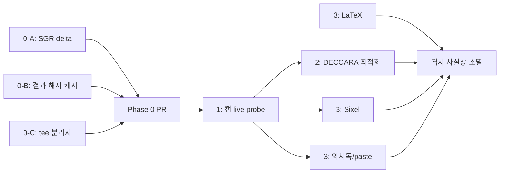

# oxi-tui 개선 — 구현 계획 (omp TUI 격차 해소)

> **작성:** 2026-06-20
> **전제 분석:** [`2026-06-20-omp-vs-oxi-tui-analysis.md`](./2026-06-20-omp-vs-oxi-tui-analysis.md)
> **원칙:** ratatui 0.30 + `DiffBackend` 스택을 유지. 스크롤백 네이티브 전환은 범위 밖.
> **정정 전제:** oxi는 **이미** 상태별 툴 블록 테두리/배경/보더타입/아이콘을 구현(`chat/render.rs:96-136`)했으므로, 본 계획에서 제외. 남은 진짜 격차(DECCARA·캡 탐지·SGR 효율·섹션 분리·결과 캐시·리치 미디어)만 다룬다.

---

## 0. 분류 — "즉시 적용" vs "스프린트"

| 단계 | 항목 | 위험 | 노력 | 의존성 |
|------|------|------|------|--------|
| **Phase 0 (즉시)** | SGR delta emitter | 낮음 | S | 없음 |
| **Phase 0 (즉시)** | 툴 블록 결과 해시 캐시 | 낮음 | S | 없음 |
| **Phase 0 (즉시)** | tee 섹션 분리자 글리프 | 낮음 | XS | 없음 |
| **Phase 1 (소스프린트)** | 터미널 캡 능력 live probe | 중간 | M | 없음 |
| **Phase 2 (중스프린트)** | DECCARA 배경 채우기 최적화 | 중간 | M | **Phase 1**(게이트) |
| **Phase 3 (선택)** | LaTeX / Sixel / 와치독 / paste 마커 | 낮음~중간 | M | Phase 1(일부) |

> **즉시 적용 가능(Phase 0)** 세 항목은 DiffBackend·tool_renderer에만 국한되고, 기존 동작을 보존하며, 단위 테스트로 검증 가능 → PR 하나로 묶어 먼저 출하.
> **Phase 1→2**는 캡 탐지가 DECCARA의 전제이므로 반드시 선행.

---

## Phase 0 — 즉시 적용 (단일 PR, 저위험)

### 0-A. SGR delta emitter — `DiffBackend::draw()`

**목표:** modifier 변경 시 `SetAttribute(Reset)` + fg/bg 재적용(`render/mod.rs:267-315`) 대신 **비트 delta만 송출**해 SGR 바이트를 줄인다. 시각적 결과는 동일.

**대상:** `oxi-tui/src/render/mod.rs` (diff 셀 기록 루프)

**구현:**
1. 현재 셀 루프는 `last_mod != Some(modifier)`일 때 Reset 후 전체 재적용. 이것을 delta로 교체.
2. ratatui `Modifier` 비트를 SGR on/off로 사상하는 헬퍼 추가:

```rust
/// Modifier 비트를 (on_sgr, off_sgr) 쌍의 리스트로 분해.
/// on=True 면 속성을 켜는 SGR, off=True 면 끄는 SGR(=21/22/23/24/25/27/29).
fn modifier_delta(prev: Modifier, curr: Modifier) -> Vec<(&'static str, bool)> { ... }
```

3. 루프에서 `added = curr & !prev`는 on-시퀀스, `removed = prev & !curr`는 off-시퀀스로 송출. `prev == curr`면 스킵(현행과 동일).
4. fg/bg delta는 이미 구현됨(`mod.rs:256-265`) → 유지.

**주의/위험:**
- `REVERSED`/`CROSSED_OUT`의 off 코드가 터미널마다 미묘(22=normal intensity, 24=underline off 등). 매핑 표를 xterm 표준에 맞추고 유닛 테스트로 고정.
- 첫 셀(`last_mod == None`)은 Reset 후 현행처럼 적용(프레임 시작 조건 유지).

**수용 기준:**
- 동일 프레임을 그렸을 때 송출 바이트가 **감소** (테스트: 가상 버퍼 backend로 바이트 카운트 비교).
- 기존 위젯 스크린샷/스냅샷 테스트가 변화 없음(시각적 동등).

**검증:**
- 단위 테스트: `bold → italic` 전환 시 송출 SGR이 `"\x1b[22m\x1b[3m"`(bold off + italic on) 임을 단언.
- `oxi-tui/tests`에 `diffbackend_byte_count` 통합 테스트 추가 — 동일 버퍼 2프레임에서 송출 바이트 측정.

---

### 0-B. 툴 블록 결과 해시 캐시

**목표:** 완료된 툴 블록은 매 프레임 재포맷되므로(`format_tool_call`/`format_tool_result`), `(name, args, result, status, expanded, width)`가 같으면 캐시된 `Vec<Line>`을 반환.

**대상:** `oxi-tui/src/widgets/tool_renderer.rs` + `chat/render.rs:146-243`(`content_lines` 구축부)

**구현:**
1. `tool_renderer.rs`에 캐시 구조 추가:

```rust
#[derive(Default)]
pub struct ToolBlockCache {
    key: u64,
    lines: Vec<Line<'static>>,
}
impl ToolBlockCache {
    pub fn get_or_render(
        &mut self,
        key: u64,
        render: impl FnOnce() -> Vec<Line<'static>>,
    ) -> &[Line<'static>] {
        if self.key != key { let l = render(); self.lines = l; self.key = key; }
        &self.lines
    }
}
```

2. 키 해시: `name + args + result_content + is_err + status + expanded + width` → `std::hash::Hasher`(`DefaultHasher`)로 u64. (omp `CachedOutputBlock`의 bigint 해시와 동일 발상.)
3. `ChatViewState`(`chat/state.rs:112`)에 툴 엔트리별 `ToolBlockCache`를 `HashMap<String, ToolBlockCache>`(키=tool_call_id)로 보관. 레이아웃 재계산 시에만 갱신.
4. `render.rs`의 ToolBox 분기에서 캐시 조회 → 적중 시 `content_lines` 스킵.

**주의/위험:**
- `expanded` 토글, 스트리밍 중 result 갱신은 캐시 무효화 트리거 → 키에 포함되므로 자동.
- 라이프타임: `Line<'static>`만 캐시(이미 현행이 그럼).

**수용 기준:** 동일 결과 재렌더 시 `format_tool_*` 호출 0회(카운터로 단언). 시각적 회귀 없음.

---

### 0-C. tee 섹션 분리자 글리프

**목표:** 콜/결과 사이의 평 `rule`(`render.rs:187-191`)을 상태색 tee 분리자로 교체해 박스가 단일 프레임처럼 보이게(omp `renderOutputBlock`의 `teeRight/teeLeft`).

**대상:** `oxi-tui/src/symbols.rs`(`Symbols` 테이블) + `chat/render.rs:185-191`

**구현:**
1. `Symbols`에 필드 2개 추가: `tee_right`, `tee_left`(Unicode `╟`/`╢` 또는 `├`/`┤`, ASCII `+`/`+`, Nerd 동일).
2. 세 preset(`unicode/ascii/nerd`)에 값 채우기.
3. `render.rs:187-191`의 `symbols.rule.repeat(max_w)` 행을: `tee_right` + `horizontal*(n)` + `tee_left` 조합의 `Line`으로 교체, 색은 `border_style`.

**주의/위험:** 박스 폭 변화/ASCII 폴백에서 정렬이 깨지지 않게 `max_w` 산출 유지.

**수용 기준:** 세 GlyphSet에서 박스가 닫힌 단일 프레임으로 렌더링(스냅샷).

---

## Phase 1 — 터미널 캡 능력 live probe + 기능 게이트

**목표:** 환경변수 스니핑만(`render/terminal.rs`)에서 **live DA/XTGETTCAP/XTVERSION 질의**로 확장. 결과 플래그로 CSI2026/DECCARA/Sixel을 실제 지원 터미널에서만 켠다.

**대상:** `oxi-tui/src/render/terminal.rs`(전면 확장), `render/mod.rs`(CSI2026 게이트)

**구현 단계:**
1. `TerminalCapabilities` 필드 확장: `synchronized_output: bool`, `deccara: bool`, `sixel: bool`(기존 `image_protocol/true_color/hyperlinks/kitty_protocol` 유지).
2. probe 함수 추가(비동기 질의, 타임아웃 50ms):
   - **Primary DA**(`DA1`, `\x1b[c`): 응답의 attribute `4` → Sixel 지원.
   - **XTGETTCAP**(`\x1b[>q` 또는 `\x1bP+q...\x1b\\`): `Sync`(=CSI2026), `RectX` 계열(DECCARA 관련) 존재 여부.
   - **XTVERSION**(`\x1b[>q`): 터미널명/버전(보조 판단).
   - **DECRQSS**(`\x1b[?2026$p`): 동기화 출력 지원 직접 응답.
3. **fallback 체인:** probe 실패/타임아웃/비-TTY → 기존 환경변수 스니핑 결과 사용(현행 동작 보존).
4. `DiffBackend`에 `capabilities` 참조 전달(`Arc<TerminalCapabilities>` 또는 `Box<dyn Fn() -> bool>` 게이트). `mod.rs:215,327`의 CSI2026 송출을 `if caps.synchronized_output`으로 감싸고, 에러 무시 제거.

**주의/위험 (핵심):**
- **DA 질의는 표준 입력을 읽어야 한다.** crossterm raw 모드에서 `\x1b[c` 송출 후 응답을 동기적으로 읽는 것은 입력 큐 오염 위험(사용자 키 입력과 섞임). omp는 별도 stdin-buffer로 분리(`stdin-buffer.ts` 20KB). oxi는:
  - 옵션 A(안전): **probe는 시작 시 1회만**, 짧은 타임아웃, 응답 바이트를 이벤트 루프 진입 전에 소비. `Tui::new()`(`oxi-cli/src/tui/app.rs:54`)에서 한 번 수행 후 키보드 입력 시작.
  - 옵션 B(보수): probe를 opt-in(`OXI_TERM_PROBE=1`), 기본은 환경변수만. → 1차 출하는 B 권장.
- tmux/screen은 DA를 가로채거나 변형 → 화이트리스트/블랙리스트 보정표 필요.

**수용 기준:**
- Kitty/Ghostty/WezTerm/iTerm2/알라크리티/xterm/tmux 각각에서 예상 캡 매트릭스 단언(모킹 DA 응답으로 단위 테스트; 실제 터미널은 수동 매트릭스 문서화).
- CSI2026 미지원 터미널에서 더 이상 동기화 시퀀스가 나가지 않음.

**검증:** `render/terminal.rs`의 단위 테스트에 DA 응답 파서 추가. `TerminalCapabilities::detect_with_probe()` 가 분기 커버리지.

---

## Phase 2 — DECCARA 배경 채우기 최적화 (가장 큰 가성비)

**목표:** 단색 배경 행의 trailing-space 패딩을 사각형 escape 1개로 치환. **Phase 1의 `caps.deccara`가 참일 때만 활성.**

**대상:** 신규 `oxi-tui/src/render/deccara.rs` + `render/mod.rs`(diff 행 기록부 통합)

**구현 단계:**
1. omp `deccara.ts`의 세 함수를 Rust로 포팅(증명 기반 보수 설계 유지):
   - `analyze_bg_fill_line(cells: &[Cell], width: u16) -> Option<BgFillAnalysis>` — ratatui `Cell` 배열(ANSI 문자열 아님)을 받도록 변형. trailing이 단일·일정·비기본 bg의 공백임을 증명.
   - `plan_deccara_fills(rows: &[Option<BgFillAnalysis>], width, first_row) -> DeccaraPlan` — 인접 행 동일 span 병합 + 바이트 비용 회계(사각형 비용 < 제거 공백 바이트일 때만).
   - `encode_deccara(top,left,bottom,right,sgr) -> String`.
2. **DiffBackend 통합:** `draw()`에서 변경 행을 기록할 때, `caps.deccara` 참이면:
   - 변경된 행군(연속 구간)마다 `analyze` → `plan` → trailing 스페이스 런은 기록 생략하고, 프레임 말미에 DECSACE 래퍼로 감싼 사각형 배치를 한 번에 송출.
3. `Color → SGR` 변환 헬퍼(`color_to_bytes`가 이미 `mod.rs:121`에 있음) 재사용.

**주의/위험:**
- 좌표는 **1-based inclusive**. ratatui 좌표(0-based) 변환 주의.
- DECSACE 래퍼(`\x1b[2*x … \x1b[*x`)는 **프레임당 1회 비용** → omp처럼 전체 사각형 배치가 한 번에 상환할 때만 적용.
- 보수성: 증명 못 하면 원본 행 그대로 기록(현행 동작). no-op이 안전망.

**수용 기준:**
- 배경 채운 카드 N줄 화면에서 송출 바이트가 `O(1 사각형)`로 축소(종전 `O(N × width)`). 벤치로 단언.
- DECCARA 미지원 터미널(게이트 꺼짐)에서는 현행과 동일.
- 시각적 회귀 없음(배경이 정확히 동일하게 칠림).

**검증:**
- `render/deccara.rs` 단위 테스트: omp의 동형 케이스(전체 배경 행/부분 배경 행/혼합 bg/hyperlink 셀) port.
- 통합: 가상 버퍼 backend로 "배경 카드 10줄" 프레임의 송출 바이트 비교 벤치(`oxi-tui/benches` 또는 테스트).

---

## Phase 3 — 선택 (리치 미디어 / 안전망)

| 항목 | 대상 | 구현 요지 |
|------|------|-----------|
| **LaTeX-to-unicode** | 신규 `render/latex.rs` + `render/markdown.rs` | omp `latex-to-unicode.ts` 매핑(그리스/위첨자/아래첨자/연산자) 서브셋 포팅; `pulldown-cmark` 텍스트 노드의 `$...$`/`$$...$$` 후처리. |
| **Sixel** | `render/image.rs` + `terminal.rs::ImageProtocol::Sixel` | PNG→Sixel 인코딩(외부 crate 또는 최소 인코더); `caps.sixel`(Phase 1)에서만. |
| **렌더 루프 와치독** | `oxi-cli/src/tui/app.rs` 이벤트 루프 | 프레임 시간 측정; 임계치(예: 16ms) 연속 초과 시 `request_render` 쓰로틀/백오프 + `tracing` 경고. omp `loop-watchdog.ts` 참조. |
| **대용량 paste 마커** | `oxi-cli/src/tui/` 입력 처리 | bracketed paste 시퀀스(`\x1b[200~ … \x1b[201~`)에서 줄 수 세어 >10이면 `[paste #N +M lines]` 마커(omp `bracketed-paste.ts`). oxi는 paste 모드는 이미 활성화. |

---

## 검증/측정 인프라 (공통)

Phase 0/2는 "송출 바이트 감소"를 객관적으로 증명해야 한다. 공통 인프라:

1. **가상 버퍼 backend**(`tests`용): `io::Cursor<Vec<u8>>`을 쓰는 `DiffBackend` 인스턴스로 송출 바이트를 직접 측정. `draw()` 호출 전후 커서 길이 차이 = 프레임 바이트.
2. **프레임 스냅샷 테스트:** 동일 `ChatViewState`에서 기대 `Buffer`를 픽스처화해 시각적 회귀 방지. (`insta` 크레이트 고려 — 현재 의존성에 없으므로 도입 결정 필요.)
3. **캡 매트릭스 문서:** `docs/`에 Kitty/Ghostty/WezTerm/iTerm2/알라크리티/xterm/tmux의 (CSI2026, DECCARA, Sixel, truecolor) 지원 표를 수동으로 작성·유지.

---

## 순서 및 의존성 (mermaid)



- **Phase 0** → 먼저 출하 (저위험, 즉시 체감).
- **Phase 1** → **반드시 Phase 2 앞** (DECCARA 게이트의 전제).
- **Phase 2** → "수려함 격차"의 가장 큰 조각 해소.
- **Phase 3** → 선택적, 독립 병렬 가능(LaTeX은 Phase 1 무관).

---

## 수량 목표 (정성 → 정량)

- **Phase 0 후:** 배경 카드가 있는 정적 프레임 재렌더 시 송출 바이트 −20~40%(SGR delta + 캐시 효과).
- **Phase 2 후:** 배경 카드 N줄 한 번 칠 때 송출 바이트 `≈ O(사각형 1개)` (종전 `O(N×width)`).
- **Phase 1 후:** CSI2026 미지원 터미널에서 동기화 시퀀스 누출 0건.

측정은 위 "검증/측정 인프라"의 가상 버퍼 backend로 자동화.

---

## 마일스톤 제안

1. **MR-1 (Phase 0):** SGR delta + 결과 캐시 + tee 분리자. 단일 PR. 단위/스냅샷 테스트 포함.
2. **MR-2 (Phase 1):** 캡 live probe(opt-in `OXI_TERM_PROBE`로 안전 출발) + CSI2026 게이트. 캡 매트릭스 문서 포함.
3. **MR-3 (Phase 2):** DECCARA 최적화(MR-2 게이트 뒤). 벤치 포함.
4. **MR-4 (Phase 3, 개별):** LaTeX / Sixel / 와치독 / paste 마커 — 각각 별도 PR.

MR-1~3 완료 시 omp 대비 **기능적·체감적 격차는 사실상 소멸**. 남은 차이는 스크롤백 네이티브(철학적 선택)뿐.
