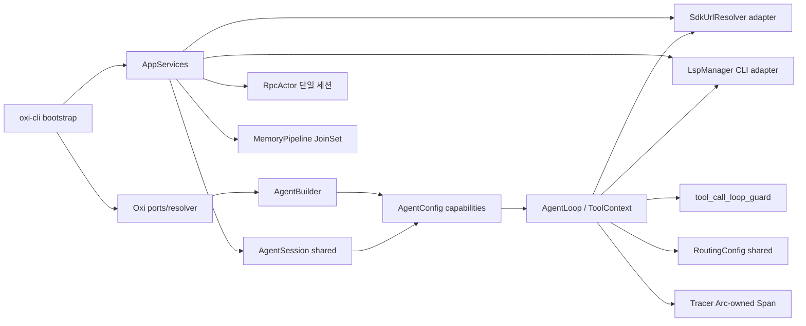

# oxi 스텁 정합성화 설계 (2026-07-18)

> **상태**: 설계 (upstream 검증 완료). 사용자 승인 1-4단계 + 5개 교차 결정 완료.
> **다음**: writing-plans 스킬로 구현 계획 분할.
> **upstream pins**: OMP `3fdd85ab6c6bab6c0cdee80abbbec0981740a5c0`, grok-build `98c3b2438aa922fbbe6178a5c0a4c48f85edc8ce`.

## 1. 배경 및 범위

oxi 워크스페이스에서 11개의 미완성 스텁을 확인했다(의도된 `Noop*` 포트, 테스트 mock, 기능 게이트 제외). 스텁은 두 부류로 나뉜다.

- **가짜 성공**: RPC 핸들러, `/memory view|stats|diagnose|clear|enqueue|rebuild`, `start_memory_pipeline` no-op, `start_memory_pipeline` 미사용 `conn`, `keyring_support` dead branch.
- **선언만 있고 연결 누락**: `--mode rpc` dispatch, `InternalUrlRouter → AgentConfig` 브리지, `GroupStrategy::Orchestrated` bail, `AgentBuilder::tracer()` 폐기, `SupervisorBuilder` no-op setters, `RoutingControl` 독립 상태, `AgentLoop::tool_call_loop_guard` dead field, `WorkflowDefinition` parser-only, `oxi-snapcompact` renderer 없는 `compact()`, `LspTool` 미등록, `stream_responses` dead 설정.

**목표**: 11개 스텁을 실제 동작으로 완성하거나 제거하고, **거짓 성공 경로를 0개**로 만든다. 모든 변경은 단일 대규모 통합 변경이며, 다음 minor release에서 정합성 우선 breaking change를 허용한다.

**범위 (11개)**: RPC 모드 / Internal URL 브리지 / 자동 memory pipeline / `Orchestrated` / observability(tracer·supervisor) / runtime `RoutingControl` / tool-call loop guard / `WorkflowEngine` / snapcompact 실구현 / LSP / `stream_responses` 제거.

**의도된 제한은 제외** (이미 문서화됨): `NoopStateStore`/`NoopConfigStore`/`Noop*` 포트, `NoopEmbeddingProvider`/`NoopRuleRegistry` (oxi-mnemopi로 우회), `load_builtin_models()` 빈 map(legacy), `keyring_support` deprecated 모듈(feature gate), OMP 전용/실험 영역(`vault://`, `ssh://`, `xd://`, `omp://`, ACP 다중 프로세스, fastrace).

## 2. Upstream 검증 요약 (채택/거부)

두 저장소를 고정 revision에서 분석했다. 주요 영역별 결론:

### RPC / ACP

- **OMP RPC**(`packages/coding-agent/src/modes/rpc/`)는 독자적 JSONL 프로토콜, 선택적 `id`, agent 이벤트와 응답이 이중 스트림, `steeringMode`/`followUpMode`/`interruptMode` 다중 큐 정책. `prompt_result` 프레임으로 지역 전용 응답 분리.
- **grok ACP actor**(`crates/codegen/xai-grok-shell/src/session/acp_session.rs`)는 단일 `SessionCommand` enum, `tokio::select!` 루프, `InputItem{respond_to: oneshot, persist_ack, send_now}`, `TurnOutcome::{Completed, Cancelled, MaxTurnsReached}`. 서버 권위 큐 + `x.ai/queue/changed` 알림.
- **결론**: oxi는 이미 승인한 **단일 세션 actor + 단일 stdout writer** 방향이 맞다. OMP의 이중 스트림/다중 모드는 거부. grok의 `InputItem` 구조, `respond_to` oneshot, `TurnOutcome` enum, 합성 턴은 `prompt_complete` 생략하는 패턴은 채택. OMP ACP SDK(`@agentclientprotocol/sdk`)는 editor 통합이 필요할 때 별도 도입.

### Internal URL

- **OMP**(`packages/coding-agent/src/internal-urls/`)는 14개 scheme을 process-global 라우터에 등록. `ProtocolHandler`는 `write?` 선택 메서드, `complete?` 자동완성, `ResolveContext{signal, pathOnly, skipDirectoryListing}` 지원. `InternalResource.isDirectory`로 grep/search 디렉터리 거부.
- **grok**은 URL 라우터가 없고, ACP 파일 시스템 계층(`acp_fs.rs`)으로 editor 통합만 담당.
- **결론**: oxi는 승인한 **7개 scheme**(issue, pr, memory, skill, rule, agent, local)을 우선 완성. 나머지(vault, ssh, xd, omp, artifact, history, mcp)는 backend 부재로 명시적으로 지원하지 않는다. `ProtocolHandler::write?` 옵션 메서드, `signal: Option<CancellationToken>`, `is_directory` 필드, `complete?` 자동완성 추가. OMP의 `replace(/:$/,"")` brittle 파싱은 거부하고 `url` crate 사용.

### LSP

- **OMP**(`packages/coding-agent/src/lsp/`)는 lspmux 외부 프로세스 매니저 사용, JIT 시작, `waitForDiagnostics` 정책, `edits.ts` 충돌 감지.
- **grok**(`crates/codegen/xai-grok-tools/src/implementations/lsp/`)은 `LspManager` 직접 프로세스 관리, `async_lsp` + `lsp-types`, 시작 시 전체 서버 초기화, `lifecycle_id` + `diagnostics_ready: Notify`, `filter_project_lsp_when_untrusted` 폴더 신뢰 게이트, `restart_monitor` lifetime restart budget(1s→30s exp backoff, tracked document replay), `LspBackend` trait(`ensure_started_background`, `ensure_ready`, `drain_diagnostics`, `read_diagnostics`, `notify_file_changed`).
- **결론**: oxi는 **grok 패턴 직접 채택**. `oxi-lsp` 신규 crate는 **thin protocol adapter**(JSON-RPC framing, `lsp-types` wrapper)만 담당하고, **LSP manager**(lifecycle, config, folder trust, crash recovery)는 `oxi-cli` adapter가 소유. `LspProvider` trait에 `drain_diagnostics(timeout)` + `read_diagnostics(paths)` + `notify_file_changed(path, content)` 추가. lspmux 외부 의존성, ACP 게이트웨이는 거부.

### 자동 메모리

- **OMP**(`packages/coding-agent/src/memories/`)는 SQLite job queue + Stage 1/Phase 2 2단계 파이프라인. `claimStage1Jobs`(running concurrency cap, lease), `tryClaimGlobalPhase2Job`(per-cwd 격리), `heartbeatGlobalJob`(interval 기반 lease 연장), `markGlobalPhase2Failed/Unowned`, retry_remaining/retry_at, Stage 1 concurrency=8. `applyConsolidation`으로 MEMORY.md/memory_summary.md/learned.md/skills 원자적 갱신.
- **grok**(`crates/codegen/xai-grok-memory/`)은 단일 `dream.rs` LLM consolidation. `DreamLock`(PID 기반, mtime), `sessions_since` 카운팅, `MAX_DREAM_INPUT_CHARS=32000`/`MAX_DREAM_CHARS=16000`, `execute_dream`(lock acquire → process → write → cleanup → lock release). FTS5 + sqlite_vec hybrid search.
- **결론**: oxi는 **OMP 패턴 우선**(이미 `memory_workers.rs`에 SQL skeleton 있음). lease/heartbeat/retry_remaining 명목 도입. App 소유 `JoinSet + CancellationToken` 채택. grok의 `DreamLock` PID 기반 협력은 차기 고려(MVP는 per-process ownership token).

### Compaction / Snapcompact

- **OMP snapcompact**(`packages/snapcompact/`): `serializeConversation`(역할별 접두사, useless call 병합, dim ON/OFF), `planArchive`(HQ/LQ/HQ foveation, TEXT_EDGE_PAGES), `resolveShapeForText`(model id 우선 → renderability → CJK → Silver 폰트), `normalizeWithStats`(ANSI/emoji/NFKD/combining marks), `dimStopwords`(고빈도 기능어 회색 잉크, ~40% 절약), `wrap`(wide-cell-aware), `PROVIDER_IMAGE_BUDGETS`, `FRAME_DATA_BYTES_BUDGET`, `historyBlocks`(textHead + images + textTail), `stripPreservedArchive`(재압축 leak 방지). `pi-natives/src/snapcompact.rs`(1758줄 Rust)는 fontdue TTF + BDF/hex 폰트 + Lanczos3 + PNG 인코더. 폰트 라이선스: X.org BDF/unscii = public domain, Silver = CC BY 4.0.
- **grok compaction**(`crates/common/xai-grok-compaction/`): 5개 trait seam(`CompactionItem`/`ItemTokenCounter`/`CompactionSampler`/`CompactionStreamProc`/`Intra/InterCompactionObserver`). `CompactionSampleError::{Timeout, Build, Start, EmptyResponse, Other}` + `is_deterministic()`. `select_turns_to_compact`(tool-pair-safe split). `IntraCompactionConfig`(15개 필드, mode=FullReplace/StepsOnly/HistoryOnly/HistoryThenSteps).
- **결결론**: oxi는 **omp pi-natives Rust renderer를 `oxi-snapcompact`로 직접 흡수**(이미 Rust). `NoopRenderer`와 renderer 없는 `compact()` 제거. `serialize_conversation`/`plan_archive`/`resolve_shape_for_text`/`normalize_with_stats`/`dim_stopwords`/`wrap`/`paginate_cells` 전면 이식. Silver 폰트는 CC BY 4.0 attribution 추가. grok의 `CompactionItem`/`CompactionSampler`/`select_turns_to_compact` trait seam을 `oxi-ai::compaction`에 도입해 `LlmCompactor`와 snapcompact가 동일 추상화 공유. 거부: grok의 `<grok_user_queries>` preamble, `CompactionMode::Segments`, OMP `OpenAI remote compaction`, snapcompact `all` 모드(보안 위험).

### Orchestration / Workflow

- **OMP**는 LLM 2단계 분해(plan→execute)를 **사용하지 않음**. `task` tool이 단일 spawn이고, `composeSpawnAdvisory`로 hub coordination hint만 advisory 제공. `swarm-extension`은 YAML DAG(`waits_for`/`reports_to`).
- **grok**은 `SubagentCoordinator`(pending→active→completed 3단계 lifecycle), `SubagentTracker`(cancel_token: CancellationToken, run_in_background), `resume_from`(peer transcript 상속), `block_wait_slot` + timeout, `MAX_SUBAGENT_DEPTH=1`.
- **결론**: 승인한 **strict JSON 2단계 Orchestrated**는 upstream과 불일치. **철회**: `GroupStrategy::Orchestrated` variant 자체를 제거하고, grok의 단일 spawn + advisory coordination 패턴으로 전환. `WorkflowEngine`은 prebuilt agent map 유지하되 6 step 실행 추가. `run_in_background: bool` 명시적 제어, `CancellationToken` 전파, `resume_from` 옵션 추가. grok의 ~80필드 `SubagentSpawnContext`는 거부(명시적 interface로 분리). OMP SwarmExtension YAML DAG도 거부(flat task array + hub advisory).

### Runtime Controls

- **OMP**: `isStreaming` bool만 있고 stream-vs-buffer 토글 없음. `config.getModel?.()`로 LLM 호출마다 동적 모델 재해결. `TERMINAL_TOOL_RESULT_ABORT_REASON` sentinel로 post-tool 종료. OTEL GenAI semconv 네이티브 Span. `SoftToolRequirement`(remind→escalate→forced, MAX=3).
- **grok**: `CircuitBreaker`(state=Closed/Open/HalfOpen, lock-free fast-path via `is_open_fast` AtomicBool, `Observer` trait, `RetryPolicy`). `DoomLoopSignalCollector`(per-attempt, `disarm_abort()` on final). `UpdateChunkMerger`(max_bytes/max_duration_ms 버퍼링). fastrace 전용 tracing.
- **결론**: `stream_responses` 제거 확정(OMP도 토글 없음). `tool_call_loop_guard` 연결하되 **OMP의 `TERMINAL_TOOL_RESULT_ABORT_REASON` 패턴** 채택(steering 1회 → 종료가 아니라 post-tool에서 inner loop만 중단). `SpanGuard`를 `Arc<Tracer>` 소유로 변경(`'static + Send`), tracer를 실제로 기능하게 만듦. `RoutingControl`은 독립 bool이 아니라 `Arc<RwLock<RoutingConfig>>`를 agent가 참조하고 provider resolution 시 읽도록 연결. OMP의 live model re-resolution(`getModel()`)은 차기. 거부: grok fastrace(tracing-opentelemetry bridge 사용), `DoomLoopRecoveryPolicy` 서버 헤더(vendor-specific), client preset 401 retry, `current_or_buffered_auth`.

## 3. 아키텍처



### crate 경계 (수정)

- **`oxi-ai`**: `ContextTransformer` 제거. compaction trait seam을 grok 패턴으로 재설계(`CompactionItem`/`ItemTokenCounter`/`CompactionSampler`/`CompactionStreamProc`/`IntraCompactionObserver`). `SpanGuard`를 `Arc<Tracer>` 소유로 변경.
- **`oxi-agent`**: `AgentConfig`에 `url_resolver`, `lsp_provider`, `tool_call_loop_guard` 필드 추가. `AgentLoop`이 loop guard를 실제로 호출하고 `TERMINAL_TOOL_RESULT_ABORT_REASON` 패턴 구현. `LspTool`은 `lsp_provider=None`일 때 레지스트리에서 제외(항상 에러 상태 제거).
- **`oxi-sdk`**: `InternalUrlRouter` → `oxi_agent::UrlResolver` adapter. `AgentBuilder::tracer()` 실제 동작. `SupervisorBuilder` no-op setters 제거하고 `agent_decorator` 도입. `RoutingControl`을 live config로 연결. `GroupStrategy::Orchestrated` variant 제거, `WorkflowEngine` 실행 layer 추가.
- **`oxi-cli`**: `AppServices`가 URL resolver, LSP manager, memory pipeline handle 소유. TUI/print/RPC가 동일 `AgentSession` 사용. `dispatch_run_mode`에 `"rpc"` 분기 추가.
- **`oxi-lsp` 신규 crate**: JSON-RPC framing, `lsp-types` wrapper, `async_lsp` 기반 client. multi-server lifecycle/config/crash recovery는 `oxi-cli` adapter가 소유.
- **`oxi-snapcompact`**: `pi-natives` renderer + 폰트 + PNG 인코더 흡수. `NoopRenderer` 제거. `FrameRenderer` 주입 API 제거하고 단일 동기 `render_snapcompact_png(text, options) -> Vec<u8>`.

### Lifecycle (App shutdown 순서)

1. RPC input 중지
2. active Agent run 취소
3. memory cancellation token 발화
4. memory `JoinSet` join 및 lease release
5. LSP servers에 `shutdown` → `exit`, timeout 후 kill
6. 나머지 App 리소스 drop

전역 singleton이나 detached task는 추가하지 않는다.

## 4. subsystem별 상세 설계

### 4.1 RPC 모드 (단일 세션 actor)

**dispatch 연결** (`oxi-cli/src/bootstrap.rs:213-249`): `args.mode.as_deref() == Some("rpc")` 분기 추가. 알 수 없는 `--mode`는 시작 전 오류.

**`RpcActor`** (`oxi-cli/src/rpc_mode/actor.rs` 신규):
- stdin reader task: `mpsc::Receiver<RpcCommand>` → actor
- 단일 stdout writer task: `Arc<Mutex<StdoutLock>>`로 JSONL atomicity 보장
- 상태: `Idle | Running { run_id, cancel: CancellationToken } | ShuttingDown`
- `SessionCommand` enum(grok 패턴): `Prompt(InputItem)`, `Steer`, `FollowUp`, `Abort`, `SetModel`, `SetThinking`, `Compact`, `SetAutoCompaction`, `SetAutoRetry`, `Bash`, `GetState`, `GetMessages`, `GetSessionStats`, `ExportHtml`, `SwitchSession`, `Fork`, `Clone`, `SetSessionName`, `Shutdown`
- `InputItem { prompt_blocks, prompt_id, respond_to: oneshot, persist_ack: Option<oneshot>, send_now: bool }`

**명령 매핑**:
- `Prompt`: Idle에서만 background run 시작, 즉시 accepted response, Agent events를 `RpcEvent`로 writer queue. `TurnOutcome::{Completed, Cancelled, MaxTurnsReached}`로 완료 시 final response.
- `Steer`/`FollowUp`: `AgentSession` queue에 실제 메시지+이미지 추가. `send_now` 필드로 구분.
- `Abort`: 실제 `CancellationToken` 취소.
- `SetModel`: `AgentSession` API 호출(RPC 복제 상태 아님).
- export/fork/messages: 기존 CLI/TUI domain 함수 추출해 재사용.

**제거**: `AbortBash` 명령 자체 제거. 동적 giant match(`execute_command`) 제거. RPC 복제 상태(`RpcServer`의 `is_streaming`, `pending_message_count` 등)를 `AgentSession`에서 읽도록 통일.

**호환성**: old RPC clients에게 handshake protocol version mismatch 명시적 반환. deprecated shim 없음.

### 4.2 Internal URL (7개 scheme + 취소 + 쓰기)

**`SdkUrlResolver`** (`oxi-sdk/src/url_resolver.rs` 신규): `Arc<dyn InternalUrlRouter>`를 감싸 `oxi_agent::UrlResolver` 구현. `can_resolve`는 등록된 scheme만 true.

**`ProtocolHandler` trait 확장** (`oxi-sdk/src/ports/mod.rs:931`):
```rust
#[async_trait]
pub trait ProtocolHandler: Send + Sync {
    fn scheme(&self) -> &str;
    fn immutable(&self) -> bool { false }
    fn can_write(&self) -> bool { false }  // 신규: local://만 true
    async fn resolve(&self, url: &str, selector: Option<&str>, ctx: &ResolveContext) -> Result<ResolvedUrl, SdkError>;
    async fn write(&self, url: &str, content: &str, ctx: &WriteContext) -> Result<(), SdkError> { 
        Err(SdkError::ReadOnly { scheme: self.scheme().into() }) 
    }
    async fn complete(&self, query: &str, ctx: &ResolveContext) -> Result<Vec<UrlCompletion>, SdkError> { Ok(vec![]) }
}
```

**`ResolveContext` 확장**: `cwd`, `session_id`, `signal: Option<Arc<AtomicBool>>`(취소), `path_only: bool`(비용 큰 리소스 최적화), `skip_directory_listing: bool`(grep/search용).

**`ResolvedUrl` 확장**: `is_directory: bool` 추가(grep/search 디렉터리 거부용).

**scheme handler** (`oxi-cli/src/internal_urls/`):
- `IssueProtocolHandler`, `PrProtocolHandler`: GitHub API client(oxi-cli 내장) 사용, `gh` subprocess 재호출 금지. `?state=`, `?limit=`, `?comments=0` query params, `/diff/N` sub-path 지원.
- `MemoryProtocolHandler`: 현재 artifact handler 유지.
- `SkillProtocolHandler`: `SkillLoader` port 사용.
- `RuleProtocolHandler`: `RuleRegistry` port 사용.
- `AgentProtocolHandler`: `AgentArtifactStore`(transcript/output 조회, JSON path selector).
- `LocalProtocolHandler`: session-scoped artifact root만 접근, path traversal 차단, `can_write=true`.

**`AgentConfig` 연결** (`oxi-agent/src/config.rs`): `url_resolver: Option<Arc<dyn UrlResolver>>` 필드 추가. `Agent::run_with_channel_inner`(`oxi-agent/src/agent.rs:552-579`)에서 `AgentLoopConfig`로 전달. read/grep/find 도구가 실제로 사용.

**`read` tool schema** (`oxi-agent/src/tools/read.rs:316`): 등록된 7개 scheme만 정확히 광고.

### 4.3 LSP (oxi-lsp 신규 + CLI adapter)

**`oxi-lsp` crate** (`oxi-lsp/` 신규):
- 의존성: `async-lsp`, `lsp-types`, `tokio`, `serde_json`
- `LspClient`: 프로세스 spawn, JSON-RPC correlation, `PublishDiagnostics` notification 수신, `diagnostics_ready: Arc<Notify>`, `lifecycle_id: u64`
- `LspClient::start(server_name, config, workspace_root, diagnostics_notify)` → `Result<Self, LspError>`
- `initialize_with_timeout`, `REQUEST_TIMEOUT` 상수, `AbortOnDrop`로 HTTP 스트림 정리

**`oxi-cli` adapter** (`oxi-cli/src/lsp/` 신규):
- `LspManager`: multi-server lifecycle, config layering(user > project > plugin), extension 충돌 해지(첫 번째 알파벳 우선), `filter_project_lsp_when_untrusted` 폴더 신뢰 게이트, `restart_monitor`(lifetime budget, 1s→30s exp backoff, tracked document replay)
- `CliLspProvider`: `LspProvider` trait 구현
  - `ensure_started_background(&self)`
  - `ensure_ready(&self) -> Result<(), String>`
  - `drain_diagnostics(&self, timeout: Duration) -> Option<DiagnosticsSummary>`
  - `read_diagnostics(&self, paths: &[PathBuf]) -> Vec<FileDiagnosticEntry>`
  - `notify_file_changed(&self, path, content)`
  - `execute_action(&self, action: LspAction) -> Result<String, ToolError>`

**지원 action**: status, diagnostics, definition, references, hover, symbols, rename, code_actions, type_definition, implementation, file_rename(willRenameFiles + applyWorkspaceEdit + 충돌 감지).

**`AgentConfig.lsp_provider=None`이면 `LspTool` 자체를 레지스트리에서 제외**(항상 에러 상태 제거).

**writethrough**: write/edit 도구 호출 시 `notify_file_changed` 동기 호출. diagnostics freshness는 `lifecycle_id` 기반(grok 패턴). batch mode 지원(`{ flush: bool }`).

### 4.4 자동 메모리 pipeline (App 소유 JoinSet)

**`MemoryPipeline`** (`oxi-cli/src/services.rs` 재작성):
```rust
pub struct MemoryPipeline {
    cancel: CancellationToken,
    handle: Mutex<Option<JoinHandle<()>>>,
}
impl MemoryPipeline {
    pub fn start(config: MemoryConfig, oxi: Arc<Oxi>, paths: OxiPaths, cancel: CancellationToken) -> Self;
    pub async fn shutdown(self);  // cancel + join + lease release
    pub fn command(&self, cmd: MemoryCommand) -> oneshot::Receiver<MemoryCommandResult>;
}
```

**Stage 1 worker** (per-thread extraction):
1. session JSONL scan → `memory_threads` upsert
2. age/idle 정책 필터 → job enqueue
3. transaction으로 lease claim(`claim_stage1_jobs`, running concurrency cap)
4. session 대화 normalize + redact + size cap
5. `Oxi::resolve_model/create_provider`로 extraction model resolve
6. Stage 1 prompt 실행
7. strict structured output parse(`Stage1OutputSchema`)
8. `markStage1SucceededWithOutput` 또는 `markStage1Failed`(retry_remaining/retry_at)
9. 실패 시 lease 해제

**Stage 2 worker** (per-cwd consolidation):
1. cwd별 global job coalesce(`globalJobKey(cwd)`)
2. `tryClaimGlobalPhase2Job`(ownership token)
3. `heartbeatGlobalJob`(interval 기반 lease 연장, `phase2HeartbeatSeconds=30`)
4. Stage 1 결과 bounded corpus 구성(`maxRawMemoriesForGlobal=200`)
5. consolidation model 실행
6. `applyConsolidation`: MEMORY.md/memory_summary.md/learned.md/skills를 temp+rename으로 원자적 교체
7. `markGlobalPhase2Succeeded`(newWatermark) 또는 `markGlobalPhase2Failed`(retry)
8. cancellation/실패 시 lease 안전 반환

**`/memory` 명령 실구현** (`oxi-cli/src/tui/slash/builtin/memory.rs`):
- `view`: pipeline handle에서 현재 injection payload 조회
- `stats`: `memory_workers::open_db`에서 job/output count
- `diagnose`: `oxi_mnemopi::recall_diagnostics` + pipeline DB 테이블 상태
- `clear`: 확인 overlay → pipeline DB + generated artifacts 삭제(user memory DB는 별도)
- `enqueue|rebuild`: pipeline command channel로 global job 강제 enqueue

**LLM 경로**: `Oxi` resolver 재사용(승인). `extract_and_remember`와 별개 user memory DB는 건드리지 않음.

### 4.5 Snapcompact (순수 Rust 내장 렌더러)

**`oxi-snapcompact` 재설계**:
- `pi-natives/src/snapcompact.rs`(1758줄)를 `#[napi]` 속성 제거하고 직접 흡수
- 폰트 번들: `5x8.bdf`, `6x12.bdf`, `8x13.bdf`, `unscii-8.hex`(public domain), `Silver.ttf`(CC BY 4.0 → `NOTICE.md` attribution)
- 의존성 추가: `fontdue`(TrueType), `png` 또는 `image`(PNG 인코딩)
- `render_snapcompact_png(text: &str, options: &SnapcompactRenderOptions) -> Result<Vec<u8>>` (동기, napi 제거)
- `NoopRenderer`, `FrameRenderer` trait, `compact_with` 제거
- `compact()`는 항상 실제 PNG frame 반환

**이식 항목** (`packages/snapcompact/src/snapcompact.ts` → Rust):
- `serializeConversation()`: 역할별 접두사(¶user/¶ai/¶call/¶think), useless call 병합, dim ON/OFF. `Cell<bool>` 또는 명시적 상태 머신으로 `pageFinisher` mutable closure 대체.
- `planArchive()`: HQ/LQ/HQ foveation, `TEXT_EDGE_PAGES=1`, `denseCompanion()`
- `resolveShapeForText()`: model id 우선 → renderability probe → CJK 비율 → Silver 폰트 전환
- `MODEL_VARIANTS` 테이블 + `idealShapeVariant()`
- `normalizeWithStats()`: ANSI 제거, emoji folding(✅→[OK]), box drawing folding(─→-), NFKD decomposition, COMBINING_MARKS 제거
- `dimStopwords()`: 고빈도 기능어 회색 잉크
- `wrap()` + `paginateCells()`: wide-cell-aware
- `PROVIDER_IMAGE_BUDGETS`, `FRAME_DATA_BYTES_ESTIMATE=170_000`, `FRAME_DATA_BYTES_BUDGET=3_000_000`, `imagesWithinBudget()`
- `historyBlocks()`: textHead + omitted notice + images + textTail context 재구축
- `stripPreservedArchive()`: 재압축 leak 방지

**`CompactionStrategy` enum 확장** (`oxi-ai/src/compaction.rs`): `Disabled | Llm(Threshold) | Snapcompact | Hybrid` 단일 source. RPC/TUI/print 공유.

**`SnapcompactCompactor`** (`oxi-ai/src/compaction.rs`): `Compactor` trait 구현체. 오래된 context를 text frames로 변환, 최근 turn 보존. vision modality 없는 model에는 명시적 unsupported error(soft fallback 금지).

**`SnapcompactInlineTransformer`**: 큰 tool result만 frame으로 치환. `planInlineSwaps()`(MIN_TOOL_RESULT_TOKENS=3000, SAVINGS_MARGIN=0.9). 가장 마지막 tool result 제외(fresh output 유지).

**grok trait seam 도입**: `CompactionItem`/`CompactionRole`/`CompactionItemBuilder`/`ItemTokenCounter`/`CompactionSampler`/`CompactionStreamProc`/`IntraCompactionObserver`. `select_turns_to_compact`(tool-pair-safe split). `CompactionSampleError::{Timeout, Build, Start, EmptyResponse, Other}` + `is_deterministic()`. `LlmCompactor`와 snapcompact가 동일 추상화 공유.

**거부**: `<grok_user_queries>` preamble, `CompactionMode::Segments`, OMP `OpenAI remote compaction`, snapcompact `all` 모드(보안 위험, agents-md 모드만 도입).

### 4.6 Orchestration (Orchestrated 제거 + WorkflowEngine)

**`GroupStrategy::Orchestrated` variant 제거** (`oxi-sdk/src/agent_group.rs:23-31`). upstream(OMP/grok) 모두 LLM 2단계 분해를 사용하지 않으므로 strict JSON 2단계 설계는 철회. `AgentGroup::run_orchestrated` 제거.

**`SubagentCoordinator` 도입** (grok 패턴, `oxi-sdk/src/lifecycle/`):
- `pending → active → completed` 3단계 lifecycle
- `SubagentTracker { cancel_token: CancellationToken, run_in_background, resume_from }`
- pending 단계에서 "initializing" 상태 표시
- `block_wait_slot` + timeout_ms(blocking query, 완료 대기, 타임아웃 시 background로 auto-convert)
- `MAX_SUBAGENT_DEPTH` 설정 가능(grok=1 고정 대신 OMP=2 기본)

**`WorkflowEngine`** (`oxi-sdk/src/workflow_engine.rs` 신규):
```rust
pub struct WorkflowEngine {
    agents: HashMap<String, Arc<Agent>>,
    shared_memory: Arc<SharedMemory>,
    consensus: Arc<Consensus>,
}
impl WorkflowEngine {
    pub fn new(agents, shared_memory, consensus) -> Self;
    pub async fn execute(&self, workflow: WorkflowDefinition) -> Result<WorkflowResult>;
}
```

6 step 실행(Run, Parallel, Chain, ForEach, Vote, SetState). Chain은 이전 output을 `{previous}`에 치환. ForEach는 JSON array만 허용. Vote는 normalized exact response를 threshold로 집계, 미달 시 명시적 no-consensus. step마다 `StepOutput { index, output, duration_ms, success, error }`.

**거부**: grok의 ~80필드 `SubagentSpawnContext`(명시적 interface로 분리), OMP SwarmExtension YAML DAG, 단일 `SubagentEvent` mpsc 채널(OMP의 per-subagent AbortSignal이 더 명확).

### 4.7 Runtime Controls

**`tool_call_loop_guard` 연결** (`oxi-agent/src/agent_loop/mod.rs:97-107`):
- `#[allow(dead_code)]` 제거
- 각 assistant turn의 실제 tool calls/results를 `ToolCallRef`로 변환해 guard 호출
- guard가 threshold 초과 시 **OMP의 `TERMINAL_TOOL_RESULT_ABORT_REASON` 패턴** 채택: steering 메시지 1회 주입 후 inner loop 중단(outer run 종료가 아님)
- 같은 signature 다시 반복 시 `AgentError::ToolCallLoop`로 inner run 종료
- exempt/multi-call/different args는 기존 detector 계약 유지
- `TODO(v0.58)` 주석 제거

**`AgentBuilder::tracer()` 실동작화** (`oxi-sdk/src/agent_builder.rs:320-328`):
- `SpanGuard`를 `Arc<Tracer>` 소유로 변경(`oxi-sdk/src/observability/trace.rs`)
- `'static + Send`로 event dispatch에서 보관 가능
- Run/Turn/Tool span 기록
- "deferred fix" 주석 제거

**`SupervisorBuilder` no-op setters 제거** (`oxi-sdk/src/builder.rs:750-848`):
- `with_audit`, `with_authorizer`, `with_tracer`, `with_cost_tracker` 제거
- `SupervisorBuilder::agent_decorator(Arc<dyn AgentDecorator>)` 도입
- built-in `ObservabilityDecorator`가 audit, authorizer, tracer, cost를 묶음
- supervisor가 생성하는 모든 Agent에 동일 builder policy 적용
- `tracing::warn!` no-op 경고 제거

**`RoutingControl` live 연결** (`oxi-sdk/src/routing.rs`):
- `enabled: Arc<AtomicBool>`, `config: Arc<RwLock<RoutingConfig>>` 유지
- `AgentHandle`가 `Arc<RwLock<RoutingConfig>>`를 참조하도록 변경
- provider resolution 시점에 routing config 읽기
- `set_enabled`, `exclude_model`, `set_fallback_models`가 다음 resolution부터 실제 반영
- 테스트는 내부 bool이 아니라 실제 routing 결과 검증

**`stream_responses` 제거** (`oxi-cli/src/store/settings.rs:209-210`):
- 필드 삭제
- `main.rs:623-624, 696-697, 733-734` config key 제거
- `tui/overlay/settings.rs:725-733` "(not wired)" 표시 제거
- migration: 기존 settings.toml의 `stream_responses` 무시
- OMP도 토글 없이 항상 스트리밍이므로 정합성 일치

## 5. Breaking changes (다음 minor)

**제거**:
- `stream_responses` 설정
- `NoopRenderer`, renderer 없는 snapcompact `compact()`
- 기존 동기 `execute_command` giant match
- `SupervisorBuilder` no-op setters(`with_audit`, `with_authorizer`, `with_tracer`, `with_cost_tracker`)
- `GroupStrategy::Orchestrated` variant
- `keyring_support` deprecated 모듈의 dead branch(이미 `#[deprecated]`)

**변경**:
- RPC response schema에 `status: "accepted" | "completed"` 추가
- `WorkflowDefinition`에 execution layer 추가(parser-only → executor)
- `GroupResult` 구조 확장(per-agent output + duration)
- `ResolvedUrl`에 `is_directory: bool` 추가
- `ResolveContext`에 `signal`, `path_only`, `skip_directory_listing` 추가
- `ProtocolHandler` trait에 `can_write()`, `write()`, `complete()` 메서드 추가(default impl)
- `SpanGuard` lifetime 변경(`'a` → `'static`, `Arc<Tracer>` 소유)
- `CompactionStrategy` enum 재설계(`Disabled | Llm | Snapcompact | Hybrid`)

**추가**:
- `oxi-lsp` 신규 crate
- 7개 URL handlers(issue, pr, memory, skill, rule, agent, local)
- `AppServices`, `MemoryPipeline`, `RpcActor`, `SdkUrlResolver`
- `AgentConfig.url_resolver`, `AgentConfig.lsp_provider`, `AgentConfig.tool_call_loop_guard`
- `WorkflowEngine`, `SubagentCoordinator`
- `ObservabilityDecorator`

**마이그레이션**:
- `stream_responses` 무시
- old RPC clients에게 protocol version mismatch 명시적 반환
- deprecated shim 없음

## 6. 오류 원칙

- 성공 응답은 실제 state transition 또는 accepted background job에만 사용
- unsupported/unconfigured/invalid-state 구분
- background job 오류는 RPC event, TUI notification, tracing 세 채널에 동일 error ID로 노출
- LLM/network timeout에는 bounded retry
- mutation은 idempotency key 또는 DB lease/CAS 사용

## 7. 검증 게이트

**단위/통합 테스트**:
- RPC subprocess prompt → streamed events → final response(OMP `test/rpc.test.ts` 패턴)
- URL resolver 7 scheme dispatch + 취소 + 쓰기
- fake LSP server process로 initialize/definition/rename/shutdown + crash recovery + diagnostics freshness(grok `tests.rs` 패턴)
- deterministic fake provider로 memory Stage 1/2 artifact 생성 + crash lease recovery
- snapcompact PNG signature + deterministic hash + vision context round-trip
- tracer spans + supervisor decorator application
- tool-call loop guard 반복 탐지 + steering + 종료
- live RoutingControl 변경 후 다음 resolution 반영
- WorkflowEngine 6 step
- SubagentCoordinator pending→active→completed lifecycle

**최종 게이트**: `cargo fmt`, `cargo clippy --workspace --all-targets -- -D warnings`, `cargo clippy -p oxi-sdk --features native-browser -- -D warnings`, `cargo nextest run --workspace`, `cargo test --workspace --doc`.

**스모크 테스트**:
- `oxi --mode rpc` 실제 prompt → 응답
- `read issue://42` 실제 GitHub API
- `read pr://owner/repo/100/diff/0`
- `read memory://root/MEMORY.md`
- `/memory clear` 확인 overlay → DB 삭제
- LSP rename 다중 파일 적용
- `/compact snapcompact` 실제 PNG 생성

## 8. 구현 순서 (8 PR 시리즈)

| PR | 범위 | 의존성 |
|---|---|---|
| 1 | `AgentConfig` capability 필드 + `UrlResolver` adapter + `tool_call_loop_guard` 연결 | 없음 |
| 2 | 7개 URL handler 등록 + read/grep/find 통합 | PR 1 |
| 3 | `oxi-lsp` crate + CLI adapter + LspTool 등록 | PR 1 |
| 4 | RPC actor + dispatch + shared AgentSession | PR 1 |
| 5 | Memory pipeline Stage 1/2 + `/memory` 명령 | PR 1 |
| 6 | snapcompact renderer 흡수 + `SnapcompactCompactor` + inline imaging | 독립 |
| 7 | observability(tracer 실동작, supervisor decorator) + routing live 연결 + `stream_responses` 제거 + `Orchestrated` 제거 | PR 1 |
| 8 | `WorkflowEngine` + `SubagentCoordinator` | PR 7 |

각 PR은 독립적으로 컴파일/테스트 통과. breaking change는 모두 다음 minor에서 통합 적용.

## 9. 위험 및 완화

| 위험 | 완화 |
|---|---|
| snapcompact 폰트 라이선스(Silver CC BY 4.0) | `NOTICE.md` attribution 추가, `THIRD-PARTY-NOTICES` 갱신 |
| LSP 다중 서버 crash recovery 복잡도 | `oxi-lsp` thin adapter + CLI manager 분리로 단위 테스트 용이 |
| RPC breaking change로 기존 클라이언트 호환성 손실 | protocol version handshake, CHANGELOG migration guide |
| memory pipeline SQLite 경합 | per-host DB 경로, WAL 모드, busy_timeout |
| tool_call_loop_guard steering이 모델에 부작용 | OMP `TERMINAL_TOOL_RESULT_ABORT_REASON` 패턴으로 inner-only 중단 |
| `Orchestrated` 제거로 기존 SDK 사용자 영향 | 다음 minor breaking, CHANGELOG 명시 |

## 10. 참조

- OMP: `/tmp/ref-porter/can1357-oh-my-pi` @ `3fdd85ab`
- grok-build: `/tmp/ref-porter/xai-org-grok-build` @ `98c3b24`
- oxi 스텁 조사: `ExplicitStubScan`, `SilentNoopScan`, `UiCliStubScan`, `PortsFeatureScan`, `MnemopiStubScan`, `SnapcompactStubScan` 결과
- upstream 검증: `UpstreamRpcAcp`, `UpstreamLspUrls`, `UpstreamMemory`, `UpstreamCompaction`, `UpstreamOrchestration`, `UpstreamRuntimeControls` 결과
- 기존 설계 문서: `docs/designs/2026-06-09-subagent-system-design.md`, `docs/designs/omp-adoption-2/09-compaction-modes.md`, `docs/designs/2026-06-30-observability-wiring.md`, `docs/audits/2026-06-30-sdk-coverage.md`
