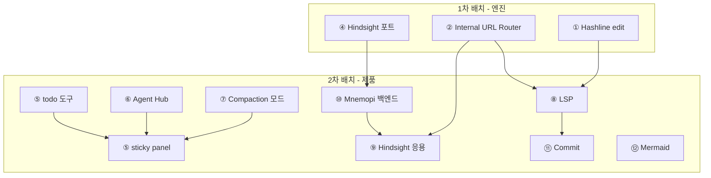

# 마스터 설계: omp 기능 도입 2차 배치 — 9개 기능

> 상태: 마스터 **v2** (코드 검증 기반 개정 — [`00-design-revisions.md`](./00-design-revisions.md) 참조)
> 작성: 2026-06-19 (v1), 2026-06-19 개정 (v2)
> 선행: [`omp-adoption/00-master-plan.md`](../omp-adoption/00-master-plan.md) (1차 배치: ①②③④)
> 분석 대상: omp v16.1.1 (`/tmp/oh-my-pi`) · oxi 현재 아키텍처 (**실제 코드 검증 완료**)
> 후속: 하위 설계 문서 9종 + [`00-design-revisions.md`](./00-design-revisions.md) (코드 검증 수정) + CHANGELOG.md
>
> **⚠️ v2 개정**: v1의 코드 스니펫 중 `ToolContext` 확장, `ToolError` 변형, `oxi_ai::high_level::complete` 시그니처가 실제 코드와 불일치했음. [`00-design-revisions.md`](./00-design-revisions.md)에서 수정된 패턴을 정의. 각 하위 문서의 코드 스니펫과 충돌 시 개정 문서가 우선.

이 문서는 **"무엇을 왜 도입하는가"**와 **"어떤 순서로, 어떤 의존성으로 도입하는가"**를 정의한다. **"어떻게 구현하는가"**는 각 하위 설계 문서가 담당한다.

---

## 0. 핵심 결정 (TL;DR)

1차 배치(Hashline, Internal URL, TTSR, Hindsight)가 **엔진/코어 계층**에 집중했다면, 2차 배치는 **사용자 가시성과 제품 완성도**에 집중한다. omp 분석에서 확인된 "oxi가 코딩 에이전트로서 가장 크게 부족한 9개 영역"을 다룬다.

### 도입 9종 (사용자 가시성 등급순)

| # | 기능 | 등급 | 상세 문서 | 리팩토링 |
|:-:|---|:-:|---|:-:|
| ⑤ | **todo 도구 + sticky panel** | 🟢 핵심 | [`05-todo-tool.md`](./05-todo-tool.md) · [`06-todo-sticky-panel.md`](./06-todo-sticky-panel.md) | **중** (TUI 입력창 위 패널) |
| ⑥ | **Agent Hub/Registry** | 🟢 핵심 | [`07-agent-hub-registry.md`](./07-agent-hub-registry.md) | **중** (oxi-sdk lifecycle 위에 TUI) |
| ⑦ | **Compaction 다중 모드** | 🟡 | [`09-compaction-modes.md`](./09-compaction-modes.md) | 소 (기존 `compaction.rs` 확장) |
| ⑧ | **LSP 통합** | 🟡 | [`10-lsp-integration.md`](./10-lsp-integration.md) | **대** (신규 서브시스템) |
| ⑨ | **Hindsight 메모리 (응용)** | 🟡 | [`12-hindsight-memory.md`](./12-hindsight-memory.md) | 소 (1차 ④ 확장) |
| ⑩ | **Mnemopi 백엔드** | 🟡 | [`11-mnemopi-backend.md`](./11-mnemopi-backend.md) | 소 (SQLite 스토어) |
| ⑪ | **Commit 도구** | 🟠 | [`08-commit-tool.md`](./08-commit-tool.md) | 중 (git + LLM) |
| ⑫ | **Mermaid 렌더링** | 🟢 저비용 | [`13-mermaid-rendering.md`](./13-mermaid-rendering.md) | 소 (마크다운 렌더 확장) |

### 1차 배치와의 관계

| 1차 (엔진) | 2차 (제품) | 관계 |
|---|---|---|
| ④ Hindsight 메모리 (포트 충전) | ⑨ Hindsight 응용 (⑩ Mnemopi 위) | 1차가 스토리지 포트, 2차가 응용 계층 + mental-models |
| ② Internal URL Router | ⑦ Compaction, ⑧ LSP | URL 라우터가 `lsp://` `memory://` 스킴 확장 기반 |
| ① Hashline edit | ⑧ LSP (willRenameFiles) | LSP rename이 Hashline snapshot과 연동 |

> **1차 ④ Hindsight 문서**(`omp-adoption/04-hindsight-memory.md`)는 포트 + SQLite 스키마 설계까지만 다뤘다. 2차 ⑨⑩은 이를 **응용 계층(retain/recall/reflect 도구, mental-models, boot inject)과 백엔드 분리(MCP 서버, 마이그레이션)**로 세분화하여 확장한다.

### 1차 "영구 제외" 목록 정정 (v2)

1차 마스터 플랜이 LSP/Commit을 "영구 제외 (oxi 포지셔닝 충돌)"로 분류했다. 2차는 이를 **feature 게이트 + 독립 크레이트 격리**로 양립시킨다:

| 기능 | 1차 판정 | 2차 정정 | 근거 |
|---|---|---|---|
| LSP | 영구 제외 | **도입** (feature gate) | 독립 `oxi-lsp` 크레이트, `--features lsp` 미활성화 시 바이너리 영향 0. 코딩 에이전트 핵심 (rename 안전성) |
| Commit | 영구 제외 | **도입** (opt-in 도구) | `disabled_tools` + `commit_tool_enabled: false` 기본. LLM 비용이지만 사용자가 통제 |
| DAP | 영구 제외 | **유지** (후순위) | LSP 안정화 후 별도 검토 |
| eval 커널 | 영구 제외 | **유지** | 런타임 의존. oxios 제품 |
| ACP | 영구 제외 | **유지** | 에디터 결합. 별도 제품 |

> 상세 근거: [`00-design-revisions.md`](./00-design-revisions.md) §5

---

## 1. 배경: 왜 2차 배치가 필요한가

### 1.1 1차 배치의 한계

1차(①②③④)는 **"에이전트가 더 정확하게 일하게"** 만드는 엔진 개선이었다. 하지만 omp 분석에서 드러난 가장 큰 격차는 **"에이전트가 뭘 하고 있는지 사용자가 볼 수 없고, 에이전트가 IDE가 아는 것을 모른다"**는 제품 관측성 부재다.

### 1.2 2차 배치가 해결하는 3가지 갭

| 갭 | 증상 | 해결 기능 |
|---|---|---|
| **G1: 진행 가시성 부재** | 에이전트가 다단계 작업을 할 때 사용자가 "지금 어디쯤인지" 알 수 없음 | ⑤ todo + sticky panel |
| **G2: 서브에이전트 블랙박스** | `task`로 서브에이전트를 띄워도 진행 상태·출력·비용이 안 보임 | ⑥ Agent Hub/Registry |
| **G3: IDE 지식 단절** | 에이전트가 LSP가 아는 심볼/참조/진단을 모름 → rename이 깨짐 | ⑧ LSP 통합 |
| **G4: 컨텍스트 비효율** | 큰 tool result가 컨텍스트를 잠식 → 비용 증가 | ⑦ Compaction 다중 모드 (snapcompact) |
| **G5: 메모리 표면화** | 세션 간 학습이 포트만 있고 응용 도구/UX가 없음 | ⑨⑩ Hindsight + Mnemopi |
| **G6: 커밋 워크플로우 부재** | 에이전트가 변경을 atomic 단위로 분할해 커밋 못 함 | ⑪ Commit 도구 |
| **G7: 다이어그램 불가** | 에이전트가 구조 설명을 텍스트로만 전달 | ⑫ Mermaid 렌더링 |

### 1.3 oxi가 이미 갖춘 기반 (도입을 싸게 만드는 자산)

| omp 기능 | oxi 기존 자산 | 도입 비용 절감 |
|---|---|---|
| Agent Hub | `oxi-sdk/src/lifecycle/` (`Supervisor`, `AgentPool`, `AgentHandle`) + `AgentGroup` | 라이프사이클 인프라 재사용, TUI 레이어만 추가 |
| Hindsight 응용 | 1차 ④의 `MemoryStore` 포트 + `SqliteMemoryStore` 설계 | 백엔드 이미 설계됨 |
| Compaction | `oxi-ai/src/compaction.rs` (1,288줄, `Compactor` trait, `LlmCompactor`) | trait 확장으로 snapcompact 구현체 추가 |
| Mermaid | `oxi-tui/src/widgets/chat/markdown.rs` (fenced code block 감지 + 하이라이트) | 블록 감지 인프라 재사용 |
| todo | `oxi-sdk`의 `AgentGroup` (phase 개념과 유사) + `MessageBus` | phase 모델 참고 |

---

## 2. 도입 원칙 (1차 원칙 계승)

1차 배치의 5원칙을 그대로 계승한다 (`omp-adoption/00-master-plan.md` §2 참조). 2차에서 추가로 강조하는 원칙:

### 원칙 6 — TUI 변경은 격리 가능해야 한다

todo sticky panel, Agent Hub, Mermaid 렌더는 모두 **기능 플래그** 뒤에 둔다. 비활성화 시 기존 TUI 렌더 경로 100% 보존.

```rust
pub struct Settings {
    pub todo_panel_enabled: bool,       // 기본 true (낮은 비용, 높은 가치)
    pub agent_hub_enabled: bool,        // 기본 true
    pub mermaid_render_enabled: bool,   // 기본 true
    pub lsp_enabled: bool,              // 기본 false (무거운 의존)
    pub commit_tool_enabled: bool,      // 기본 false (LLM 비용)
}
```

### 원칙 7 — LSP는 독립 크레이트로 격리

LSP 클라이언트(`tower-lsp` 또는 자체)와 tree-sitter 의존은 `oxi-lsp` 독립 크레이트에 격리한다. `oxi-agent`가 기본 의존하지 않고, `oxi-cli`가 feature 게이트로 끌어온다. 미활성화 시 바이너리 크기 영향 최소.

### 원칙 8 — omp의 시각적 디테일을 충실히 이식

todo 패널의 스트라이크루 애니메이션, Agent Hub의 상태 배지 색상, snapcompact의 프레임 형상 등 — omp가 검증한 시각적 디테일은 사용자 경험의 핵심이므로 충실히 이식한다. "기능만 되면 된다"가 아니라 "omp처럼 보여야 한다".

---

## 3. 의존성 그래프 & 도입 순서



### 순서와 병렬성

| 단계 | 작업 | 선행 | 병렬? |
|:-:|---|---|:-:|
| **N1** | ⑤ todo 도구 + sticky panel | — | 기반 (가장 높은 가치) |
| **N1** | ⑫ Mermaid 렌더링 | — | **N1-⑤와 병렬** (독립) |
| **N2** | ⑦ Compaction 다중 모드 | — | N1과 병렬 |
| **N2** | ⑥ Agent Hub/Registry | `oxi-sdk` lifecycle | N1과 병렬 |
| **N3** | ⑩ Mnemopi 백엔드 | 1차 ④ 포트 | N2와 병렬 |
| **N3** | ⑨ Hindsight 응용 | ⑩ Mnemopi | N3 순차 |
| **N4** | ⑧ LSP 통합 | 1차 ② URL Router (lsp:// 스킴) | 독립 |
| **N4** | ⑪ Commit 도구 | ⑧ LSP (선택) | N4 이후 권장 |

> **병렬 설계/구현**: ⑤⑫⑦⑥는 서로 파일 충돌 없이 병렬 진행 가능. ⑩⑨는 순차. ⑧⑪은 LSP→Commit 의존.

### 가치 등급 vs 구현 순서 (분리)

- **가치 등급**: ⑤(🟢) > ⑥(🟢) > ⑫(🟢 저비용) > ⑦⑧⑨⑩(🟡) > ⑪(🟠)
- **구현 순서**: N1 ⑤⑫ → N2 ⑦⑥ → N3 ⑩⑨ → N4 ⑧⑪

---

## 4. 크레이트/포트/도구 구조 변화

### 4.1 신규 크레이트: `oxi-lsp`

omp의 `lsp/` 서브시스템(2,480줄)과 대응. 독립 라이브러리 크레이트로 분리하는 이유:
1. LSP 클라이언트(`lsp-server` + `lsp-types`) 의존이 무거움 — 기본 빌드에 포함시키지 않음.
2. tree-sitter 문법 의존(선택적 하이라이트)을 feature 뒤에 격리.
3. 임베더가 LSP 없이 oxi를 사용할 때 바이너리 크기 최소화.

```
oxi-lsp/  (feature-gated, oxi-cli가 --features lsp로 활성화)
├── client.rs       LSP 클라이언트 (lsp-server 래핑)
├── manager.rs      다중 서버 관리 (lspmux)
├── operations.rs   14개 오퍼레이션
├── diagnostics.rs  진단 누적/갱신
├── rename.rs       workspace/willRenameFiles
└── render.rs       결과 → ToolResult 변환
```

### 4.2 기존 크레이트에 미치는 영향

| 크레이트 | 변경 | 비고 |
|---|---|---|
| **oxi-lsp** (신규) | 전체 | omp `lsp/` 포팅 |
| oxi-agent | todo 도구, commit 도구, memory_*도구(⑨), lsp 도구(⑧ 브릿지만) | additive |
| oxi-tui | sticky panel 위젯, agent hub 오버레이, mermaid 렌더, compaction 카드 | 위젯 추가 |
| oxi-cli | agent registry TUI 통합, commit CLI, lsp 활성화, snapcompact | 제품 레이어 |
| oxi-sdk | (1차에서 이미 포트 추가됨) AgentHandle에 TUI 상태 필드 추가 | additive |

### 4.3 포트/도구 카운트 변화

```
oxi-sdk ports:   13–14 (1차) → 14–15  (+LspManager 포트 후보, 기존 MemoryStore는 1차)
oxi-agent tools: 19 (1차) → 24–25    (+todo, +commit, +memory_* 4개는 1차④에서 이미 설계,
                                        +lsp 1개)
oxi-tui widgets: 현재 → +3            (TodoPanel, AgentHubOverlay, MermaidBlock)
```

---

## 5. 리팩토링 허용 범위

### 5.1 sticky panel 도입에 필수 (N1)

- **`oxi-tui/src/widgets/`**: 신규 `todo_panel.rs` 위젯. `ChatView` 레이아웃에 패널 슬롯 추가.
- **`oxi-cli/src/tui/app.rs`**: `AppState`에 `todo_phases: Vec<TodoPhase>` 필드 + 렌더 훅.
- **`oxi-agent/src/agent_loop/`**: `AgentEvent::TodoUpdate` 이벤트 추가 (에이전트 → TUI 통신).

### 5.2 Agent Hub 도입에 필수 (N2)

- **`oxi-cli/src/tui/overlay/`**: 신규 `agent_hub.rs` 오버레이 (기존 20개 → 21개).
- **`oxi-sdk/src/lifecycle/supervisor.rs`**: `AgentHandle`에 `display_name`, `last_activity`, `unread_count` 필드 추가.
- **`oxi-agent/src/tools/subagent.rs`**: 서브에이전트 생성 시 registry 등록 훅.

### 5.3 LSP 도입에 필수 (N4)

- **신규 `oxi-lsp` 크레이트**: 전체.
- **`oxi-agent/src/tools/`**: `lsp.rs` 도구 (oxi-lsp 브릿지).
- **`Cargo.toml` (workspace)**: `oxi-lsp` 멤버 추가, `lsp` feature.

### 5.4 하위 호환성 보장 전략

각 기능은 **기능 플래그** 뒤에:
- `Settings::todo_panel_enabled: bool` (기본 true)
- `Settings::agent_hub_enabled: bool` (기본 true)
- `Settings::lsp_enabled: bool` (기본 false — 무거움)
- `Settings::mermaid_render_enabled: bool` (기본 true)
- `Settings::commit_tool_enabled: bool` (기본 false — LLM 비용)
- `Settings::snapcompact_enabled: bool` (기본 false — 실험적)

> **CI 게이트**: 각 단계마다 `cargo nextest run --workspace` + `cargo clippy --workspace --all-targets -- -D warnings` + `cargo clippy -p oxi-sdk --features native-browser -- -D warnings` 통과 필수. LSP 추가 시 `cargo clippy -p oxi-cli --features lsp -- -D warnings` 추가.

---

## 6. 각 하위 설계 문서 인덱스

| 문서 | 등급 | 핵심 질문 | omp 소스 맵 |
|---|:-:|---|---|
| [`05-todo-tool.md`](./05-todo-tool.md) | 🟢 | omp의 phased todo 도구를 어떻게 oxi-agent에 이식할 것인가? | `tools/todo.ts` (938줄) |
| [`06-todo-sticky-panel.md`](./06-todo-sticky-panel.md) | 🟢 | 입력창 위 상주 패널 + 자동 매칭 + 스트라이크루 애니메이션을 어떻게 구현할 것인가? | `modes/interactive-mode.ts` 1,375–1,567 |
| [`07-agent-hub-registry.md`](./07-agent-hub-registry.md) | 🟢 | oxi-sdk lifecycle 위에 라이브 모니터링 + 트랜스크립트 뷰어를 어떻게 구축할 것인가? | `modes/components/agent-hub.ts` (566) + `agent-transcript-viewer.ts` (461) |
| [`08-commit-tool.md`](./08-commit-tool.md) | 🟠 | atomic split + 위상정렬 + conventional 커밋을 어떻게 Rust로 이식할 것인가? | `commit/` (3,000줄+) |
| [`09-compaction-modes.md`](./09-compaction-modes.md) | 🟡 | snapcompact 비트맵 아카이빙 + inline imaging을 기존 Compactor trait에 어떻게 통합할 것인가? | `snapcompact/` (1,554) + `session/snapcompact-inline.ts` (542) |
| [`10-lsp-integration.md`](./10-lsp-integration.md) | 🟡 | 14개 LSP 오퍼레이션 + willRenameFiles를 oxi-lsp 독립 크레이트로 어떻게 구현할 것인가? | `lsp/` (7,500줄) |
| [`11-mnemopi-backend.md`](./11-mnemopi-backend.md) | 🟡 | SQLite 메모리 백엔드 + 마이그레이션 + MCP 서버를 어떻게 Rust로 이식할 것인가? | `packages/mnemopi/` |
| [`12-hindsight-memory.md`](./12-hindsight-memory.md) | 🟡 | retain/recall/reflect + mental-models + boot inject를 1차 ④ 위에 어떻게 확장할 것인가? | `hindsight/` (2,000줄+) |
| [`13-mermaid-rendering.md`](./13-mermaid-rendering.md) | 🟢 | 터미널 Mermaid ASCII/Unicode 렌더링을 어떻게 구현할 것인가? | `modes/theme/mermaid-cache.ts` + `pi-utils` |

---

## 7. 위험 & 의사결정 보드 (cross-cutting)

| 항목 | 상태 | 결정권자 | 비고 |
|---|:-:|---|---|
| sticky panel 렌더 성능 (매 프레임 재구축) | 🟡 미결정 | 리드 | ratatui 직접 렌더 vs 캐시. omp는 render cache 사용 |
| Agent Hub와 oxi-sdk AgentGroup 통합 방식 | 🟡 미결정 | 리드 | AgentGroup은 일회성, Hub는 지속적. 통합 vs 별개 |
| LSP 의존 크기 (`lsp-server` + `lsp-types`) | 🟠 확인 필요 | 조사 | 바이너리 크기 영향. feature 게이트로 완화 |
| snapcompact 비트맵 렌더러 (omp는 Rust 네이티브) | 🟢 유리 | — | omp `crates/pi-natives/src/snapcompact.rs`가 이미 Rust. 직접 재사용 가능 |
| Mermaid 렌더러 (omp는 `@mermaid-js/mermaid-cli` 의존) | 🔴 확인 필요 | 조사 | Rust 순수 구현 또는 mermaid.js WASM 번들 검토 |
| Commit 도구 LLM 비용 | 🟠 위험 | 리드 | 분석/메시지 생성에 LLM 호출. `commit_tool_enabled` 기본 false |
| todo 스트라이크루 ANSI 9번 호환성 | 🟢 검증됨 | — | 대부분의 현대 터미널 지원. fallback: 색상 변경 |
| Mnemopi MCP 서버 포함 여부 | 🟡 미결정 | 리드 | omp는 MCP 서버 포함. oxi는 별도 프로세스 또는 생략 |
| Hindsight mental-models 요약 품질 | 🟢 별도 모델 | — | 세션 종료 시 별도 LLM 호출. 비용 토글 |

---

## 8. 마일스톤 (실행 계획)

각 마일스톤은 **noop 폴백 보존**을 전제로, 부분 도입이 안전하다.

### N1 — todo + Mermaid (최우선, ⑤⑫, 병렬)
- [x] ⑤ `todo` 도구 (oxi-agent): phase 모델, 7개 op, 세션 저장 — 950 LOC, 11 tests ✅
- [~] ⑤ `TodoPanel` 위젯 (oxi-tui): sticky 렌더, 접기/펼치기 — 위젯 코드 있으나 tape_render.rs가 compact 'X todos' badge만 렌더함, 풀 패널 미사용
- [~] ⑤ `AgentEvent::TodoUpdate` 이벤트 브리지 — AppState.todo_panel 매 프레임 sync 되나 풀 위젯 미렌더
- [ ] ⑤ 서브에이전트 자동 매칭 + 스트라이크루 애니메이션 — 코드에서 구현 확인 못 함 (데이터 구조는 있음)
- [x] ⑫ Mermaid 블록 감지 + ASCII 렌더 (oxi-tui) — 2,608 LOC, 4 diagram types, 25+ tests, markdown.rs에 wiring ✅
- 상세: [`05`](./05-todo-tool.md) §5, [`06`](./06-todo-sticky-panel.md) §5, [`13`](./13-mermaid-rendering.md) §4

### N2 — Compaction + Agent Hub (⑦⑥, 병렬)
- [x] ⑦ `SnapcompactCompactor` (Compactor trait 구현체) — oxi-sdk 312 LOC, 5 tests + oxi-snapcompact 풀 렌더러 ✅
- [~] ⑦ inline imaging (transform hook) — oxi-ai/src/compaction.rs에 ContextTransformer trait + hook 존재, SnapcompactCompactor.compact()가 PNG 프레임 반환
- [ ] ⑦ `/compact soft|remote|snapcompact` 슬래시 명령 — `/compact` 명령은 있으나 subcommand 라우팅 없음 (설계 대비 미완)
- [x] ⑥ Agent Registry (oxi-sdk lifecycle 확장) — AgentPool, AgentHandle, HubStatus/HubKind 완전 구현, 28 tests ✅
- [x] ⑥ `AgentHubOverlay` (oxi-tui): 테이블 + 트랜스크립트 뷰어 — `Ctrl+h`/`/agents`로 열림, 28 tests ✅
- 상세: [`09`](./09-compaction-modes.md) §4, [`07`](./07-agent-hub-registry.md) §5

### N3 — Mnemopi + Hindsight 응용 (⑩⑨, 순차)
- [x] ⑩ `SqliteMemoryStore` (1차 ④ 설계 구현체) — oxi-mnemopi 풀 크레이트 (40+ src files, FTS5+vectors) ✅
- [~] ⑩ 마이그레이션 시스템 + WAL — schema.rs에 migration 로직, WAL 모드 설정 코드 있음 (코드 검증: 파일 존재, 테스트는 스키마 수준)
- [~] ⑩ (선택) MCP 서버 노출 — oxi-mnemopi/src/mcp.rs 존재, 843 LOC (파일 존재 확인, 기능 검증은 미수행)
- [x] ⑨ 4개 메모리 도구 (retain/recall/reflect/edit) — 각각 AgentTool impl, 26 tests 통합, ToolRegistry 등록 ✅
- [ ] ⑨ mental-models (세션 종료 요약 압축) — `services.rs::session_reflect()`는 정의됐으나 미호출. 자동 세션 종료 훅 없음
- [x] ⑨ boot 시 recall 주입 + `/memory` 슬래시 — `build_memory_recall()` + `read_path_block()` → system prompt 인젝션. `/memory` 명령 등록 (status/sleep/harmonize 동작, 5개 서브커맨드 스텁) ✅
- 상세: [`11`](./11-mnemopi-backend.md) §4, [`12`](./12-hindsight-memory.md) §5

### N4 — LSP + Commit (⑧⑪, 순차)
- [x] ⑧ `oxi-lsp` 크레이트 (client, manager, operations) — LspClient 545 LOC, async_lsp 기반, typed request/notify, diagnostics accum, ReplayState ✅
- [~] ⑧ 14개 오퍼레이션 + diagnostics ledger — 11/14 operations 구현 (diagnostics/definition/references/hover/rename/symbols/status/code_actions/type_definition/implementation/file_rename). Rename.apply/FileRename.apply는 preview-only. willRenameFiles 미확인
- [ ] ⑧ `workspace/willRenameFiles` 통합 — 코드에서 확인 못 함 (oxi-agent tools/lsp.rs: rename/file_rename만 노출)
- [x] ⑧ `lsp` 도구 (oxi-agent 브릿지) — LspTool implements AgentTool, 11 operations, CliLspProvider 완전 구현 (674 LOC) ✅
- [x] ⑪ `commit` 도구 (분석 + 위상정렬 + 메시지) — 1,798 LOC, 44 tests, hybrid LLM+deterministic ✅
- [ ] ⑪ `/commit` 슬래시 명령 — 미구현. `oxi commit` CLI 서브커맨드는 TODO 스텁
- 상세: [`10`](./10-lsp-integration.md) §5, [`08`](./08-commit-tool.md) §5

---

## 9. 1차 배치와의 통합

2차 배치 완료 후, 1차 + 2차를 통합한 `omp-adoption/FINAL-ROADMAP.md`를 작성한다:

```
1차 (엔진): ① Hashline · ② URL Router · ③ TTSR · ④ Hindsight 포트
2차 (제품): ⑤ todo/panel · ⑥ Agent Hub · ⑦ Compaction · ⑧ LSP
           ⑨ Hindsight 응용 · ⑩ Mnemopi · ⑪ Commit · ⑫ Mermaid
```

완료 시 oxi는 omp의 **핵심 코딩 에이전트 기능**을 Rust 단일 바이너리로 제공하면서, omp가 영구 제외한 영역(TTSR, snapcompact, Hindsight)에서 **독자적 우위**를 갖는다.

---

## 10. 후순위 (본 로드맵 종료 후 별도 검토)

| 기능 | 재검토 조건 |
|---|---|
| **DAP 디버거** | ⑧ LSP 안정화 후. omp의 28개 DAP 오퍼레이션 (lldb/gdb/dlv/debugpy) |
| **eval 코드 실행 커널** | 영구 Python + JS 커널. 의존 무거움. oxios 제품으로 이관 검토 |
| **ACP (Zed 통합)** | Agent Client Protocol. 에디터 구동. 별도 제품 결정 필요 |
| **`/review` 코드 리뷰** | P0-P3 우선순위. ⑥ Agent Hub 위에서 자연스럽게 구현 가능 |
| **Collab (다중 사용자)** | 호스트/게스트 실시간. 네트워킹 계층 필요. oxios 제품 |
| **STT/TTS** | 음성 입출력. 별도 하드웨어 의존 |
| **omp commit의 agentic 모드** | ⑪ 기본(trivial) 안정화 후. LLM 기반 자율 분할 |

> 이들은 "가치가 없어서"가 아니라 **"지금 우선순위가 아니다"**. 9개 핵심 기능이 안정화되면 별도 설계 문서로 재검토한다.

---

> **시작점**: [`05-todo-tool.md`](./05-todo-tool.md)부터. 가장 높은 가치(진행 가시성), 1차 배치와 독립, 그리고 sticky panel(⑥)의 데이터 원천.

---

## 부록: 설계 문서 통계

| 문서 | 라인 수 | 상태 |
|---|---:|---|
| `00-master-plan.md` (본 문서) | 333 | ✅ 완료 |
| `05-todo-tool.md` | 699 | ✅ 완료 |
| `06-todo-sticky-panel.md` | 718 | ✅ 완료 |
| `07-agent-hub-registry.md` | 627 | ✅ 완료 |
| `08-commit-tool.md` | 807 | ✅ 완료 |
| `09-compaction-modes.md` | 528 | ✅ 완료 |
| `10-lsp-integration.md` | 742 | ✅ 완료 |
| `11-mnemopi-backend.md` | 867 | ✅ 완료 |
| `12-hindsight-memory.md` | 891 | ✅ 완료 |
| `13-mermaid-rendering.md` | 465 | ✅ 완료 |
| **총계** | **6,677** | **9개 기능 + 마스터** |

교차 참조 무결성: ✅ 모든 내부 링크 유효 (2차 내부 + 1차 `../omp-adoption/`)
코드 경로 참조: ✅ 85+ oxi 소스 경로 일관성 확인
omp 소스 매핑: ✅ 각 문서 부록에 omp → oxi 파일 대응표 포함
