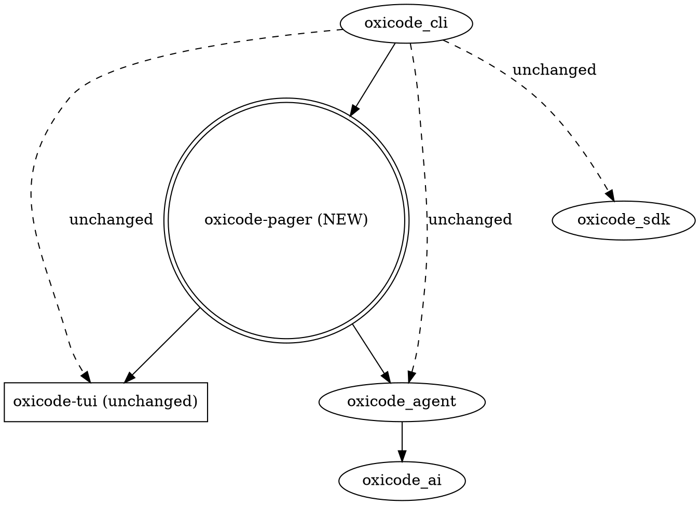

# oxicode-pager: oxicode-cli 프론트엔드 grok-style 재설계

**날짜**: 2026-07-20
**상태**: 설계 (사용자 승인 대기)
**범위**: 신규 `oxicode-pager` 크레이트 1개 + `oxicode-tui::keybindings::Action` enum 4-variant 추가 (backward-compatible) + `oxicode-cli`의 `tui/app.rs` 일부 1줄 위임. oxicode-tui widget 코드 0줄 변경.
**버전 타겟**: v0.57
**선행 분석**: `docs/ref-porter/xai-org-grok-build.md` (2026-07-20), `docs/ref-porter/2026-07-20-xai-org-grok-build.md` (architecture), `docs/ref-porter/xai-org-grok-build-tui.md` (TUI patterns), `docs/designs/2026-07-20-grok-build-applied-design.md` (toolbus / typed tools backend candidates), `docs/superpowers/specs/2026-07-19-oxicode-tui-grok-pattern-adoption-design.md` (W1 workstream).

---

## 0. 라이선스 정정 (clean-room rewrite)

grok-build은 **Apache-2.0**. oxicode는 **MIT**. 본 설계는 grok의 **구조와 패턴만 차용**하고 **소스 코드는 복사하지 않는다**. 모든 신규 코드는 oxicode MIT 헤더로 작성되며, grok 파일을 import하거나 `/// adapted from` 헤더를 두지 않는다.

근거:
- oxicode는 외부 기여를 받는다 (MIT). grok는 외부 PR 거부 + Apache-2.0. 두 저장소의 license 호환은 가능 (양방향 호환) 하지만, Apache §4(b) "change notice" 의무는 **파일을 가져올 때만** 발생한다. 본 설계는 파일을 가져오지 않으므로 NOTICE.md 수정 불필요.
- 이전 분석(`docs/ref-porter/2026-07-20-xai-org-grok-build.md:191-192`)에서 "라이선스 문제 없음"으로 결론 지었으나, 이 결론은 "codex/opencode처럼 작은 attribution을 동반한 차용" 시나리오에 한정. 본 설계는 차용 단계가 아니라 **clean-room rewrite** 단계이므로 더 단순.
- 사용자 명시 요구: "완전히 버려도 됨, 같은 rust니까 사실상 그대로 코드를 도입해도 되고" — 두 번째 절은 사용자가 라이선스 의무를 가볍게 본 결과이지만, 본 설계는 보수적으로 clean-room을 채택.

---

## 1. 배경과 동기

`docs/ref-porter/2026-07-20-xai-org-grok-build.md:189-192`에서 "oxicode-sdk를 grok급으로 끌어올리는 경로"로 typed tool signature / 분산 toolbus / 컴팩션 reminder / 샌드박스 추출 4개 후보를 식별. 본 spec은 그 중 **typed tool signature(후보 A)** 와 **프론트엔드 재설계** 를 묶어서 다룬다. 분산 toolbus(B), 컴팩션 reminder, 샌드박스 추출은 `docs/designs/2026-07-20-grok-build-applied-design.md`대로 별도 spec/PR로 미루고 본 spec 범위 외로 명시.

프론트엔드 동기:
- `oxicode-cli/src/tui/app.rs` (2,021 LOC) + `tui/handlers.rs` (1,633 LOC) 가 단일 `App` 구조체에서 `AgentEvent`를 직접 mutate. 테스트하기 어렵고 reducer/dispatch 경계가 흐림.
- `tui/overlay/*` (9,210 LOC) + `tui/slash/builtin/*` (3,020 LOC) 가 18개 overlay / 16개 slash command 를 직접 dispatch. routing logic이 분산.
- grok의 `xai-grok-pager` (2,650 LOC `server.rs`)는 state machine + emitter + dispatch + reduce 패턴으로 명확한 경계. 같은 패턴을 oxicode에 도입하되, **actor 모델은 의도적으로 배제** (grok의 `xai-chat-state` actor는 oxicode-tui의 widget 패러다임 대비 2x 복잡도).

**UX 측면**은 `docs/superpowers/specs/2026-07-19-oxicode-tui-grok-pattern-adoption-design.md`의 W1 (가상 좌표계 + sticky 헤더) + B1-B7 (scroll normalization, slash dropdown, scrollback search 등) + B5/B7 (shortcuts) workstream이 본 spec과 **직교한다**. 본 spec은 *앱 구조* 변경, 그 spec은 *위젯/렌더* 변경. 같이 진행 가능.

---

## 2. 설계 원칙

1. **신규 크레이트는 1개** — `oxicode-pager`. oxicode-tui / oxicode-cli / oxicode-agent는 신규 크레이트 추가 없음.
2. **oxicode-tui widget 코드는 0줄 변경** — pager가 *기존 widget 위에 얇은 어댑터*로 동작.
3. **단방향 의존** — `oxicode-pager → oxicode-tui` + `oxicode-pager → oxicode-agent` + `oxicode-cli → oxicode-pager`. `oxicode-agent ⇏ oxicode-pager`, `oxicode-tui ⇏ oxicode-pager`.
4. **Reducer는 순수 함수** — `&mut PagerState` 만 mutate. `await` 호출 없음. lock-guard가 await 위로 넘어가지 않음 (AGENTS.md pitfall 준수).
5. **PR당 1개 변경, PR당 회귀 게이트** — `cargo fmt --check`, `cargo clippy --workspace --all-targets -- -D warnings`, `cargo nextest run --workspace` 모두 pass. native-browser feature도 PR-1, PR-3에서 sanity check.
6. **각 PR 끝에 `cargo run`이 한 번도 안 깨진 상태** — 점진 도입.
7. **Print / RPC mode는 1차 마일스톤 범위 외** — TUI만 pager로 라우팅. print/RPC는 기존 `oxicode-cli` 경로 그대로.
8. **actor / mpsc-per-source 5-채널 패턴 도입 안 함** — 단일 `select!` 4-source (agent, input, tick, background).

---

## 3. 아키텍처 경계 (Section 1)

### 3.1 신규 crate 표면

```
oxicode-pager/
├── Cargo.toml                    [workspace.member 추가]
└── src/
    ├── lib.rs                    [pub use 인덱스]
    ├── state.rs                  [PagerState — 단일 source of truth]
    ├── emitter.rs                [AgentEvent + input + tick + bg → PagerEvent]
    ├── reducer.rs                [순수 함수 reduce(state, event) -> Vec<PagerAction>]
    ├── dispatch.rs               [PagerAction::SendToAgent → AgentCmd 매핑]
    ├── main_loop.rs              [select! 루프 + render debounce]
    ├── prompt.rs                 [PromptState + history + completion 모드 라우팅]
    ├── modal.rs                  [ModalKind enum + 모달 디스패치]
    ├── slash.rs                  [슬래시 명령 router — oxicode-cli의 registry에 위임]
    ├── status.rs                 [StatusState + spinner phase + token bar]
    ├── keymap.rs                 [KeyRouter — modal-local vs global vs pass-through]
    ├── theme_bridge.rs           [oxicode-tui::Theme → line style lookup]
    └── scrollback.rs             [ScrollbackState — block index + viewport + line cache]
```

### 3.2 의존성 그래프



solid = 본 spec이 추가. dashed = 기존.

### 3.3 데이터 흐름

```
oxicode-agent::Agent                oxicode-pager                  oxicode-tui widgets
     │                              │                              │
     │  AgentEvent stream           │                              │
     ├─────────────────────────────►│  emitter::normalize          │
     │                              │  reduce(state, event)        │
     │                              │  ──────────►                 │
     │  (only AgentEvent crosses)   │  state mutation + actions    │
     ├─────────────────────────────►│  dispatch AgentCmd ─────────►│
     ◄──────────────────────────────┤                              │
     │                              │  Render                      │
     │                              ├─────────────────────────────►│
     │                              │  ChatWidget/Footer           │
     │                              │  ToolRenderer/...            │
     │                              │                              │
     │  (Crossterm event)           │                              │
     │  ◄────────────────────────────┤  KeyRouter::resolve         │
     │                              │  PagerEvent::Input           │
     │                              │                              │
     │  50ms tick                   │                              │
     │  ◄────────────────────────────┤  PagerEvent::Tick            │
```

---

## 4. 이벤트 모델 (Section 2)

### 4.1 입력 source → PagerEvent

| 입력 source | 출처 | PagerEvent variant |
|---|---|---|
| `AgentEvent` (~30 variants, `oxicode-agent/src/events.rs:130-408`) | oxicode-agent 이벤트 스트림 | `PagerEvent::Agent(AgentEvent)` |
| Crossterm key/mouse/resize | terminal backend | `PagerEvent::Input(ResolvedKey)` |
| Wall-clock tick (50ms) | timer | `PagerEvent::Tick` |
| Background job (subagent complete, MCP tool done) | channel | `PagerEvent::Background(BackgroundEvent)` |

### 4.2 PagerAction 출력

```rust
pub enum PagerAction {
    Render,                          // draw() 호출
    SendToAgent(AgentCmd),           // oxicode-agent로 전달
    SendToTerminal(TermCmd),         // raw terminal 조작
    PlaySound(Sound),                // 1차: 미사용 (no-op)
    ScheduleTick(u64),               // 다음 spinner tick까지 ms
    OpenModal(ModalKind, ModalCtx),  // overlay 인스턴스화 요청
    CloseModal,
    Quit(ExitReason),
}

pub fn reduce(state: &mut PagerState, event: PagerEvent) -> Vec<PagerAction>;
```

- `reduce`는 **순수 함수**. 외부 호출 없음, lock-guard가 await 위로 넘어가지 않음.
- 결과는 `Vec<PagerAction>` — batch (1 event → N action).
- `TermCmd` 실행은 main loop 책임. reducer는 `println!` 직접 호출 안 함.

### 4.3 PagerState

```rust
pub struct PagerState {
    pub scrollback: ScrollbackState,
    pub prompt: PromptState,
    pub modal: Option<ModalKind>,
    pub status: StatusState,
    pub agent_meta: AgentMetaState,
    pub pending_input: Option<PendingTool>,
    pub sticky_panels: StickyPanelState,
}
```

- `Arc<parking_lot::RwLock<PagerState>>`로 main loop와 reducer가 공유.
- write lock은 reduce만, read lock은 render path.
- 모든 `Default` 가능. `Clone` 구현은 derive만 (Arc 공유 deep clone 방지 위해 명시적 `Clone`은 `Arc::clone`만 허용).

### 4.4 동시성 모델

```rust
loop {
    select! {
        Some(ev) = agent_rx.recv() => { /* reduce → apply actions */ }
        Some(ev) = input_rx.recv()  => { /* resolve key → reduce */ }
        _ = tick_interval.tick()    => { /* reduce Tick → apply actions */ }
        Some(ev) = bg_rx.recv()     => { /* reduce → apply actions */ }
    }
    // 16ms (60fps) 단위 Render debounce
    if last_render.elapsed() >= FRAME_BUDGET {
        let _ = state.read();
        render(&state, &mut terminal)?;
        last_render = Instant::now();
    }
}
```

**mutex guard가 `.await` 위로 넘어가지 않음** — reduce는 `&mut PagerState` 만 mutate하고 즉시 drop. `SendToAgent`는 lock 밖에서 실행.

---

## 5. 컴포넌트 표면 (Section 3)

### 5.1 KeyRouter (`oxicode-pager/src/keymap.rs`)

```rust
pub struct KeyRouter {
    inner: KeybindingsManager,        // oxicode-tui의 기존 매니저
    modal_active: bool,
    focused: FocusTarget,             // Chat | Prompt | Modal | Status
}

pub enum ResolvedKey {
    Bind(Action),                     // 글로벌 keymap 매핑
    ModalLocal(ModalInput),           // 모달이 처리
    PassThrough(KeyEvent),
    Ignored,
}

impl KeyRouter {
    pub fn resolve(&self, ev: KeyEvent) -> ResolvedKey;
}
```

- `state.modal.is_some()`이면 `ModalLocal` 우선.
- 신규 Action variant 4개 (5.6)만 oxicode-tui `Action` enum에 추가.
- 그 외 keymap은 oxicode-tui의 `KeybindingsManager` 그대로 보존.

### 5.2 Modal dispatch (`oxicode-pager/src/modal.rs`)

```rust
#[derive(Clone, Copy, PartialEq, Eq)]
pub enum ModalKind {
    None,                              // sentinel
    Ask,
    ModelSelect,
    ProviderSelect,
    Settings,
    Extensions,
    McpDashboard,
    McpConfig,
    Issues,
    Roles,
    Router,
    Skill,
    ToolConfirm,
}
```

- 18개 overlay 자체는 `oxicode-cli/src/tui/overlay/*`에 그대로 (Box<dyn Overlay>).
- pager는 *어떤 overlay가 떠 있는지* (ModalKind) 만 안다.
- `PagerAction::OpenModal(ModalKind, ModalCtx)` → main loop가 `Overlay::new(ctx)` 인스턴스화.

### 5.3 Slash dispatch (`oxicode-pager/src/slash.rs`)

```rust
pub enum SlashDecision {
    Dispatch(String),                  // oxicode-cli의 registry에 위임
    Unknown(String),
}

pub fn route_slash(text: &str) -> SlashDecision;
```

- 입력 박스에서 `/` 감지 시 `state.prompt.completion_mode = Slash`.
- `reduce(PagerEvent::Input(Submit))` 가 text를 보고 SlashDecision 결정.
- main loop가 `SlashDecision::Dispatch` → `oxicode_cli::tui::slash::dispatch(text, ctx)` 호출.
- 결과로 overlay가 열리면 `PagerEvent::ModalOpened(ModalKind)` 로 pager에 다시 통지.

### 5.4 Prompt + completion (`oxicode-pager/src/prompt.rs`)

- `PromptState { text: String, cursor: usize, history_cursor: Option<usize>, completion_mode: CompletionMode, completion_suggestions: Vec<Suggestion> }`.
- 키 처리: `Submit / NewLine / Tab / HistoryUp/Down / CompletionNext/Prev/Accept/Dismiss` 모두 pager reducer.
- 1차 completion 소스: fuzzy file (`oxicode-cli/src/tui/completion/fuzzy_file.rs` 재사용) + slash command list.

### 5.5 Status / footer / spinner (`oxicode-pager/src/status.rs`)

- `StatusState { model, session_id, tokens_in, tokens_out, cost, spinner_phase, last_error: Option<String>, dirty: bool }`.
- `PagerEvent::Tick` (50ms)마다 `spinner_phase` advance.
- `Footer` 위젯은 oxicode-tui의 `widgets/footer.rs` 그대로 — pager가 `FooterState` (1-depth plain struct) 채워서 전달.
- `last_error`는 1회성 표시 후 clear.

### 5.6 Sticky panels

- `state.sticky_panels: StickyPanelState { todo: bool, issues: bool, hub: bool, lsp: bool }`.
- 패널 위젯은 oxicode-tui 그대로. visibility 토글만.
- 신규 Action variant 4개 추가 (`oxicode-tui::keybindings::Action`):
  - `ToggleTodo` (Ctrl+T)
  - `ToggleIssues` (Ctrl+I)
  - `ToggleHub` (Ctrl+H)
  - `ToggleLsp` (Ctrl+L)
- default binding은 KeybindingsManager의 default 섹션에 추가. user override 가능.

### 5.7 widget 보존 (변경 0줄)

- `oxicode-tui::widgets::chat/*` (ChatWidget) — pager가 `AgentEvent::MessageUpdate` → `ChatWidget::append_token(line)` 호출.
- `oxicode-tui::widgets::tool_renderer.rs` — pager가 `ToolExecutionStart/Update/End` → `begin/progress/finalize` 호출.
- `oxicode-tui::widgets::footer.rs` — pager가 `FooterState` 채워서 전달.
- `oxicode-tui::keybindings/keys.rs` (KeyId 540 LOC) — pager가 `KeybindingsManager` 인스턴스를 들고 동작.

### 5.8 신규 pager 컴포넌트

| 컴포넌트 | 위치 | 설명 |
|---|---|---|
| `MarkdownStreaming` | oxicode-pager::render | line-by-line 마크다운 캐시. 1차: oxicode-tui의 기존 `markdown` 위에서 thin adapter |
| `Spinner` phase machine | oxicode-pager::status | 12 frames. 50ms tick. `glyph_set.symbols.spinner` 사용 |
| `TokenBar` | oxicode-pager::status | footer의 토큰/비용 1줄 |
| `ToolProgressCard` | oxicode-pager::widgets | tool call의 progress를 struct로 누적 |

---

## 6. Typed tool trait (PR-1)

`docs/designs/2026-07-20-grok-build-applied-design.md:50-186`의 후보 A (typed tool signature 마이그레이션) 중 **PR-A1 단계** 만 본 spec에 포함 (A2-A3-N은 별 spec). 본 spec은 A1의 핵심 결정 두 가지를 적용:

1. **typed trait은 `oxicode-agent/src/tools/typed.rs`에 둔다.** oxicode-pager가 정의하지 않는다 — pager는 `oxicode-agent`를 단방향 consume할 뿐.
2. **dyn 소거 표면은 `AgentTool` 그대로** — `ToolDyn` 같은 별도 트레이트를 만들지 않는다 (applied-design.md:87). typed 신규 도구는 `TypedToolAdapter: AgentTool`로 들어가서 기존 `Arc<dyn AgentTool>` 슬롯에 합류.

### 6.1 새 trait — `oxicode-agent/src/tools/typed.rs`

applied-design.md:53-81과 정확히 동일한 4-파라미터 시그니처. **스트리밍 (`ToolStream<T>` / `Output` 연관 타입) 없음** — applied-design.md:145-147의 A.3에서 명시적으로 후속 시리즈로 분리. `ToolCallContext` 이름도 *사용 안 함* — `oxicode-agent/src/events.rs:18`의 `ToolCallContext` enum이 이미 그 이름을 점유 (web exploration context용). 본 spec은 `AgentTool::execute`와 동형의 4-파라미터.

```rust
use schemars::JsonSchema;
use serde::de::DeserializeOwned;
use tokio::sync::oneshot;

use crate::tools::{AgentTool, AgentToolResult, ToolContext, ToolError, ToolExecutionMode};

/// 타입 안전 도구 트레이트.
///
/// Generic + 연관 타입 → **dyn 호환 안 됨**. [`TypedToolAdapter`]가
/// [`AgentTool`]을 구현해 `Arc<dyn AgentTool>` 로 소거한다.
pub trait TypedTool: Send + Sync + 'static {
    /// LLM 에서 넘어오는 JSON 인자의 타입. `DeserializeOwned + JsonSchema` 둘 다 필수.
    type Args: DeserializeOwned + JsonSchema + Send + 'static;

    fn name(&self) -> &str;
    fn label(&self) -> &str { self.name() }
    fn description(&self) -> &str;
    fn essential(&self) -> bool { false }

    /// Typed execution — 인자는 이미 deserialized.
    async fn execute_typed(
        &self,
        tool_call_id: &str,
        args: Self::Args,
        signal: Option<oneshot::Receiver<()>>,
        ctx: &ToolContext,
    ) -> Result<AgentToolResult, ToolError>;
}
```

### 6.2 어댑터 — `TypedToolAdapter<T>`

applied-design.md:85-141의 A.2와 1:1. dyn 표면은 **기존 `AgentTool`** — `ToolDyn` 같은 별도 트레이트 안 만듦. 헬퍼 `wrap_typed<T>` 가 `register_arc`에 그대로 넘길 수 있는 `Arc<dyn AgentTool>` 반환.

```rust
pub struct TypedToolAdapter<T: TypedTool>(pub Arc<T>);

impl<T: TypedTool> std::fmt::Debug for TypedToolAdapter<T> {
    fn fmt(&self, f: &mut std::fmt::Formatter<'_>) -> std::fmt::Result {
        f.debug_struct("TypedToolAdapter")
            .field("name", &self.0.name())
            .finish()
    }
}

#[async_trait]
impl<T: TypedTool> AgentTool for TypedToolAdapter<T>
where
    T::Args: serde::de::DeserializeOwned,
{
    fn name(&self) -> &str { self.0.name() }
    fn label(&self) -> &str { self.0.label() }
    fn description(&self) -> &str { self.0.description() }
    fn essential(&self) -> bool { self.0.essential() }

    fn parameters_schema(&self) -> serde_json::Value {
        serde_json::to_value(schemars::schema_for!(<T as TypedTool>::Args))
            .unwrap_or_else(|_| serde_json::json!({"type": "object"}))
    }

    fn execution_mode(&self) -> ToolExecutionMode { ToolExecutionMode::ParallelSafe }

    async fn execute(
        &self,
        tool_call_id: &str,
        params: serde_json::Value,
        signal: Option<oneshot::Receiver<()>>,
        ctx: &ToolContext,
    ) -> Result<AgentToolResult, ToolError> {
        let tool_name = self.0.name();
        let args = <T as TypedTool>::Args::deserialize(params)
            .map_err(|e| ToolError::InvalidArgs(format!("invalid args for '{tool_name}': {e}")))?;
        self.0.execute_typed(tool_call_id, args, signal, ctx).await
    }
}

/// 등록 헬퍼 — `register_arc` 에 그대로 넘기면 `HashMap` 에 dyn 표면으로 들어간다.
pub fn wrap_typed<T: TypedTool>(tool: T) -> Arc<dyn AgentTool> {
    Arc::new(TypedToolAdapter(Arc::new(tool)))
}
```

**`ToolError::InvalidArgs` variant** — applied-design.md:176이 경고했듯 현재 `oxicode-agent/src/tools.rs:557`의 `pub type ToolError = String;` (단순 `String` 별칭) 이다. PR-1에서 `oxicode-agent/src/error.rs`에 `#[derive(thiserror::Error, Debug)] pub enum ToolError { #[error("invalid args: {0}")] InvalidArgs(String), ... }` 형태로 enum화 + `String` 별칭 제거. **32개 도구 중 에러를 `String`으로 반환하는 곳이 있을 수 있음** — `grep -rn "Err(ToolError" oxicode-agent/src/tools/*.rs | grep -v "ToolError::"` 후 hand-roll 변환.
```

### 6.3 `ToolRegistry` 변경 — 무수정

applied-design.md:149-154의 A.4와 동일. `oxicode-agent/src/tools.rs:852-1094`의 `ToolRegistry`는 **변경 없음**. `register_arc(Arc<dyn AgentTool>)` 그대로 사용. 사용처에서:

```rust
// 신규 typed 도구 등록
registry.register_arc(crate::tools::typed::wrap_typed(MyNewTool { ... }));

// 기존 도구 등록
registry.register(ReadTool::new(...));
```

- `register` / `register_arc` / `get` / `names` / `definitions` / `to_definition` **시그니처 무변경**.
- 호출 지점 (`oxicode-agent/src/agent_loop/`) 도 `Arc<dyn AgentTool>::execute(...)` 그대로. 메서드 이름 한 줄도 안 바뀜.
- `McpTool`, `McpDirectTool` 같은 기존 typed 마이그레이션 비대상 도구는 **변경 없음**.
- **PR-1에서 `ToolRegistry`에 메서드 추가는 0건**.

### 6.4 외부 의존

- `schemars = "0.8"` (workspace dep 추가, `Cargo.toml [workspace.dependencies]` 에 한 줄) — applied-design.md:175 권고 버전.
- 그 외 추가 의존 없음.
### 6.5 호환성 보장

- 기존 32개 도구 (`oxicode-agent/src/tools/*.rs`) 의 `AgentTool` 구현은 **변경 없음**. 손도 안 댐 (단, `Err(ToolError::from(...))` → `Err(ToolError::InvalidArgs(...))` 등 `ToolError` variant enum화 영향은 6.2 노트 참고).
- `oxicode-sdk::closure_tool::ClosureTool` 도 그대로 (별 spec에서 다룸, applied-design.md:161의 A.2).
- MCP 도구 (`McpTool`, `McpDirectTool`) 도 그대로.
- `oxicode-cli/src/bootstrap.rs` 의 `ToolRegistry::register` 호출도 그대로.
- 본 spec의 도입 후: **신규 도구를 짤 때 `TypedTool` 로 짜고 `register_arc(wrap_typed(tool))`로 등록**하는 경로가 권장이 되지만, 기존 `AgentTool` 직접 구현도 계속 유효. 두 경로가 공존.

### 6.6 PR-1 검증

- `cargo nextest run -p oxicode-agent` — 32개 도구 기존 테스트 전부 pass (회귀 0).
- 신규 `typed_tool_tests` (`oxicode-agent/src/tools/typed.rs` 안 `#[cfg(test)]`):
  - `test_typed_adapter_roundtrip` — typed 도구 정의 → `wrap_typed` → `register_arc` → `definitions()` 에 포함
  - `test_typed_schema_matches_schemars` — `adapter.parameters_schema()` 출력이 `serde_json::to_value(schemars::schema_for!(T::Args))` 와 value-equal
  - `test_typed_args_validation_fails_loudly` — 잘못된 JSON → `ToolError::InvalidArgs` 반환 (silent no-op 아님)
  - `test_typed_and_legacy_coexist` — 같은 `ToolRegistry` 에 typed 1개 + legacy 1개 등록 → `names()` 가 union
- `cargo clippy --workspace --all-targets -- -D warnings` pass.
- `cargo clippy -p oxicode-sdk --features native-browser -- -D warnings` pass (sanity check — PR-1은 oxicode-sdk에 영향 없음, gate 깨지지 않음 확인).
## 7. PR 분할 (Section 4)

| # | 범위 | 변경 파일 | 위험 | 회귀 테스트 |
| **PR-2** | `PagerState` + `PagerEvent` + `reduce` skeleton (빈 reducer) | `oxicode-pager/src/{state,emitter,reducer}.rs` | 무 | reducer unit tests + `cargo nextest run -p oxicode-pager` |
| **PR-3** | `KeyRouter` + modal router + `Action` enum 4 variants (5.6) | `oxicode-pager/src/keymap.rs`, `oxicode-tui/src/keybindings/registry.rs` (4 variants) | 낮음 | `cargo nextest run -p oxicode-tui -p oxicode-pager` |
| **PR-1** | typed tool trait (6장) | `oxicode-agent/src/tools/typed.rs` (신규), `oxicode-agent/src/error.rs` (`ToolError` enum화), `oxicode-agent/src/tools/*.rs` (에러 변환 hand-roll) | 낮음 | `cargo nextest run -p oxicode-agent` + 신규 `typed_tool_tests` |
| **PR-5** | reducer 본체 + `PromptState` / `StatusState` / `ScrollbackState` | `oxicode-pager/src/{reducer,prompt,status,scrollback}.rs` | 중-상 | TUI smoke: prompt + history + completion + submit + tool progress + status spinner |
| **PR-6** | 모달 + slash + sticky panels | `oxicode-pager/src/{modal,slash}.rs` | 중 | TUI smoke: `/model`, `/issue`, `ask` tool overlay |
| **PR-7** | UX polish — `Ctrl+D` 2-tap, `MarkdownStreaming`, `TokenBar`, footer, ESC cancel | `oxicode-pager/src/render/*`, `oxicode-pager/src/widgets/*` | 낮음 | TUI smoke + 시각 회귀 3장 + full CI gate |

### 7.1 PR-0 detail

```toml
# oxicode-pager/Cargo.toml
[package]
name = "oxicode-pager"
edition.workspace = true
rust-version.workspace = true
license.workspace = true
authors.workspace = true
repository.workspace = true
description = "Pager state machine + emitter + reducer for the oxicode-cli TUI"

[dependencies]
oxicode-tui = { path = "../oxicode-tui" }
oxicode-agent = { path = "../oxicode-agent" }
schemars = { workspace = true }
```

```rust
// oxicode-pager/src/lib.rs
#![forbid(unsafe_code)]
//! oxicode-pager — pager state machine for the oxicode-cli TUI.
pub fn version() -> &'static str { env!("CARGO_PKG_VERSION") }
```

PR-0 끝에 `cargo build -p oxicode-pager` + `cargo clippy -p oxicode-pager -- -D warnings` pass.

### 7.2 PR-4 detail (가장 위험 큰 PR)

`oxicode-cli/src/tui/app.rs:898-903`의 기존 진입점:

```rust
pub async fn run_tui_interactive(app: crate::App) -> Result<()> { ... }
pub async fn run_tui_interactive_with_continue(app: crate::App, resume_last: bool) -> Result<()> { ... }
```

PR-4에서 이 함수의 본문은 *위임* 으로 교체:

```rust
pub async fn run_tui_interactive(app: crate::App) -> Result<()> {
    oxicode_pager::run(app).await
}
```

`oxicode_pager::run`이 `App`을 받아서:
1. `PagerState::default()` 생성 + `Arc<RwLock<>>` wrap.
2. `oxicode-agent` 이벤트 스트림을 `agent_rx`로 구독.
3. `crossterm` event stream을 `input_rx`로 구독 (KeyRouter 적용).
4. `tokio::time::interval(50ms)`로 `tick_interval` 생성.
5. background job 채널을 `bg_rx`로 구독 (MCP, subagent).
6. `select!` 루프 진입 (4.4).

이 단계에서 **reducer 본체는 stub** — 모든 event는 `Vec::new()` 반환. 화면 출력은 oxicode-tui의 기존 `ChatWidget` + `Footer` 가 *raw event*로 직접 동작 (App의 기존 path 유지). pager는 state만 들고 있는 dead loop. **PR-4의 회귀 테스트는 "기존 TUI와 동일하게 동작"**.

### 7.3 마일스톤

- **M1 (PR-0..2)**: scaffolding + typed trait. 사용자 화면 변화 없음.
- **M2 (PR-3..4)**: 키 라우팅 + main loop. pager가 이벤트 받아서 기존 위젯에 전달. 코드 경로만 변경.
- **M3 (PR-5..6)**: reducer 본체. 기능 동일하지만 pager state 경유.
- **M4 (PR-7)**: UX polish. 사용자 체감 변화 시작.

---

## 8. 명시적 비목표 (이번 spec에서 배제)

1. **oxicode-cli 모놀리식 분리** — AGENTS.md pitfall 유지. `oxicode-pager` 추가만.
2. **oxicode-tui widget 코드 변경** — 0줄.
3. **32개 도구의 typed 마이그레이션** — PR-1 어댑터로 호환 유지, 점진 이식은 별 spec/PR.
4. **Print / RPC mode의 pager 통합** — TUI만 pager로 라우팅. print/RPC는 기존 `oxicode-cli` 경로.
5. **분산 toolbus / ACP (Agent Client Protocol)** — `docs/designs/2026-07-20-grok-build-applied-design.md`의 별 PR.
6. **MCP+WS transport** — 같은 doc의 별 PR.
7. **컴팩션 reminder** — 같은 doc의 별 PR.
8. **샌드박스 추출** — 같은 doc의 별 PR.
9. **grok의 actor 모델** — 의도적 제외. mpsc-per-source 5-채널 안 함.
10. **grok의 `views/chat.rs` 600 LOC 자체 구현** — `ChatWidget` 보존.
11. **grok의 line-by-line diff 렌더** — 1차: full-replace (ratatui 표준). line-by-line diff는 2차.
12. **`PagerEvent`의 serde IPC** — 인-프로세스만.
13. **`PagerState`의 persistent data structure (im, rpds)** — in-place mutate.
14. **oxicode-tui::keybindings::Action enum의 그 외 변경** — 4 variants 추가만.
15. **서버측 oxicode-as-server** — applied-design.md의 별 PR.
16. **OIDC / OAuth provider** — 적용 안 함.

---

## 9. 위험과 mitigation

| 위험 | 영향 | mitigation |
|---|---|---|
| `PagerState`를 `Arc<RwLock<>>`로 들고 reducer가 lock 잡은 채 `await` 호출 | compile error (parking_lot `!Send`) | reducer는 순수 함수. lock 잡고 mut만, await 안 함. await는 main loop |
| AgentEvent를 1ms 단위로 수신할 때 매번 full render → 깜빡임 | UX | 16ms (60fps) 단위 `Render` debounce. main loop가 frame budget gate |
| `ChatWidget`의 line cache가 pager의 `ScrollbackState.line_cache`와 중복 | 메모리 | ChatWidget의 line cache는 그대로. ScrollbackState는 *block-level visibility*만 |
| 32개 도구 동시 typed 변경 | 회귀 폭증 | PR-1에서 어댑터로 0 변경 호환. 점진 이식은 spec 외 |
| `oxicode-cli` 64K LOC monolith가 pager 도입 후 더 커짐 | 빌드 시간 | pager는 consumer가 아닌 peer. oxicode-cli에서 pager로 위임되는 부분만 감소. ±5% 변화 |
| Reducer 내부에서 `String` clone이 큰 경우 | perf | `Cow<'_, str>` 또는 `&str` 참조 위주. 필요 시 smallvec |
| oxicode-tui의 `ChatWidget`이 full-replace 모델 | UX | 1차 유지. line-by-line diff는 후속 spec |
| `Action` enum 4 variants 추가로 기존 user keymap override가 깨질 가능성 | 사용자 데이터 | additive change — 기존 override는 무영향. 신규 variant에 user override 추가 가능 |
| native-browser feature clippy (AGENTS.md 강제) | CI | PR-1, PR-3에서 sanity check. pager가 oxicode-sdk에 의존 안 하므로 영향 없음 |
| PR-4에서 reducer가 stub이라 pager가 dead loop | 자원 | `state.dirty = true`만 emit하고 아무것도 안 함. 의도적. PR-5에서 본체. |

---

## 10. 명시적 *수락* 결정 (이전 applied-design.md 정정)

`docs/designs/2026-07-20-grok-build-applied-design.md` (in-flight) 의 4개 후보 중:
- **A (typed tool signature)** — **본 spec의 PR-1로 채택**.
- **B (MCP+WS toolbus delta)** — **별 spec/PR로 미룸** (이전 결정을 유지).
- **C (컴팩션 reminder)** — 별 spec/PR로 미룸.
- **D (샌드박스 추출)** — 별 spec/PR로 미룸.

이전 applied-design.md가 in-flight 상태이므로, 본 spec 승인 후 그 doc은 "**A 항목은 2026-07-20 spec이 supersede, B/C/D는 그대로**" 라는 한 줄 노트를 머리에 추가.

---

## 11. 검증 게이트 (모든 PR 종료 시점)

| 게이트 | 기준 |
|---|---|
| `cargo fmt --all -- --check` | pass |
| `cargo clippy --workspace --all-targets -- -D warnings` | pass |
| `cargo nextest run --workspace` | pass |
| `cargo clippy -p oxicode-sdk --features native-browser -- -D warnings` | pass |
| `cargo build -p oxicode-pager` (각 PR) | pass |
| TUI smoke (PR-4,5,6,7) | `cargo run`으로 5분 interactive 사용 + 종료. 사용자 직접 확인. |
| 시각 회귀 (PR-7) | TUI 시작 / tool 호출 / modal 열린 후 스크린샷 3장. PR-7 이전과 비교. |
| 문서 | 본 spec + `oxicode-pager/README.md` |

---

## 12. 문서 위치

- 본 spec: `docs/superpowers/specs/2026-07-20-grok-pager-redesign.md` (현 파일)
- 적용 노트: `docs/designs/2026-07-20-grok-build-applied-design.md` (in-flight) — 머리에 supersede 노트 추가
- plan: `docs/superpowers/plans/2026-07-20-grok-pager-redesign.md` (writing-plans skill로 생성)
- 신규 README: `oxicode-pager/README.md` (PR-0에서 작성)
