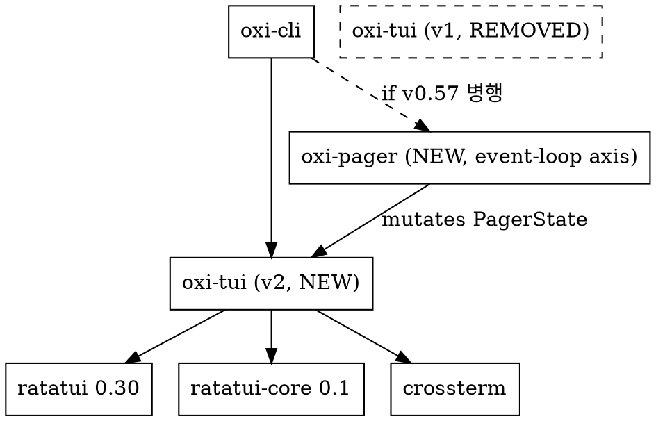

# oxi-tui v2: 렌더링 파이프라인 + 위젯 모델 재설계

**날짜**: 2026-07-21
**상태**: 설계 (사용자 승인 대기)
**범위**: `oxi-tui` crate 전면 재설계 (greenfield). 기존 `oxi-tui` (~22.5K LOC)를 폐기하고 동일 이름으로 신규 작성. `oxi-cli/src/tui/` (~19.7K LOC)의 callsite 재작성 포함.
**버전 타겟**: v0.58 (v0.57 = `oxi-pager` event-loop 설계와 병행 가능)
**선행 분석**:
- `docs/ref-porter/xai-org-grok-build-tui.md` (TUI 기능 비교)
- 이전 분석 회차 (2026-07-21): grok vs oxi 렌더링 차이 검증

---

## 0. 라이선스 — clean-room rewrite

grok-build은 **Apache-2.0**, oxi는 **MIT**. 본 설계는 grok의 **구조와 통찰만 차용**하고 소스 코드를 복사하지 않는다. 모든 신규 코드는 oxi MIT 헤더로 작성. `docs/superpowers/specs/2026-07-20-grok-pager-redesign.md`의 §0과 동일한 입장.

---

## 1. 배경과 동기

### 1.1 핵심 통찰: frame lifecycle ownership

이전 분석에서 나열한 7개 "폴리시 갭"은 전부 **단 하나의 아키텍처 결정**에서 비롯된다.

**oxi (현재)** — framework-first:
```rust
terminal.draw(|frame| { render::draw(frame, state, theme) })?;   // oxi-cli/src/tui/app.rs:1542
```
이 한 줄이 `ratatui::Terminal::draw()`를 부르고, ratatui는 내부적으로 `try_draw → apply_buffer_with_cursor`를 실행. `apply_buffer_with_cursor`(`ratatui-core-0.1.2/src/terminal/render.rs:288-320`)는 `flush()` 이후에 **매 프레임 무조건** `hide_cursor` 또는 `show_cursor + set_cursor_position`을 emit. 변경 여부는 보지 않는다.

oxi의 `DiffBackend`는 `flush()` 단계만 소유. 그 뒤의 커서 emission은 ratatui 내부에 갇혀서 간섭 불가. **이래서 커서 깜빡임 보존이 원천 불가능**.

**grok** — terminal-first: `try_draw`를 분해해서 자체 `draw_frame`으로 소유. 단, grok은 이를 위해 ratatui `Terminal`을 fork (`xai-ratatui-inline`).

### 1.2 검증된 사실 (2026-07-21)

ratatui 0.30 (= ratatui-core 0.1.2)은 lifecycle 단계를 **전부 `pub`으로 노출**:

| 메서드 | 위치 | 용도 |
|---|---|---|
| `Terminal::autoresize` | init.rs | resize 감지 + buffer 동기화 |
| `Terminal::get_frame` | buffers.rs:51 | back buffer에 대한 `Frame` ref 반환 |
| `Terminal::flush` | buffers.rs:97 | back vs front diff → backend write. **`Result<()>` 반환 (bool 아님)** |
| `Terminal::swap_buffers` | buffers.rs:121 | back을 front로 승격 |
| `Terminal::hide_cursor` / `show_cursor` / `set_cursor_position` | cursor.rs:15/30/80 | 커서 escape emit |
| `Terminal::apply_buffer_with_cursor` | render.rs:288 | 위의 것들을 묶은 high-level (우리가 안 씀) |

**fork 불필요**. 우리가 우아하게 분해하면 grok보다 적은 코드로 동일한 통제권 확보.

### 1.3 추가 검증: DiffBackend는 이미 resize를 처리

`oxi-tui/src/render/mod.rs:320-325`:
```rust
if term_w != self.last_width || term_h != self.last_height {
    self.force_full_redraw = true;
    self.last_width = term_w;
    self.last_height = term_h;
}
```
→ resize-race panic은 이미 다른 메커니즘으로 차단. **SafeBuf 불필요**.

### 1.4 proactive vs reactive

사용자가 선택한 widget model B(retained tree + memoization)와 pipeline 분해가 하나로 녹는다.

| 모델 | 흐름 | 결과 |
|---|---|---|
| **grok (reactive)** | render → flush(bool 반환) → 조건부 커서 | 매 프레임 렌더 연산 수행 후 회고 |
| **oxi v2 (proactive)** | hash check → 변경 없으면 render/flush/cursor 전부 skip | idle 화면에서 0 work, 0 bytes |

retained tree의 content_hash가 flush 호출 전에 변경 여부를 안다. 따라서 `flush()`의 반환값이 bool이 아닌 문제를 **회피**한다 — flush를 부르지 않으면 되니까.

### 1.5 dead code 구조적 차단

현재 oxi-tui의 "지저함" 원인:
- `render/color_level.rs` (394 LOC): `ColorLevel`/`detect_color_level()`/`adapt_color()` 정의 후 `pub use`로 재노출됐지만 **프로덕션 caller 0** (테스트만 호출)
- `render/terminal.rs`의 `hyperlinks: bool` 감지: 어디서도 `\x1b]8` emit 안 함
- `render/image.rs` (10.6KB): chat 렌더에 연결 안 됨
- `render/ansi.rs` `AnsiTracker`: DiffBackend가 `modifier_delta_codes`를 직접 써서 미사용

본 설계는 **capability detection과 consumer를 같은 모듈에 강제**해서 이런 dead code를 구조적으로 차단한다.

---

## 2. 설계 원칙

1. **단일 crate, 내부 layer 분리** — `oxi-tui` (기존 이름 유지, greenfield 재작성). 외부 crate 신규 추가 없음. `AGENTS.md`의 "pure widget lib, no oxi-* deps" 정체성 유지.
2. **Terminal-first pipeline** — `Terminal::draw()`를 부르지 않는다. `autoresize → get_frame → render → flush → conditional cursor → swap_buffers`를 직접 조합.
3. **Proactive not reactive** — widget의 `content_hash()`가 프레임 시작 시 변경 여부를 결정. 변경 없으면 render/flush/cursor 전부 skip.
4. **모든 모듈 ≤ 500 LOC** — 현재 `theme.rs` 1,907 LOC, `state.rs` 1,227 LOC, `chat/mod.rs` 791 LOC의 비대함을 허용하지 않음.
5. **Capability detection과 consumer 같은 모듈** — dead code 구조적 차단. `theme/capability.rs`가 감지하고 같은 모듈의 `palette.rs`가 소유.
6. **기존 oxi-pager 설계와 직교** — 본 설계는 rendering axis. `docs/superpowers/specs/2026-07-20-grok-pager-redesign.md`는 event loop axis. 두 축은 `PagerState`에서 만난다.
7. **Clean-room** — grok 코드 복사 없음, 구조/통찰만 차용.
8. **`oxi-tui`는 위젯 라이브러리** — agent runtime, ACP, IDE 통합, 음성, credit 시스템은 범위 밖 (oxi-cli 또는 oxi-pager 책임).

---

## 3. 아키텍처

### 3.1 crate 표면

```
oxi-tui/src/
├── lib.rs                ~80 LOC    pub use 인덱스 + 재export
│
├── pipeline/            총 ~1,150 LOC  ★ terminal-first frame lifecycle
│   ├── mod.rs           ~50 LOC    draw_frame() + FrameOutcome
│   ├── cursor.rs        ~80 LOC    CursorState + reconcile()
│   └── diff_backend.rs  ~950 LOC    DiffBackend 이식 (현재 mod.rs 743 + diff.rs 144 + deccara.rs 406 = 1,293 LOC → 통합 정리)
│
├── (widget/ 아래는 별도 블록으로 분리 — 아래 widget/ 블록 참조)
│
├── content/              총 ~700 LOC   ★ domain state (oxi-pager reducer가 mutate)
│   ├── mod.rs            ~30 LOC
│   ├── chat_log.rs       ~150 LOC   append-only Vec<ChatMessage> + active stream
│   ├── chat_view.rs      ~250 LOC   scroll/follow/selection (현재 state.rs 1,227 LOC에서 추출)
│   ├── message.rs        ~150 LOC   ChatMessage + ContentBlock + ToolCallStatus
│   └── streaming.rs      ~120 LOC   StreamingState + token accumulator
│
├── text/                 총 ~500 LOC   ★ streaming markdown
│   ├── mod.rs            ~30 LOC
│   ├── streaming_md.rs   ~250 LOC   checkpoint renderer (stable freeze + tail만 reparse)
│   ├── wrap.rs           ~150 LOC   CJK-aware word wrap + soft/hard break tracking
│   └── syntax.rs         ~100 LOC   syntect + tmTheme (feature = "syntax")
│
├── theme/                총 ~470 LOC   ★ capability-aware (dead code 해소)
│   ├── mod.rs            ~50 LOC    Theme 공개 API
│   ├── palette.rs        ~200 LOC   semantic slots (현재 1,907 LOC에서 추출)
│   ├── capability.rs     ~120 LOC   detect + consumer (color_level.rs 흡수)
│   └── serializer.rs     ~100 LOC   TOML load (serialize 책임만)
│
├── link/                 총 ~140 LOC   ★ OSC8 (현재 감지만, emit 추가)
│   ├── mod.rs            ~30 LOC
│   ├── osc8.rs           ~60 LOC    escape emitter
│   └── detector.rs       ~50 LOC    URL + absolute-path → LinkTarget
│
├── input/                총 ~200 LOC
│   ├── mod.rs            ~30 LOC
│   └── textarea.rs       ~170 LOC   stock ratatui-textarea 0.9 wrapper
│
└── widget/              총 ~1,530 LOC   ★ widget module root
    ├── mod.rs           ~40 LOC    RetainedTree 공개 API
    ├── renderable.rs    ~70 LOC    trait Renderable (content_hash, height_for, render)
    ├── tree.rs          ~120 LOC   RetainedTree 내부 (hash 추적 + walk)
    ├── context.rs       ~80 LOC    RenderCtx (area, buf, theme, caps, focus, time)
    ├── chat/            총 ~600 LOC   ★ chat-specific renderable widgets
    │   ├── mod.rs       ~80 LOC    ChatView (Renderable 구현)
    │   ├── message_item.rs ~150 LOC   개별 메시지 Renderable
    │   ├── tool_call.rs ~150 LOC   tool call 카드 Renderable
    │   └── spinner.rs   ~50 LOC    streaming indicator
    ├── panel/           총 ~400 LOC
    │   ├── footer.rs    ~150 LOC   status + token bar + model info
    │   ├── sticky.rs    ~120 LOC   sticky 헤더/패널 (todo, issues)
    │   └── overlay.rs   ~130 LOC   modal overlay container
    └── primitive/       총 ~250 LOC
        ├── text.rs      ~50 LOC    정적 텍스트 + styling
        ├── border.rs    ~50 LOC    박스 테두리 (Block 대체)
        ├── list.rs      ~80 LOC    가상화 리스트 (scrollback 용)
        └── scrollbar.rs ~70 LOC    스크롤 인디케이터

**총 LOC 추정: ~4,760 LOC** (현재 22.5K LOC의 21%, 4.7× 축소). 나머지 17.7K LOC:
- `widgets/{tool_renderer,list_selector,table_list,stateful_list,dashboard,routing,slash_dropdown,completion,todo_panel}` (~5,200 LOC) → oxi-cli/tui로 이동 또는 축소
- `symbols.rs` (905 LOC), `keybindings/` (~1,500 LOC), `markdown_styles.rs`, `overlay_anchor.rs`, `cell.rs`, `fuzzy.rs`, `text.rs`, `table_renderer.rs` → 대부분 oxi-cli로 이동
- 기존 `render/` (8 파일, 총 ~8,900 LOC) → 분해: `diff.rs + deccara.rs`(~1,300 LOC)는 `pipeline/diff_backend.rs`로 흡수, `terminal.rs + color_level.rs`(~640 LOC)는 `theme/capability.rs`로 흡수, `ansi.rs`(AnsiTracker, 미사용)·`image.rs`(연결 안 됨)는 폐기, `latex.rs + mermaid.rs`는 oxi-cli feature로 이동

### 3.2 의존성 그래프



`oxi-tui`는 ratatui/crossterm 외에 oxi-* 의존성 없음 유지.

### 3.3 데이터 흐름 (단방향)

```
oxi-pager reducer      oxi-tui v2 internal                  terminal
─────────────         ─────────────────                     ────────
PagerEvent ─→ reduce  ─→  RetainedTree
                       │      │ any_hash_changed?
                       │      ↓
                       │  yes │ no → FrameOutcome::Idle (0 bytes)
                       │      ↓
                       │  term.autoresize()
                       │  term.get_frame()
                       │  tree.render(frame, ctx) ← widget이 buffer에 write
                       │      │
                       │  term.flush()           ← DiffBackend cell-diff + CSI 2026
                       │  cursor.reconcile(...)  ← 조건부 커서 (핵심)
                       │  term.swap_buffers()
                       │      ↓
                       └─ FrameOutcome::Rendered
```

state는 oxi-pager reducer가 mutates하고, oxi-tui는 그것을 읽기만 한다. 역방향 없음.

---

## 4. Pipeline 설계

### 4.1 `FrameOutcome`

```rust
// pipeline/mod.rs
pub enum FrameOutcome {
    /// 위젯 트리의 content_hash가 변경되지 않아 render/flush/cursor 전부 skip.
    /// 호출자는 다음 tick까지 sleep 가능.
    Idle,
    /// 렌더가 수행됨. cell diff 결과로 변경 셀이 있었는지는 DiffBackend 내부 정보.
    Rendered,
}

/// 커서 요청. `None` = hide, `Some(pos)` = show + position.
/// CursorRequest enum 없이 Option<Position>을 직접 사용 (단순화).
```

### 4.2 `draw_frame` — 핵심 함수

```rust
// pipeline/mod.rs
pub fn draw_frame<B: Backend>(
    term: &mut Terminal<B>,
    tree: &mut RetainedTree,
    ctx: &mut RenderCtx,
    cursor: &mut CursorState,
) -> Result<FrameOutcome, B::Error> {
    // 1. resize 감지 (ratatui pub API — size() 는 backend.rs:55에서 pub)
    let prev_size = term.size()?;
    term.autoresize()?;
    let resized = term.size()? != prev_size;
    
    // 2. ★ proactive: hash check로 render 자체를 skip.
    //    cursor 변경은 tree hash 변경에 포함 (cursor_position은 frame state의 일부).
    //    따라서 별도의 pending 큐 없이 tree hash만 검사.
    if !tree.any_hash_changed() && !resized {
        return Ok(FrameOutcome::Idle);
    }
    
    // 3. render — 위젯이 back buffer에 write (내부에서 per-widget hash skip).
    //    widget이 render 중 ctx.set_cursor(pos) 호출 → tree.render가 drain해서 반환.
    //    (frame.cursor_position 자체는 pub(crate)라 외부에서 못 읽음 — frame.rs:28)
    ctx.begin_frame(&mut frame);
    let want: Option<Position> = tree.render(&mut frame, ctx);
    
    // 4. flush — DiffBackend가 cell diff + CSI 2026 + DECCARA + ★OSC8 (links 전달)
    //    중요: OSC8 escape는 CSI 2026 윈도우 안에서 emit되어야 tearing 방지.
    //    따라서 LinkCollector를 flush 전에 DiffBackend에 넘겨야 함.
    ctx.diff_backend_mut().set_links(ctx.take_links());
    term.flush()?;
    
    
    // 5. ★ conditional cursor emission (0 bytes if no change)
    cursor.reconcile(want, term)?;
    
    // 6. swap — 다음 프레임 준비
    term.swap_buffers();
    term.backend_mut().flush()?;
    
    Ok(FrameOutcome::Rendered)
}
```

**핵심 로직 14 LOC (본체)**. fork 없음. writer thread 없음. SafeBuf 없음. DiffBackend는 `flush()`에서 동작.

### 4.3 `CursorState` — 조건부 커서 emit

```rust
// pipeline/cursor.rs
#[derive(Default)]
pub struct CursorState {
    last_pos: Option<Position>,
    visible: bool,
}

impl CursorState {
    /// 이번 프레임의 cursor 요청을 term에 반영. 변경 없으면 0 byte.
    /// `want`: None = hide, Some(p) = show at p.
    pub fn reconcile<B: Backend>(
        &mut self,
        want: Option<Position>,
        term: &mut Terminal<B>,
    ) -> Result<(), B::Error> {
        let new_visible = want.is_some();
        
        // 가시성 전이 (드문 경우) — Show 또는 Hide emit
        if new_visible != self.visible {
            if new_visible {
                term.show_cursor()?;
                self.visible = true;
            } else {
                term.hide_cursor()?;
                self.visible = false;
                self.last_pos = None;
            }
        }
        
        // 위치 이동 (변경 시에만) — 같은 위치면 0 byte
        if let (Some(new), Some(prev)) = (want, self.last_pos) {
            if new != prev {
                term.set_cursor_position(new)?;
                self.last_pos = Some(new);
            }
            // ★ new == prev: 0 bytes — blink 타이머 보존 (핵심 최적화)
        } else if let Some(new) = want {
            // visible 방금 전이 → 위치만 설정
            term.set_cursor_position(new)?;
            self.last_pos = Some(new);
        }
        
        Ok(())
    }
}
```

### 4.4 왜 writer thread가 필요 없는가

grok은 inline viewport(pty 경합) 때문에 TermWriter 배경 thread를 도입. oxi는 단일 fullscreen terminal:
- pty write는 `flush()` 호출에서 동기적으로 발생
- DiffBackend가 cell diff로 이미 write 양을 최소화
- event loop stall은 일반적인 사용에서 관측되지 않음
- writer thread 추가 시 `Send` bound + mpsc channel + WriterSync timeout이라는 비용 발생

→ MVP에서 제외. 추후 pty back-pressure가 실제 측정되면 재검토.

---

## 5. Widget model — retained tree + memoization

### 5.1 `Renderable` trait

```rust
// widget/renderable.rs
pub trait Renderable: Send {
    /// 이 위젯의 content hash. 변경 시에만 render가 호출됨.
    /// 자식을 가진 위젯은 자식 hash들을 집계.
    fn content_hash(&self) -> u64;
    
    /// 주어진 width에서 이 위젯이 차지하는 높이. 
    /// scrollback virtualization에 필수 — 화면 밖 위젯은 render 안 함.
    fn height_for(&self, width: u16, ctx: &RenderCtx) -> u16;
    
    /// buffer에 그리기. 이 메서드는 content_hash가 변경된 경우에만 호출됨.
    fn render(&mut self, area: Rect, ctx: &mut RenderCtx);
}
```

모든 위젯(메시지, 툴 카드, 푸터, 스크롤바, 패널)이 이 trait을 구현.

### 5.2 `RetainedTree`
// widget/tree.rs
pub struct RetainedTree {
    root: Box<dyn Renderable>,
    last_hash: u64,
    /// ★ 이전 프레임의 cursor 위치. hash-skip으로 cursor-setting widget이
    /// render에서 누락될 때(예: textarea hash 안 바뀌었지만 다른 곳에서
    /// streaming token이 온 경우) 이 값을 폴백으로 사용.
    /// 없으면 ctx.cursor_position()이 None을 반환 → reconcile(None)이
    /// cursor hide로 해석 → 다음 프레임에 re-show → 깜빡임.
    /// 해결: render()가 ctx.cursor_position().or(self.last_cursor) 반환.
    last_cursor: Option<Position>,
}

impl RetainedTree {
    /// 이번 프레임에 root의 hash가 바뀌었는지.
    /// pipeline이 render/flush skip 여부를 결정하는 데 사용.
    pub fn any_hash_changed(&mut self) -> bool {
        let h = self.root.content_hash();
        let changed = h != self.last_hash;
        self.last_hash = h;
        changed
    }
    
    pub fn render(&mut self, frame: &mut Frame, ctx: &mut RenderCtx) -> Option<Position> {
        let area = frame.area();
        // ctx.begin_frame은 draw_frame이 호출 (단일 책임).
        // ctx.cursor는 begin_frame 시 CursorSlot::NotSet으로 리셋.
        self.root.render(area, ctx);
        // ★ tri-state 폴백: NotSet이면 직전 cursor 유지, Show/Hide는 authoritative.
        let cursor = match ctx.take_cursor_slot() {
            CursorSlot::Show(p) => Some(p),
            CursorSlot::Hide => None,
            CursorSlot::NotSet => self.last_cursor,  // hash-skip 또는 미접근
        };
        self.last_cursor = cursor;
        cursor
    }
}
```

**★ tri-state가 필요한 이유**: 단순 `Option<Position>`는 "widget이 hash-skip되어 set_cursor를 안 불렀음"과 "widget이 명시적으로 `hide_cursor()`를 불렀음"을 구분 못 함. `.or(last_cursor)`는 후자를 전자로 해석해 hide를 clobber. `CursorSlot::{NotSet, Show(p), Hide}` tri-state로 구분 — `NotSet`만 폴백 대상.

```rust
// widget/tree.rs (또는 widget/renderable.rs)
#[derive(Default, Clone, Copy, Debug)]
pub enum CursorSlot {
    /// widget이 이번 프레임에 cursor를 건드리지 않음 (hash-skip 또는 미접근).
    /// 프레임 시작 시 begin_frame이 이 상태로 리셋.
    /// RetainedTree::render가 last_cursor로 폴백.
    #[default]
    NotSet,
    /// widget이 명시적으로 cursor를 p에 표시. authoritative.
    Show(Position),
    /// widget이 명시적으로 cursor를 숨김. authoritative — 폴백으로 덮어쓰지 않음.
    Hide,
}
```

**핵심**: hash는 트리 전체를 따라 전파. 자식 hash가 안 바뀌면 부모 hash도 안 바뀌고, root hash도 안 바뀌어 `any_hash_changed()`가 false 반환 → pipeline 전체 skip.

### 5.3 `RenderCtx`

```rust
// widget/context.rs
pub struct RenderCtx<'a> {
    frame: &'a mut Frame<'a>,
    theme: &'a Theme,
    caps: &'a TerminalCaps,        // 감지된 터미널 능력 (capability.rs에서 populate)
    focus: FocusTarget,             // Chat | Input | Overlay | None
    time: Instant,                  // spinner animation 등
    links: &'a mut LinkCollector,   // OSC8 emit용 (§9)
    cursor: CursorSlot,            // tri-state — widget이 Show/Hide/NotSet
}

impl<'a> RenderCtx<'a> {
    pub fn buffer_mut(&mut self) -> &mut Buffer { self.frame.buffer_mut() }
    pub fn area(&self) -> Rect { self.frame.area() }
    pub fn set_cursor(&mut self, pos: Position) { self.cursor = CursorSlot::Show(pos); }
    pub fn hide_cursor(&mut self) { self.cursor = CursorSlot::Hide; }
    /// widget이 cursor를 안 건드렸는지 확인 (RetainedTree 내부용)
    pub(crate) fn take_cursor_slot(&mut self) -> CursorSlot {
        std::mem::replace(&mut self.cursor, CursorSlot::NotSet)
    }
    /// begin_frame이 cursor를 NotSet으로 리셋.
    pub fn emit_link(&mut self, target: LinkTarget, text: &str) { ... }
}
```

### 5.4 scrollback virtualization

`ChatView`는 `Vec<Box<dyn Renderable>>` 형태의 메시지 리스트를 소유. viewport 안의 메시지만 `render` 호출:

```rust
// widget/chat/mod.rs (개념)
impl Renderable for ChatView {
    fn content_hash(&self) -> u64 {
        // scroll 위치 + viewport 메시지 hash 집계
        // off-screen 메시지는 hash에서 제외 (가상화)
    }
    fn height_for(&self, width: u16, ctx: &RenderCtx) -> u16 { self.viewport_height }
    fn render(&mut self, area: Rect, ctx: &mut RenderCtx) {
        let (top, bottom) = self.visible_msg_range();
        for i in top..bottom {
            self.messages[i].render(self.msg_area(i, area), ctx);
        }
    }
}
```

화면 밖 메시지는 `render` 자체가 안 불림 → 50K 토큰 응답에서도 viewport 안 메시지만 렌더 비용 발생.

---

## 6. Content state — MVC 분리

현재 `widgets/chat/state.rs` 1,227 LOC가 messages + streaming + scroll + follow + selection + layout cache를 전부 들고 있음. 관심사를 3-way로 분리:

### 6.1 `ChatLog` (data)

```rust
// content/chat_log.rs
pub struct ChatLog {
    messages: Vec<ChatMessage>,
    active_stream: Option<StreamId>,
}

impl ChatLog {
    pub fn append_message(&mut self, msg: ChatMessage) { ... }
    pub fn append_token(&mut self, stream: StreamId, token: &str) { ... }
    pub fn finalize_stream(&mut self, stream: StreamId) { ... }
    pub fn messages(&self) -> &[ChatMessage] { &self.messages }
    pub fn active_stream(&self) -> Option<StreamId> { self.active_stream }
}
```

순수 데이터. oxi-pager reducer가 mutates.

### 6.2 `ChatView` (view state)

```rust
// content/chat_view.rs
pub struct ChatView {
    scroll_offset: u32,            // 가상 좌표 (W1 설계)
    follow_mode: FollowMode,       // Bottom | Pinned | AutoFollow
    selection: Option<Selection>,  // 텍스트 선택
    last_layout_hash: u64,
}

impl ChatView {
    pub fn scroll_to_bottom(&mut self, log: &ChatLog) { ... }
    pub fn scroll_up(&mut self, lines: u32) { ... }
    pub fn visible_msg_range(&self, log: &ChatLog, viewport_h: u16) -> (usize, usize) { ... }
    /// viewport 안 메시지들의 hash만 집계 (off-screen 제외)
    pub fn viewport_hash(&self, log: &ChatLog, width: u16, theme: &Theme) -> u64 { ... }
}
```

### 6.3 controller (input)

키/마우스 입력은 oxi-pager reducer가 `PagerEvent::Input`을 reduce하면서 `ChatView`를 mutate. oxi-tui 안에는 controller 계층이 별도로 없다.

---

## 7. Theme — capability-aware (dead code 해소)

현재 `theme.rs` 1,907 LOC + `color_level.rs` 394 LOC(미사용). 3-way로 분해:

### 7.1 `palette.rs` (semantic 색상 슬롯)

```rust
// theme/palette.rs
pub struct ColorScheme {
    pub background: Color,
    pub foreground: Color,
    pub response_bg: Color,
    pub thinking_bg: Color,
    // ... 기존 28 슬롯 유지 (AGENTS.md brightness 계층 준수)
}

pub struct Theme {
    pub colors: ColorScheme,
    pub styles: ThemeStyles,        // pre-resolved Style 구조체
    pub name: Cow<'static, str>,
}

impl Theme {
    pub fn dark() -> Self { ... }
    pub fn light() -> Self { ... }
    pub fn nord() -> Self { ... }
    pub fn catppuccin() -> Self { ... }
    pub fn github_dark() -> Self { ... }
    pub fn monokai() -> Self { ... }
}
```

### 7.2 `capability.rs` (감지 + 소비 동일 모듈)

```rust
// theme/capability.rs
pub struct TerminalCaps {
    pub color_level: ColorLevel,        // None | Basic | Ansi256 | TrueColor
    pub true_color: bool,
    pub hyperlinks: bool,
    pub kitty_protocol: bool,
    pub sixel: bool,
    pub synchronized_output: bool,
    pub deccara: bool,
    pub cell_size: Option<(u16, u16)>,
}

impl TerminalCaps {
    pub fn detect() -> Self {
        // NO_COLOR, COLORTERM, TERM, OSC 11 (background luminance), etc.
        // 기존 render/color_level.rs + render/terminal.rs 통합
    }
    
    /// Theme의 모든 Color를 terminal의 color_level에 맞게 downgrade.
    /// TrueColor면 그대로, Ansi256이면 cube mapping, Basic이면 16색 fallback.
    pub fn adapt_theme(&self, theme: &mut Theme) {
        if self.color_level < ColorLevel::TrueColor {
            adapt_color_scheme(&mut theme.colors, self.color_level);
        }
    }
}
```

**★ 핵심**: `adapt_theme`이 `palette.rs`의 색을 소비. 같은 모듈 안에서 감지와 소비가 일어남. dead code 불가능.

### 7.3 `serializer.rs` (TOML load)

```rust
// theme/serializer.rs
pub fn load_theme(path: &Path) -> Result<Theme> { ... }
pub fn save_theme(theme: &Theme, path: &Path) -> Result<()> { ... }
```

`palette.rs`에서 serialize 로직을 분리.

### 7.4 런타임 흐름

```rust
// bootstrap 시 한 번
let caps = TerminalCaps::detect();
let mut theme = Theme::dark();
caps.adapt_theme(&mut theme);  // TrueColor 아니면 자동 downgrade
// theme.styles는 이미 adapt된 색으로 pre-resolved

// render 시
ctx.theme.colors.response_bg  // 항상 terminal이 지원하는 색
```

---

## 8. Text — streaming markdown checkpoint

### 8.1 `StreamingMarkdown` 구조

```rust
// text/streaming_md.rs
pub struct StreamingMarkdown {
    /// 안정화된 라인들 — 재렌더하지 않음
    frozen_lines: Vec<Line<'static>>,
    /// checkpoint 위치 (frozen_lines의 끝 인덱스)
    checkpoint: usize,
    /// 마지막 줄의 미확정 텍스트 (코드 블록 열림 등)
    pending_tail: String,
    /// 코드 하이라이트 상태 (열린 코드 블록용)
    syntax_state: Option<SyntaxState>,
}

impl StreamingMarkdown {
    pub fn push_token(&mut self, token: &str) { ... }
    /// 안정화 경계(\n\n, 코드 블록 닫힘)까지를 frozen_lines에 freeze
    fn advance_checkpoint(&mut self) { ... }
    /// 현재까지의 렌더 결과. frozen_lines + pending_tail을 합침
    pub fn lines(&self, width: u16, theme: &Theme) -> Vec<Line> { ... }
}
```

**핵심**: stable boundary(빈 줄, 닫힌 코드 블록)까지는 한 번만 파싱/렌더. tail만 매 토큰마다 incremental reparse. 50K 토큰 응답에서 CPU 선형 증가 폭 완화.

### 8.2 `wrap.rs`

현재 oxi의 `widgets/chat/markdown.rs`가 매번 전체 재랩핑. 본 설계는 `frozen_lines`에 이미 랩핑된 결과를 보관. tail만 새로 wrap.

CJK width는 `unicode-width` crate. soft vs hard line break 추적(grok의 joiner 모델) — soft break는 후행 공백 skip, hard break는 `\n`.

### 8.3 `syntax.rs` (feature = "syntax")

`syntect` + `.tmTheme`(TextMate). 닫힌 코드 블록은 하이라이트 캐시. 열린 tail은 incremental highlight (grok `open_code_highlighter.rs` 패턴). opt-in feature (binary 크기 절약).

---

## 9. Link — OSC8 emit

### 9.1 `LinkCollector`

```rust
// link/mod.rs
pub enum LinkTarget {
    Url(String),                    // https://...
    File { path: PathBuf, line: Option<u32> },  // /abs/path/file.rs:42
}

pub struct LinkCollector {
    spans: Vec<(Range<u16>, LinkTarget)>,  // (셀 범위, 타겟)
}

impl LinkCollector {
    pub fn add(&mut self, range: Range<u16>, target: LinkTarget) { ... }
    pub fn emit(&self, caps: &TerminalCaps, buf: &mut Vec<u8>) {
        if !caps.hyperlinks { return; }  // 미지원 → 폴백 (자동)
        for (range, target) in &self.spans {
            // \x1b]8;;<url>\x1b\\<text>\x1b]8;;\x1b\\
            ...
        }
    }
}
```

### 9.2 emit 시점 — CSI 2026 윈도우 안

OSC8 escape는 buffer cell에 저장되지 않으며, **반드시 CSI 2026 synchronized output 윈도우 안에서 emit**되어야 함. 그렇지 않으면 tmux/zellij에서 링크 텍스트가 tearing됨.

구현: `LinkCollector`를 flush 호출 **전**에 DiffBackend에 전달. DiffBackend는 row write 중에 셀이 링크 range 안에 들어오면 OSC8 begin `\x1b]8;;<url>\x1b\\`을 셀 앞에, end `\x1b]8;;\x1b\\`을 셀 뒤에 inline emit. 모두 `\x1b[?2026h` ... `\x1b[?2026l` 안쪽.

```rust
// pipeline/mod.rs (draw_frame 안 — 수정된 순서)
ctx.begin_frame(&mut frame);
let want = tree.render(&mut frame, ctx);     // widget이 ctx.emit_link()로 LinkCollector 채움

ctx.diff_backend_mut().set_links(ctx.take_links());  // ★ flush 전에 links 전달
term.flush()?;                                // CSI 2026 begin → cells + inline OSC8 → CSI 2026 end
cursor.reconcile(want, term)?;                // 커서 (CSI 2026 밖 — 단일 명령이라 tearing 무관)
term.swap_buffers();
```

**잘못된 순서 (회피)**: `term.flush()` → `cursor.reconcile()` → `links.emit()`. 이 경우 OSC8이 CSI 2026 end 마커 뒤에 붙어서 tearing 발생.

### 9.3 DiffBackend 연동

DiffBackend에 신규 메서드 `set_links(&mut self, links: LinkCollector)` 추가. 내부적으로 row index → 링크 ranges 맵 유지. row write 시:

```rust
// pipeline/diff_backend.rs (개념)
for (x, cell) in row_cells {
    if let Some(link) = self.links.at(y, x) {
        if !link.open_emitted { write!(buf, "\x1b]8;;{}\x1b\\", link.url)?; link.open_emitted = true; }
    }
    write_cell(buf, cell)?;
    if link_closes_at(y, x) { write!(buf, "\x1b]8;;\x1b\\")?; }
}
```

### 9.3 `detector.rs`

`linkify` crate으로 URL 검출. 추가로 절대 파일 경로 패턴(`^/[^:]+(:\d+)?`) 감지 → `LinkTarget::File`. 위험 스킴(`javascript:`, `file://`)은 거부 허용 리스트(`is_safe_to_open`).

---

## 10. 기존 위젯 인벤토리 재설계

현재 `oxi-tui/src/widgets/*.rs` (위젯 인벤토리)의 migration 계획:

| 현재 파일 | LOC | 새 위치 | 처리 |
|---|---|---|---|
| `chat/state.rs` | 1,227 | `content/chat_view.rs` + `content/chat_log.rs` | 분해 (§6) |
| `chat/mod.rs` | 791 | `widget/chat/mod.rs` (ChatView Renderable) | 재작성, 1/10 크기 |
| `chat/render.rs` | 480 | `widget/chat/message_item.rs` | Renderable로 재작성 |
| `chat/layout.rs` | 471 | `widget/chat/mod.rs` 내부 | 통합 |
| `chat/markdown.rs` | 453 | `text/streaming_md.rs` + `text/wrap.rs` | 분해 (§8) |
| `chat/highlight.rs` | 314 | `text/syntax.rs` | 통합 |
| `chat/mouse.rs` | 601 | oxi-cli/tui/handlers | 이동 (입력 처리는 pager) |
| `chat/sticky.rs` | 205 | `widget/panel/sticky.rs` | Renderable로 재작성 |
| `chat/dashboard.rs` | 241 | oxi-cli/tui (overlay) | 이동 |
| `chat/terminal_support.rs` | 241 | `theme/capability.rs` | 통합 |
| `tool_renderer.rs` | 1,725 | `widget/chat/tool_call.rs` + oxi-cli | 분해 (핵심만 widget, 포매터는 cli) |
| `input.rs` | 466 | `input/textarea.rs` | 축소 재작성 |
| `footer.rs` | 376 | `widget/panel/footer.rs` | Renderable로 재작성 |
| `slash_dropdown.rs` | 415 | oxi-cli/tui (overlay) | 이동 |
| `completion.rs` | 338 | oxi-cli/tui | 이동 |
| `todo_panel.rs` | 419 | oxi-cli/tui (sticky panel controller) | 이동 (위젯은 `widget/panel/sticky.rs`로) |
| `routing.rs` | 386 | oxi-cli/tui | 이동 (routing display는 cli 책임) |
| `dashboard.rs` | 467 | oxi-cli/tui (overlay) | 이동 |
| `list_selector.rs` | 920 | oxi-cli/tui (overlay) | 이동 |
| `table_list.rs` | 457 | oxi-cli/tui (overlay) | 이동 |
| `stateful_list.rs` | 332 | `widget/primitive/list.rs` | Renderable로 재작성 (1/4 크기) |
| `theme.rs` | 1,907 | `theme/{palette,capability,serializer}.rs` | 3-way 분해 (§7) |
| `symbols.rs` | 905 | oxi-cli (glyph_set) | 이동 — oxi-tui는 직접 글리프 사용 |
| `keybindings/` | ~1,500 | oxi-cli (keybindings) | 이동 |
| `render/{mod.rs(DiffBackend 부분), diff.rs, deccara.rs}` | ~950 | `pipeline/diff_backend.rs` | 통합 (새 모듈) |
| `render/{color_level,terminal}.rs` | ~640 | `theme/capability.rs` | 흡수 (§7.2) |
| `render/{ansi,image,latex,mermaid}.rs` | ~5,000 | oxi-cli (latex/mermaid는 cli feature) | 이동 |

**새 oxi-tui**: ~4,760 LOC (현재 22.5K의 21%, 4.7× 축소)
**oxi-cli/tui로 이동**: ~14,000 LOC (위젯 인벤토리 + keybindings + symbols + overlays)
**폐기/흡수**: ~3,800 LOC (dead code 5,000 - capability/color_level 흡수 1,200)

### 10.1 왜 이렇게 분배하는가

`AGENTS.md`의 "oxi-tui는 순수 위젯 라이브러리, oxi-* 의존성 없음, 자체 도메인 타입" 원칙을 엄격히 적용:
- **oxi-tui에 남음**: 순수 렌더링 (pipeline, widget, content, text, theme, link, input textarea). agent runtime을 모름.
- **oxi-cli로 이동**: 도메인 overlay (dashboard, settings, mcp_config, model_select 등), routing display, todo/issues panel 컨트롤러, slash command dropdown — 이들은 agent state를 직접 참조.
- **폐기**: dead code (color_level.rs caller 없음, image.rs 연결 안 됨 등).

---

## 11. 직교성 — oxi-pager event-loop 설계와의 관계

`docs/superpowers/specs/2026-07-20-grok-pager-redesign.md`는 event loop axis를 다룸:
- `PagerEvent → reduce(&mut PagerState) → Vec<PagerAction>` (순수 reducer)
- 신규 `oxi-pager` crate
- "oxi-tui widget 코드 0줄 변경"

본 설계는 rendering axis:
- `draw_frame(term, retained_tree, ctx, cursor)` (terminal-first pipeline)
- 기존 `oxi-tui` crate를 재작성

**두 축은 `PagerState`에서 만남**:

```
oxi-pager                         oxi-tui v2
────────                          ─────────
PagerEvent ─→ reduce(state)       draw_frame(term, tree, ctx, cursor)
                ↓                         ↑
                └── mutates ──→ RetainedTree (ChatLog, ChatView, ...)
```

- oxi-pager는 reducer가 pure function이 되도록 돕는다.
- 본 설계는 draw_frame이 proactive + 0-byte idle이 되도록 돕는다.

**순차 진행 가능**. v0.57에 oxi-pager 먼저 출시, v0.58에 oxi-tui v2. 또는 병행. 두 설계 모두 widget 수준 변경이 없으므로(oxi-pager) / pager-agnostic하므로(oxi-tui v2) 충돌 없음.

---

## 12. Migration plan (PR sequence)

| PR | 내용 | LOC | 의존 |
|---|---|---|---|
| **PR-0** | `oxi-tui-v2-staging` 브랜치 생성. 기존 oxi-tui를 `oxi-tui-legacy`로 rename, 새 `oxi-tui` 디렉토리 생성 (workspace에 둘 다 존재, oxi-cli은 아직 legacy 사용) | scaffold | - |
| **PR-1** | `pipeline/`: `draw_frame`, `CursorState`, `FrameOutcome`, `CursorSlot` tri-state. DiffBackend를 새 `pipeline/diff_backend.rs`로 이식 (현재 `render/{mod.rs(DiffBackend 부분), diff.rs, deccara.rs}`). 단위 테스트: cursor dedup, resize 감지, idle skip | ~1,150 | PR-0 |
| **PR-2** | `widget/`: `Renderable` trait, `RetainedTree`, `RenderCtx`. 더미 widget으로 hash skip 동작 검증 | ~400 | PR-1 |
| **PR-3** | `theme/`: 3-way split. `palette.rs` (semantic slots) + `capability.rs` (detect + adapt_theme) + `serializer.rs`. 기존 color_level.rs 흡수. 모든 6개 named constructor dark/light/nord/catppuccin/github_dark/monokai 유지 | ~700 | PR-1 |
| **PR-4** | `text/streaming_md.rs` + `text/wrap.rs`. 기존 `widgets/chat/markdown.rs` 교체. benchmark: 50K 토큰 응답에서 CPU 비교 | ~600 | PR-2 |
| **PR-5** | `content/`: `ChatLog`, `ChatView`, `Message`, `StreamingState`. 기존 `chat/state.rs` 1,227 LOC에서 의미 단위로 추출 | ~700 | PR-3 |
| **PR-6** | `widget/chat/`: `ChatView` Renderable, `MessageItem`, `ToolCall`. `widget/panel/`: `Footer`, `Sticky`, `Overlay`. `widget/primitive/`: `Text`, `Border`, `List`, `Scrollbar` | ~1,200 | PR-4, PR-5 |
| **PR-7** | `link/`: OSC8 emit. `LinkCollector` + detector. 기존 `hyperlinks: bool` 감지를 마지막으로 연결 (dead code 해소) | ~200 | PR-3, PR-6 |
| **PR-8** | `input/textarea.rs`: stock ratatui-textarea 0.9 wrapper. IME, paste, undo는 그대로 | ~200 | PR-2 |
| **PR-9** | oxi-cli의 `tui/app.rs:1542` (`terminal.draw(closure)`)를 `pipeline::draw_frame` 호출로 교체. 모든 overlay (`tui/overlay/*`)를 새 Renderable로 이식. **이 순간 구 시스템 cutover 완료** | ~3,000 (대부분 이동) | PR-6, PR-7, PR-8 |
| **PR-10** | `oxi-tui-legacy` 폐기. workspace에서 제거. oxi-cli의 모든 callsite 정리 | -1,000 | PR-9 안정화 후 |
| **PR-11** | widget 인벤토리 migration (slash_dropdown, todo_panel, dashboard, routing 등을 oxi-cli로 이동) | ~5,000 이동 | PR-10 |

**총 기간 추정**: 10~14주 (1인). PR-1, PR-2, PR-3, PR-4, PR-5, PR-7, PR-8은 서로 비교적 독립적이라 병렬 진행 가능.

---

## 13. 위험과 검증

### 13.1 검증 항목별 최소 테스트

| 항목 | 깨질 수 있는 것 | 최소 테스트 |
|---|---|---|
| **PR-1 cursor dedup** | 같은 위치에서도 MoveTo emit → blink 리셋 | `cursor_same_position_emits_zero_bytes`: 같은 위치 두 번째 reconcile → backend에 기록된 byte 수 0 |
| **PR-1 idle skip** | hash가 안 바뀌어도 render/flush 실행 → CPU 낭비 | `idle_frame_skips_flush`: hash 동일 시 term.flush() 호출 횟수 0 |
| **PR-2 retained tree** | 자식 hash가 바뀌어도 부모 hash 갱신 안 됨 → stale render | `child_hash_change_propagates_to_root` |
| **PR-2 cursor tri-state** | hash-skip된 textarea가 cursor 누락 → 다른 subtree 변경 시 깜빡임. 반대로 명시적 `hide_cursor()`가 폴백에 clobber되는 regression | `cursor_persists_across_hash_skip` (NotSet → last_cursor 폴백) + `explicit_hide_respected` (Hide는 last_cursor 폴백 없이 None 전파) |
| **PR-1 resize** | autoresize 후 force_full_redraw 누락 → 잔상 | `resize_triggers_full_redraw`: 크기 변경 시 DiffBackend의 `force_full_redraw` 플래그 true |
| **PR-3 color level** | TrueColor 오탐으로 256색 강등 → 색 왜곡 | `colorterm_truecolor_not_downgraded`, `no_color_env_returns_none` |
| **PR-3 OSC 11** | 터미널 배경 밝기 오판 → 어두운 테마로 고정 | 가상 응답으로 luminance 계산 검증 |
| **PR-4 streaming checkpoint** | 잘못된 경계로 stable 부분 깜빡임 | `checkpoint_stable_until_newline`, `open_code_block_rehighlights_only_tail` |
| **PR-4 50K 토큰 CPU** | 전체 재파싱으로 CPU 선형 증가 | `bench_50k_token_response`: 기존 대비 CPU 50%+ 절감 |
| **PR-7 OSC8** | 미지원 터미널에서 escape 노이즈 | `unsupported_terminal_falls_back_to_plain_text`, `dangerous_scheme_rejected` |
| **PR-9 cutover** | 기존 overlay 18개 중 하나라도 깨짐 | oxi-cli의 모든 overlay에 대해 시각적 regression test (TestBackend 비교) |

### 13.2 PTY 기반 e2e (후보)

본 설계는 `docs/ref-porter/xai-org-grok-build-tui.md` 후보 5(PTY e2e)와 독립적이지만, PR-1 cursor dedup과 PR-7 OSC8 emit은 실제 터미널 바이트 검증이 유의미. `oxi-cli/tests/pty_e2e/`를 별도 PR로 도입 가능 (본 설계 범위 밖, 추천).

### 13.3 회귀 게이트 (모든 PR)

```bash
cargo fmt --check
cargo clippy --workspace --all-targets --exclude oxi-vendor-* -- -D warnings
cargo nextest run --workspace
cargo clippy -p oxi-sdk --features native-browser -- -D warnings
```

각 PR 끝에 `cargo run --interactive`가 한 번도 안 깨진 상태 유지 (원칙 6).

---

## 14. 본 설계가 **하지 않는** 것 (범위 밖 명시)

1. **Actor model / ChatStateActor** — grok의 `xai-chat-state`는 oxi-tui 위젯 패러다임 대비 2x 복잡도. oxi-pager reducer로 충분.
2. **Background writer thread** — oxi는 단일 fullscreen terminal, pty 경합 없음. advisory 검증 완료.
3. **SafeBuf** — DiffBackend가 이미 resize 처리.
4. **Terminal fork** — ratatui 0.30의 pub API로 충분.
5. **음성 / ACP / IDE 통합 / credit 시스템** — 제품 관심사, oxi-tui 범위 밖.
6. **inline viewport (native scrollback 보존)** — `xai-ratatui-inline` 패러다임. oxi는 alternate screen 유지.
7. **이미지 렌더링 (Kitty/iTerm2 protocol)** — 현재 `render/image.rs` 10.6KB가 연결 안 되어 있음. 본 설계는 폐기. 사용자 요구 시 별도 PR.

---

## 15. 부록 — 검증한 소스

**ratatui 0.30 (ratatui-core 0.1.2)**:
- `terminal/render.rs:81,189,239,288-320` — `draw/try_draw/apply_buffer/apply_buffer_with_cursor` 전체 소스
- `terminal/buffers.rs:51,97,121` — `get_frame/flush/swap_buffers` (전부 pub)
- `terminal/cursor.rs:15,30,80` — `hide_cursor/show_cursor/set_cursor_position` (전부 pub)

**oxi 현재 상태**:
- `oxi-cli/src/tui/app.rs:1542` — `terminal.draw(closure)` 호출 지점
- `oxi-tui/src/render/mod.rs:281,291,320-325,333-342,505,512` — DiffBackend의 `force_full_redraw`/resize 처리
- `oxi-tui/src/render/mod.rs:345-352,469-478` — CSI 2026 sync output (raw escape `\x1b[?2026h/l`)
- `oxi-tui/src/render/color_level.rs:1-393` — dead code (호출자 0)
- `oxi-tui/src/render/terminal.rs:150,178,226,235,242,248,255,267,272,276` — `hyperlinks: bool` 감지 (emit 안 됨)
- `oxi-tui/src/widgets/chat/state.rs` — 1,227 LOC (비대)
- `oxi-tui/src/theme.rs` — 1,907 LOC (비대)

**직교 설계**:
- `docs/superpowers/specs/2026-07-20-grok-pager-redesign.md` — event loop axis
