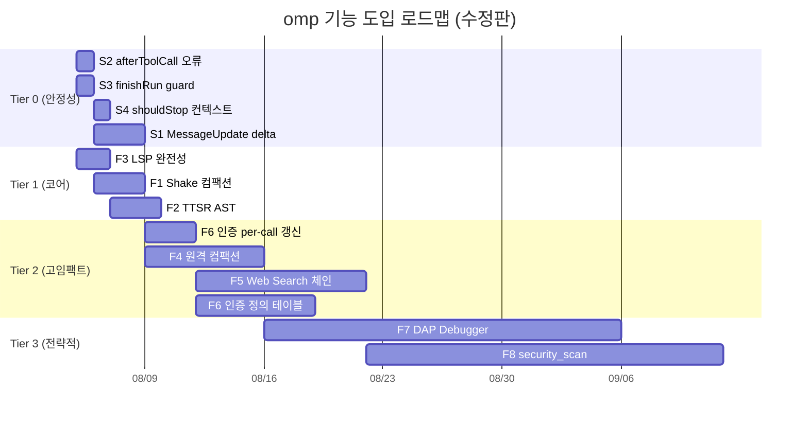

# omp 미포팅 기능 도입 설계서 (수정판)

> **분석 기준**: omp v17.2.8 (can1357/oh-my-pi) vs oxicode v0.64.0
>
> **우선순위 기준**: 에이전트 런타임 동작 + 인증 + 안정성에 직접 영향하는 기능만.
> IDE 통합(ACP), 협업(/collab), UX 편의(conflict://)는 제외.
>
> **검증**: omp 소스 10개 병렬 스카우트 심층 분석 + oxicode 코드 직접 검증으로
> 각 이슈의 현재 유효성 확인.

---

## 우선순위 매트릭스

| ID  | 기능                             | 복잡도 | 영향 범위              | Tier |
| --- | -------------------------------- | ------ | --------------------- | ---- |
| S1  | MessageUpdate typed delta        | **M**   | 스트리밍 표현력        | 0    |
| S2  | afterToolCall 오류 처리           | **S**   | 훅 신뢰성              | 0    |
| S3  | finishRun cleanup guard           | **S**   | 패닉 안전성            | 0    |
| S4  | shouldStopAfterTurn 컨텍스트 활용  | **S**   | 루프 종료 결정 품질     | 0    |
| F1  | Shake 컴팩션                     | **M**   | 장세션 안정성          | 1    |
| F2  | TTSR AST 조건                    | **M**   | 에이전트 스티어링      | 1    |
| F3  | LSP 완전성 (3 ops + 레시피)      | **S**   | 코드 인텔리전스        | 1    |
| F4  | 원격 컴팩션 (OpenAI V1/V2)       | **M**   | 장세션 안정성          | 2    |
| F5  | Web Search 다중 프로바이더 체인   | **L**   | 검색 품질              | 2    |
| F6  | 프로바이더 인증 확장              | **L**   | 인증 범위              | 2    |
| F7  | DAP Debugger                     | **XL**  | 디버깅 역량            | 3    |
| F8  | security_scan                    | **XL**  | 보안 리뷰              | 3    |

---

## Tier 0 — 에이전트 런타임 안정성 (직접 수정)

> deep-comparison-report.md에서 식별된 이슈 중 **코드 검증으로 현재도 유효함을 확인한 것**.
> 각각은 기존 코드의 버그/결함이므로 새 기능이 아닌 수정이다.

### S1: MessageUpdate typed delta — 스트리밍 이벤트 세분화

**문제** (`oxicode-agent/src/events.rs:177`):

```rust
MessageUpdate {
    message: oxicode_ai::Message,
    delta: Option<String>,   // ← 텍스트 델타만. thinking/tool-call 구분 불가
}
```

omp는 `message_update`가 `assistantMessageEvent` (typed: `text_delta`,
`thinking_delta`, `toolcall_delta`)를 함께 전달한다. oxicode는 텍스트만 전달하므로:

- TUI가 reasoning/thinking 시각화를 할 수 없음
- 도구 호출 스트리밍(프로바이더가 부분적 인수를 스트리밍할 때)이 소비자에게 보이지 않음

**검증**: `streaming.rs:277`에서 `delta: Some(delta)`로 텍스트만 emit.
`thinking_delta` / `toolcall_delta` 이벤트가 발생해도 동일한 `MessageUpdate`로 flatten됨.

**설계**:

```rust
// events.rs — MessageUpdate 확장

/// 스트리밍 델타의 종류를 구분
#[derive(Debug, Clone)]
pub enum StreamDelta {
    /// 일반 텍스트 출력
    Text(String),
    /// 추론/사고 블록 (reasoning models)
    Thinking(String),
    /// 도구 호출 인수 스트리밍 시작
    ToolCallStart { tool_call_id: String },
    /// 도구 호출 인수 부분
    ToolCallDelta { tool_call_id: String, delta: String },
    /// 도구 호출 완료
    ToolCallEnd { tool_call: ToolCall },
}

pub enum AgentEvent {
    // ...
    MessageUpdate {
        message: oxicode_ai::Message,
        delta: StreamDelta,   // ← Option<String> → StreamDelta
    },
}
```

**streaming.rs 수정**: 프로바이더 이벤트 타입에 따라 적절한 `StreamDelta` 변형 emit.

**복잡도**: **M** — ProviderEvent에 이미 `ThinkingDelta`/`ToolCallDelta` 변형이 존재하는지
확인 필요. 존재하면 매핑만 추가 (~300 LOC). 없으면 oxicode-ai 프로바이더 trait부터 확장.

---

### S2: afterToolCall 오류 처리 — 조용한 무시 제거

**문제** (`oxicode-agent/src/agent_loop/tool_exec.rs:450-451`):

```rust
if let Some(ref hook) = loop_ref.after_tool_call
    && let Some(modified) = hook(&tc_name, &result).await.ok().flatten()
    //                                                ^^^^.^^^
    //                          오류가 나면 None으로 취급 → 조용히 무시됨
```

omp는 `afterToolCall`이 throw하면 **오류 도구 결과**를 생성한다. oxicode는 `.ok()`로
오류를 삼켜버린다 — 훅이 실패해도 아무 일도 일어나지 않는다.

**설계**:

```rust
// tool_exec.rs:450 수정

if let Some(ref hook) = loop_ref.after_tool_call {
    match hook(&tc_name, &result).await {
        Ok(Some(modified)) => {
            if let Some(ref details) = modified.metadata {
                tracing::debug!(tool = %tc_name, details = %details,
                    "after_tool_call hook returned details");
            }
            result = modified;
            is_error = !result.success;
        }
        Ok(None) => {} // 훅이 수정 없음
        Err(hook_err) => {
            // omp 동작: 오류를 도구 결과로 변환
            tracing::warn!(tool = %tc_name, error = %hook_err,
                "after_tool_call hook failed, creating error result");
            result = AgentToolResult::error(&format!(
                "after_tool_call hook failed: {hook_err}"
            ));
            is_error = true;
        }
    }
}
```

**복잡도**: **S** — 15분 수정. 안전망 추가.

---

### S3: finishRun cleanup guard — 패닉 안전성

**문제**: `Agent::run_with_channel_inner`에 cleanup guard가 없다.
스트리밍 중 패닉이 발생하면 `is_running` 플래그가 true로 남아 이후 실행이 차단된다.

omp는 `runWithLifecycle`의 `finally` 블록에서 항상 `finishRun()`을 호출하여
`isStreaming`, `streamingMessage`, `pendingToolCalls`를 정리한다.

**검증**: `catch_unwind`, `Drop for Agent`, cleanup guard 패턴 — 코드에서 발견 안 됨.

**설계**:

```rust
// agent.rs — run_with_channel_inner에 cleanup guard 추가

pub async fn run_with_channel_inner(&self, ...) -> Result<...> {
    // 패닉 안전망: 이 블록이 어떤 경로로 빠져나가도(정상/패닉/취소) 정리 실행
    let cleanup = scopeguard::guard((), |_| {
        // is_running 플래그 해제
        self.inner.write().is_running = false;
        // 스트리밍 상태 초기화
        // (필요시 additional cleanup)
    });

    // ... 기존 루프 로직 ...

    // 정상 종료 시 guard 해제 (이중 정리 방지)
    scopeguard::ScopeGuard::into_inner(cleanup);
    Ok((messages, events))
}
```

또는 `tokio::task::spawn_blocking` + `catch_unwind` 패턴으로 래핑.

**복잡도**: **S** — `scopeguard` 크레이트 추가 + cleanup 로직. ~50 LOC.
의존성: `scopeguard` (이미 간접 의존할 가능성 높음).

---

### S4: shouldStopAfterTurn 실질적 컨텍스트 사용

**문제**: `helpers.rs:50`의 `should_stop_after_turn()`는 `external_stop` 플래그만 확인한다:

```rust
pub fn should_stop_after_turn(external_stop: &Arc<AtomicBool>) -> bool {
    external_stop.load(Ordering::SeqCst)
}
```

`ShouldStopAfterTurnContext`는 `agent.rs:1101`에서 **실제 메시지/도구 결과와 함께**
구성되어 훅에 전달되지만, 실제 루프 종료 결정은 이 컨텍스트를 무시하고
`external_stop`만 본다. 즉, 훅이 "메시지 내용을 기반으로 종료 판단"을 할 수 없다.

omp는 `shouldStopAfterTurn`이 `{ message, toolResults, context, newMessages }`를
받아 콘텐츠 기반 종료 결정을 내릴 수 있다.

**설계**:

```rust
// helpers.rs — 컨텍스트 기반 종료 결정 지원

/// 외부 중단 + 훅 기반 종료 판단
pub fn should_stop_after_turn(
    external_stop: &Arc<AtomicBool>,
    hook: Option<&Arc<dyn Fn(&ShouldStopAfterTurnContext) -> bool + Send + Sync>>,
    ctx: &ShouldStopAfterTurnContext,
) -> bool {
    if external_stop.load(Ordering::SeqCst) {
        return true;
    }
    // 훅이 있으면 컨텍스트 기반 판단 위임
    if let Some(h) = hook {
        return h(ctx);
    }
    false
}
```

`agent_loop/mod.rs:1171` 호출 지점에서 훅과 컨텍스트를 전달하도록 수정.

**복잡도**: **S** — 시그니처 변경 + 호출 지점 수정. ~80 LOC.

---

## Tier 1 — 코어 기능 (M, 1~3일/기능)

### F1: Shake 컴팩션 — LLM 없는 기계적 컨텍스트 압축

**omp 구현** (`packages/agent/src/compaction/shake.ts`):

LLM 호출 없이 메시지 시퀀스에서 압축 가능한 영역을 식별하여 자리표시자로 교체:

1. **보호 창**(최근 16K 토큰) 외의 영역 스캔
2. **압축 대상 식별**: tool result 전체(≥400 토큰), fenced code block(≥400 토큰), XML 블록
3. **자리표시자 교체**: `"[tool result elided (N tokens)]"`, `"```...elided...```"`
4. **최소 절약 검증**: 4K 토큰 미만 절약 시 롤백 (무의미한 압축 방지)
5. **3 모드**: `DEFAULT`(보호창 16K), `AGGRESSIVE`(8K), `RESCUE`(데드엔드 복구)

**왜 중요한가**: 컨텍스트가 찰 때 LLM 요약을 기다리지 않고 **즉시** 공간 확보.
장세션 안정성에 직결. 현재 oxicode는 snapcompact(PNG 렌더링) 또는 LLM 요약만 있고,
즉각적인 기계적 압축이 없다.

**설계**:

```rust
// oxicode-agent/src/agent_loop/compaction/shake.rs (신규)

pub struct ShakeCompactor {
    config: ShakeConfig,
}

pub struct ShakeConfig {
    pub protect_window_tokens: usize,  // DEFAULT: 16384
    pub min_elidable_tokens: usize,    // 400
    pub min_savings_tokens: usize,     // 4096
}

/// 압축 가능한 영역
struct ElidableRegion {
    message_idx: usize,
    token_estimate: usize,
    kind: RegionKind,  // ToolResult | CodeBlock | XmlBlock
}

impl ShakeCompactor {
    /// 메시지 시퀀스를 그 자리에서 압축 (mutate)
    pub fn shake(&self, messages: &mut Vec<Message>) -> ShakeOutcome {
        let protect_end = self.find_protect_boundary(messages);

        // 보호 창 밖에서 압축 대상 수집
        let mut regions: Vec<ElidableRegion> = Vec::new();
        for (idx, msg) in messages[..protect_end].iter().enumerate() {
            for region in self.scan_elidable(msg) {
                if region.token_estimate >= self.config.min_elidable_tokens {
                    regions.push(region);
                }
            }
        }

        let total_saved: usize = regions.iter().map(|r| r.token_estimate).sum();
        if total_saved < self.config.min_savings_tokens {
            return ShakeOutcome::NoChange;
        }

        // 자리표시자로 교체
        for region in &regions {
            self.replace_with_placeholder(&mut messages[region.message_idx], region);
        }

        ShakeOutcome::Shaken {
            regions_elided: regions.len(),
            tokens_saved: total_saved,
        }
    }

    /// 메시지에서 압축 가능한 영역 스캔
    fn scan_elidable(&self, msg: &Message) -> Vec<ElidableRegion> {
        let mut regions = Vec::new();
        let text = msg.as_text();

        // 1. Tool result 전체 (tool role 메시지)
        if msg.is_tool_result() {
            let tokens = estimate_tokens(&text);
            if tokens >= self.config.min_elidable_tokens {
                regions.push(ElidableRegion {
                    message_idx: 0, // 상위에서 재설정
                    token_estimate: tokens,
                    kind: RegionKind::ToolResult,
                });
            }
        }

        // 2. Fenced code blocks (``` ... ```)
        for (start, end) in find_fenced_blocks(&text) {
            let block = &text[start..end];
            let tokens = estimate_tokens(block);
            if tokens >= self.config.min_elidable_tokens {
                regions.push(ElidableRegion {
                    message_idx: 0,
                    token_estimate: tokens,
                    kind: RegionKind::CodeBlock,
                });
            }
        }

        // 3. XML blocks (<tag> ... </tag>)
        // omp는 fence+XML 스캐닝을 함
        regions
    }
}

fn estimate_tokens(text: &str) -> usize {
    // omp와 동일: len/4 근사 (정확한 토크나이저 호출은 오버헤드)
    text.len() / 4
}
```

**통합 지점**: `agent_loop/mod.rs`의 컨텍스트 관리 로직에서
`should_compact()` → `try_shake()` → 부족 시 snapcompact/LLM 요약 폴백.

**복잡도**: **M** — 외부 의존성 없음. 토큰 추정(char/4) + 블록 스캐닝 + 교체.
~400 LOC.

---

### F2: TTSR AST 조건 — 구조적 패턴 매칭

**omp 구현** (`packages/coding-agent/src/export/ttsr.ts` + `crates/pi-natives/src/ast.rs`):

현재 oxicode는 TTSR 규칙에서 **regex 조건만** 지원 (`oxicode-agent/src/agent_loop/ttsr.rs`, 561 LOC).
omp는 regex + **ast-grep 패턴**을 모두 지원한다.

**omp AST 경로**:
1. 규칙 frontmatter: `astCondition: "Box::leak($X)"` (ast-grep Smart 패턴)
2. 도구(edit/write) 실행 후 파일 스냅샷 추출
3. 파일 확장자 → 언어 추론 (`.rs` → Rust)
4. `astMatch({patterns, source, lang, strictness: Smart})` — tree-sitter 파싱
5. `totalMatches > 0` → 스트림 중단 + 규칙 주입

**oxicode 재사용 자산**: `oxicode-agent/src/tools/ast_grep.rs` (23.8KB)가 이미
**tree-sitter + ast-grep Pattern**을 사용 중. 언어 추론, 패턴 컴파일, 매칭 로직 재사용 가능.

**설계**:

```rust
// oxicode-agent/src/agent_loop/ttsr.rs 확장

/// AST 조건 매칭 (기존 regex 매칭과 병렬 실행)
pub struct TtsrAstMatcher {
    rules: Vec<AstRule>,
    /// per-file digest dedup: 동일 파일 내용 재검사 방지
    seen: HashMap<PathBuf, u64>,
}

struct AstRule {
    name: String,
    pattern: String,             // ast-grep Smart 패턴
    file_scope: Option<Glob>,    // "*.rs", "*.ts" 필터
    interrupt_mode: InterruptMode,
}

impl TtsrAstMatcher {
    /// 도구 실행 후 호출 — edit/write의 결과물로 AST 체크
    pub async fn check_snapshot(
        &mut self,
        file_path: &Path,
        content: &str,
    ) -> Option<TtsrTrigger> {
        // 1. 언어 추론 (ast_grep.rs의 resolve_language 재사용)
        let lang = resolve_language(file_path)?;

        // 2. scope 필터링
        let candidates: Vec<&AstRule> = self.rules.iter()
            .filter(|r| r.file_scope.as_ref().map_or(true, |g| g.matches(file_path)))
            .collect();
        if candidates.is_empty() { return None; }

        // 3. digest dedup
        let digest = fxhash::hash(content);
        if self.seen.get(file_path) == Some(&digest) { return None; }
        self.seen.insert(file_path.to_path_buf().unwrap(), digest);

        // 4. ast-grep 매칭 (ast_grep.rs의 compile_and_match 재사용)
        for rule in candidates {
            if ast_grep_match(&rule.pattern, content, lang) {
                return Some(TtsrTrigger {
                    rule_name: rule.name.clone(),
                    interrupt_mode: rule.interrupt_mode,
                });
            }
        }
        None
    }
}
```

**builtin 규칙**: omp의 28개 내장 규칙 중 4개 AST 규칙 포팅
(go-bench-loop, go-new-expr, go-range-int, ts-no-inline-cast-access) +
24개 regex 규칙 동봉.

**복잡도**: **M** — ast-grep 인프라 재사용으로 핵심 ~300 LOC.
builtin 규칙 포팅 +300 LOC. 총 ~600 LOC.

---

### F3: LSP 완전성 — 3개 누락 연산 + 서버 레시피

**omp 구현** (`packages/coding-agent/src/lsp/index.ts`):

oxicode는 14개 LSP 연산 중 11개만 구현. 누락:

| 연산           | omp 동작                                                        |
| -------------- | -------------------------------------------------------------- |
| `reload`       | rust-analyzer/reloadWorkspace → didChangeConfiguration → restart |
| `capabilities` | 서버 capabilities JSON 덤프                                      |
| `request`      | raw LSP method passthrough (query + payload)                   |

또한 omp는 `defaults.json`에 **~50개 서버 레시피**를 내장 (rust-analyzer, clangd,
gopls, pyright, jdtls, zls 등).

**설계**:

```rust
// oxicode-lsp/src/lib.rs — 3개 메서드 추가

impl LspClient {
    /// 서버 재시작 (rust-analyzer/reloadWorkspace 등)
    pub async fn reload_server(&self) -> Result<()> {
        // 1. workspace/didChangeConfiguration 전송
        self.request("workspace/didChangeConfiguration", json!({})).await?;
        // 2. 언어별 reload 요청 (rust-analyzer/reloadWorkspace 등)
        // 3. wedge 시 프로세스 재시작
    }

    /// initialize에서 캡처한 capabilities 반환
    pub fn server_capabilities(&self) -> &Value {
        &self.capabilities  // 이미 initialize에서 저장됨
    }

    /// raw LSP 요청 passthrough
    pub async fn raw_request(&self, method: &str, params: Value) -> Result<Value> {
        self.request(method, params).await
    }
}

// oxicode-cli/src/lsp/defaults.rs (신규) — ~50 서버 레시피
pub const DEFAULT_LSP_SERVERS: &[LspServerRecipe] = &[
    LspServerRecipe {
        name: "rust-analyzer",
        command: "rust-analyzer",
        args: &[],
        file_types: &["rs"],
        root_markers: &["Cargo.toml"],
        init_options: None,
    },
    LspServerRecipe {
        name: "clangd",
        command: "clangd",
        args: &["--background-index"],
        file_types: &["c", "cpp", "cc", "h", "hpp"],
        root_markers: &["compile_commands.json", "CMakeLists.txt"],
        init_options: None,
    },
    // ... gopls, pyright, jdtls, zls, ts-language-server, ...
];
```

**복잡도**: **S** — 각 연산은 기존 `LspClient`에 1~2개 메서드. 레시피는 정적 데이터.
~400 LOC.

---

## Tier 2 — 고임팩트 (L)

### F4: 원격 컴팩션 (OpenAI V1/V2)

**omp 구현** (`packages/agent/src/compaction/`):

omp는 4단계 컴팩션 폴백 체인을 운영:

```
Shake(기계적) → V2 streaming → V1 /responses/compact → generic → 로컬 LLM 요약
```

**V2** (`compaction-v2-streaming.ts`):
- OpenAI Responses API 요청에 `compaction_trigger` item 추가
- `stream: true, store: false`로 SSE 수신
- 정확히 1개의 `compaction` 출력 item 추출
- 유지 예산 64K 토큰 (user/developer/system + compaction item)
- 180s 타임아웃, 2회 재시도 (지수 백오프)

**V1** (`openai.ts`):
- POST `/responses/compact` (encrypted reasoning replay 포함)
- Responses items (thinkingSignature, call-id pairing) 전체 전송

**Generic**: `/chat/completions` 또는 커스텀 엔드포인트로 요약 요청

**설계**:

```rust
// oxicode-agent/src/agent_loop/compaction/remote.rs (신규)

#[async_trait]
pub trait RemoteCompactor: Send + Sync {
    async fn compact(
        &self,
        messages: &[Message],
        budget: TokenBudget,
    ) -> Result<CompactionResult, CompactionError>;
}

/// OpenAI V2: compaction_trigger를 Responses API에 주입
pub struct OpenAiV2Compactor {
    client: reqwest::Client,
    model: String,
    endpoint: String,
}

/// OpenAI V1: /responses/compact 엔드포인트
pub struct OpenAiV1Compactor {
    client: reqwest::Client,
    model: String,
    endpoint: String,
}

/// 컴팩션 디스패치 (F1 Shake와 통합)
pub async fn compact_context(
    messages: &mut Vec<Message>,
    strategy: CompactionStrategy,
) -> Result<CompactionOutcome> {
    // 1. Shake 먼저 시도 (즉각적, LLM 없음)
    if strategy.shake_first {
        if let ShakeOutcome::Shaken { .. } = ShakeCompactor::default().shake(messages) {
            return Ok(CompactionOutcome::Shaken);
        }
    }
    // 2. 원격 V2
    if let Some(c) = strategy.remote_v2 {
        if let Ok(result) = c.compact(messages, budget).await {
            return Ok(CompactionOutcome::Remote(result));
        }
    }
    // 3. 원격 V1
    if let Some(c) = strategy.remote_v1 {
        if let Ok(result) = c.compact(messages, budget).await {
            return Ok(CompactionOutcome::Remote(result));
        }
    }
    // 4. 로컬 LLM 요약 (기존 로직)
    local_summary(messages).await
}
```

**복잡도**: **M** — V2/V1은 OpenAI Responses API 특화. oxicode-ai에
`compaction_trigger` item 타입 추가 필요. ~600 LOC.
**의존성**: F1(Shake)과 디스패치 프레임워크 공유.

---

### F5: Web Search 다중 프로바이더 체인

**omp 구현** (`packages/coding-agent/src/web/search/`):

23개 프로바이더를 순차 폴백 체인으로 운영:

| 분류 | 프로바이더 |
|------|-----------|
| LLM 네이티브 | Anthropic web_search, OpenAI/Codex, Gemini, Perplexity |
| REST API (키) | Tavily, Exa, Brave, Kagi, Jina, Firecrawl, Kimi, Parallel, XAI |
| 무료 스크랩 | DuckDuckGo, Startpage, Google, Mojeek, Public(병렬) |

핵심: lazy registry + ordered fallback + query directive 파싱 + lenient relaxation.

**oxicode 현재**: `web_search.rs` — DDG/Wiki/Bing 스크랩만. API 키 없음, 체인 없음.

**설계**:

```rust
// oxicode-agent/src/tools/web_search/ (기존 단일 파일 교체)

#[async_trait]
pub trait SearchProvider: Send + Sync {
    fn id(&self) -> &str;
    fn is_available(&self, auth: &dyn AuthProvider) -> bool;
    async fn search(&self, params: &SearchParams) -> Result<SearchResponse, SearchError>;
}

pub struct SearchChain {
    providers: Vec<Box<dyn SearchProvider>>,
}

impl SearchChain {
    pub async fn search(&self, query: &str, opts: &SearchOptions) -> Result<SearchResponse> {
        let candidates = self.resolve_candidates(opts); // ordered + exclusion
        let mut failures = Vec::new();
        for provider in &candidates {
            if !provider.is_available(&opts.auth) { continue; }
            match provider.search(&params).await {
                Ok(resp) if has_content(&resp) => return Ok(resp),
                Err(e) => failures.push((provider.id(), e)),
                _ => {}
            }
        }
        Err(SearchError::AllFailed(failures))
    }
}
```

**포팅 순서**:
1. 프레임워크 + DuckDuckGo 스크랩 (기존 코드 마이그레이션)
2. REST API: Tavily → Brave → Exa (각 ~150 LOC, reqwest)
3. 무료 스크랩: Startpage → Google (oxibrowser 재사용)
4. LLM 네이티브: Anthropic → Gemini (provider API 확장)

**복잡도**: **L** — 프레임워크 ~500 LOC + 프로바이더당 ~150 LOC × 10.
재사용: `http_client.rs`, `browse/` 엔진, `multi_provider.rs`.

---

### F6: 프로바이더 인증 확장 — per-call 키 해상도 + 범위 확대

**현재 상태** (코드 검증 완료):

oxicode는 OAuth **인프라**는 갖추고 있다:
- `oauth.rs` (934 LOC): `ensure_valid_token`, `refresh_token`, `TokenBundle`
- `provider_registry.rs`: `ProviderAuthRegistry` — runtime override → stored credential →
  OAuth token → ambient credentials → env var 5단계 해상도
- `OAuthTokenInfo::needs_refresh()`: 만료 5분 전 갱신 플래그

**하지만 두 가지 갭이 있다**:

**갭 1: per-call 해상도 미연결**. deep-comparison-report #14.
omp는 스트리밍 직전에 `getApiKey(provider)`를 호출하여 **만료된 토큰을 갱신**한다.
oxicode는 `ApiKeyAuth::get_api_key()`가 `self.api_key.clone()` 정적 반환.
`OAuthAuth::get_api_key()`도 `self.token.access_token`을 그대로 반환 —
`ensure_valid_token`을 호출하지 않는다.

```rust
// provider_registry.rs:177 — 현재
fn get_api_key(&self) -> Option<String> {
    self.token.as_ref().map(|t| t.access_token.clone())
    // ← 만료 여부 확인 없음. ensure_valid_token 호출 없음.
}
```

**갭 2: 프로바이더별 인증 정의 부족**. omp는 ~76개 프로바이더별로
env key 이름, OAuth client_id/scope/callback_port, paste-code flow를 정의한다.
oxicode는 13개 와이어 구현만 있고, 인증 메타데이터가 분산되어 있다.

**설계**:

```rust
// oxicode-ai/src/auth/provider_auth.rs (신규 또는 확장)

/// 프로바이더별 인증 메타데이터 (omp ProviderDefinition에 대응)
pub struct ProviderAuthDef {
    pub provider_id: &'static str,
    pub display_name: &'static str,
    /// API 키 환경 변수명 (예: "ANTHROPIC_API_KEY")
    pub env_keys: &'static [&'static str],
    /// OAuth 설정 (있는 경우)
    pub oauth: Option<OAuthDef>,
}

pub struct OAuthDef {
    pub client_id: &'static str,
    pub auth_url: &'static str,
    pub token_url: &'static str,
    pub scopes: &'static [&'static str],
    pub callback_port: u16,
    /// device code (paste-code) 흐름 지원 여부
    pub device_code: bool,
}

/// 주요 프로바이더 인증 정의 테이블
pub const PROVIDER_AUTH: &[ProviderAuthDef] = &[
    ProviderAuthDef {
        provider_id: "anthropic",
        display_name: "Anthropic",
        env_keys: &["ANTHROPIC_API_KEY"],
        oauth: None,  // API 키 only
    },
    ProviderAuthDef {
        provider_id: "google",
        display_name: "Google (Gemini)",
        env_keys: &["GOOGLE_API_KEY", "GEMINI_API_KEY"],
        oauth: Some(OAuthDef {
            client_id: "...",
            auth_url: "https://accounts.google.com/o/oauth2/v2/auth",
            token_url: "https://oauth2.googleapis.com/token",
            scopes: &["https://www.googleapis.com/auth/cloud-platform"],
            callback_port: 8765,
            device_code: false,
        }),
    },
    // ... openai, cursor, codex, bedrock, ...
];

// provider_registry.rs 수정 — 만료된 토큰 갱신
impl ProviderAuth for OAuthAuth {
    fn get_api_key(&self) -> Option<String> {
        let token = self.token.as_ref()?;
        if token.needs_refresh() {
            // 동기 컨텍스트에서는 갱신 불가 — 호출자가 ensure_valid_token을
            // 호출하도록 API 변경 필요 (see below)
            tracing::warn!("OAuth token needs refresh but get_api_key is sync");
        }
        Some(token.access_token.clone())
    }

    /// 비동기 갱신 포함 키 해상도 (신규)
    async fn get_api_key_async(&self) -> Option<String> {
        let mut token = self.token.as_ref()?.clone();
        if token.needs_refresh() {
            match ensure_valid_token(&self.client, &self.oauth_config, &token).await {
                Ok(refreshed) => {
                    token = refreshed;
                }
                Err(e) => {
                    tracing::error!("OAuth refresh failed: {e}");
                    return None;
                }
            }
        }
        Some(token.access_token.clone())
    }
}
```

**스트리밍 경로 수정**: 프로바이더 `stream()` 호출 직전에
`auth.get_api_key_async().await`를 호출하여 만료된 토큰 갱신.

**복잡도**: **L** — 갭 1(per-call 갱신)은 **M** (~300 LOC, ProviderAuth trait에
async 메서드 추가). 갭 2(인증 정의 테이블)는 ~20개 주요 프로바이더 정의 ~1000 LOC.
갭 1을 먼저 해결하는 것이 긴급.

---

## Tier 3 — 전략적 (XL, 별도 마일스톤)

### F7: DAP Debugger

**omp 구현** (`packages/coding-agent/src/dap/`, ~5000 LOC):

omp의 #3 헤드라인 기능. 28개 디버그 연산 + 14개 어댑터:

- **세션** (4): launch, attach, terminate, sessions
- **중단점** (6): source/function/instruction/data set+remove
- **실행** (5): continue, step_over/in/out, pause
- **검사** (9): stack_trace, threads, scopes, variables, evaluate, disassemble, read_memory, modules, loaded_sources
- **raw** (3): write_memory, custom_request, output

14개 어댑터: gdb, lldb-dap, codelldb, debugpy, dlv, js-debug-adapter, netcoredbg,
kotlin-debug-adapter, rdbg, php-debug-adapter, bash-debug-adapter, dart, flutter, elixir-ls

**재사용**: `oxicode-lsp`의 Content-Length JSON-RPC 프레이밍 (DAP는 동일 프레이밍, 다른 문법).

**설계**:

```
oxicode-dap/ (신규 크레이트)
├── src/client.rs       // DAP wire client
├── src/session.rs      // DapSessionManager
├── src/config.rs       // 어댑터 config + 14 defaults
├── src/types.rs        // DAP 프로토콜 타입
└── src/transport.rs    // Stdio | Tcp | UnixSocket
oxicode-agent/src/tools/debug.rs // 28-action tool surface
```

**핵심 난제**: race discipline (stopped 이벤트를 launch 전 subscribe),
configurationDone cascade, write-wedge guard, multi-session 중단점 동기화.

**권고**: Phase 1 = stdio + 4개 주요 어댑터(gdb, lldb, debugpy, dlv).
Phase 2 = TCP/소켓 + 나머지 어댑터 + multi-session.

**복잡도**: **XL** — 가장 큰 단일 포팅.

---

### F8: security_scan

**omp 구현** (`packages/coding-agent/src/security/`, ~6000 LOC):

LLM 기반 보안 스캔 오케스트레이터:
1. **preflight**: 타겟 정규화, tree digest, 스캔 계획 지문
2. **coordinator**: 제한된 도구로 AgentSession 생성, security-reviewer 서브에이전트 분할 위임
3. **reviewer**: 파일 영역 검사 → 구조화 findings yield
4. **publish**: canonical findings → JSON/SARIF/report.md 번들
5. **cloud**: Codex Security 클라우드 API 연동

**재사용 자산**: `subagent.rs` + `yield_tool.rs`, `ast_grep.rs`/`lsp.rs`/`grep.rs`.

**권고**: 4단계 분할 — contracts+store (S-M) → coordinator+publication (M-L) →
서브에이전트 위임 (L) → 클라우드 클라이언트 (L).

**복잡도**: **XL**.

---

## 도입 로드맵



### 의존성

```
S2, S3 (독립, 즉시)
S4 (S2 이후)
S1 (S3 이후, 프로바이더 이벤트 확인 필요)

F3 (독립)
F1 (독립)
F2 (F3 이후, ast_grep 인프라 공유 가능)

F6a per-call 갱신 (S1 이후, async API 필요)
F4 원격 컴팩션 (F1 Shake 이후, 디스패치 공유)
F5 Web Search (F6a 이후, auth 계층 공유)
F6b 인증 정의 테이블 (F6a 이후)

F7 DAP (독립)
F8 security_scan (독립, subagent 인프라 이미 존재)
```

### 예상 효과

| 단계 | 도입 | 효과 |
|------|------|------|
| Tier 0 | S1–S4 | 스트리밍 표현력 + 훅 신뢰성 + 패닉 안전성 |
| Tier 1 | F1–F3 | 장세션 안정성 + 스티어링 품질 + 코드 인텔리전스 |
| Tier 2 | F4–F6 | 원격 컨텍스트 관리 + 검색 품질 + 인증 범위 |
| Tier 3 | F7–F8 | 디버깅 역량 + 보안 리뷰 |
